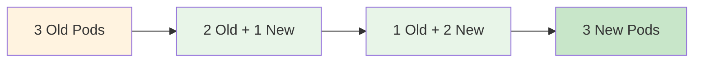

# 3️⃣ Deployments - Managing Multiple Pods

<div align="center">


**🎯 Manage Multiple Pods | 📈 Scale Applications | 🔄 Handle Failures**

</div>

---

## 🎯 What We'll Learn

```mermaid
graph TD
    A[📦 Single Pod<br/>Can fail and disappear] --> B[🚀 Deployment<br/>Manages multiple pods]
    B --> C[📊 ReplicaSet<br/>Ensures desired number]
    C --> D[📈 Scaling<br/>Add/remove pods easily]
    D --> E[🔄 Self-healing<br/>Replaces failed pods]
    
    style A fill:#ffcdd2
    style B fill:#e1f5fe
    style C fill:#fff3e0
    style D fill:#e8f5e8
    style E fill:#c8e6c9
```



**Learn how to run applications reliably at scale!**

---

## 🤔 Why Do We Need Deployments?

### **The Problem with Single Pods**

```mermaid
graph TB
    subgraph "❌ Single Pod Problems"
        A[📦 Pod] --> B[💥 Pod Crashes]
        B --> C[😱 App is Down!]
        C --> D[👨‍💻 You manually restart]
    end
    
    style A fill:#e1f5fe
    style B fill:#ffcdd2
    style C fill:#ffcdd2
    style D fill:#fff3e0
```


### **The Solution: Deployments**

```mermaid
graph TB
    subgraph "✅ Deployment Solution"
        A[🚀 Deployment] --> B[📦 Pod 1]
        A --> C[📦 Pod 2]
        A --> D[📦 Pod 3]
        
        B --> E[💥 Pod 1 Crashes]
        E --> F[🤖 Deployment creates new Pod 1]
        F --> G[✅ App stays running!]
    end
    
    style A fill:#e8f5e8
    style B fill:#e1f5fe
    style C fill:#e1f5fe
    style D fill:#e1f5fe
    style E fill:#ffcdd2
    style F fill:#c8e6c9
    style G fill:#c8e6c9
```


**Benefits:**
- 🔄 **Self-healing** - Automatically replaces failed pods
- 📈 **Scaling** - Easy to add/remove pods
- 🚀 **Updates** - Rolling updates with zero downtime
- 📊 **Desired state** - Always maintains the number you want

---

## 🏗️ Understanding the Architecture

```mermaid
graph TB
    subgraph "🚀 Deployment"
        DEPLOY[Deployment<br/>Desired: 3 replicas<br/>Image: nginx:1.21]
    end
    
    subgraph "📊 ReplicaSet"
        RS[ReplicaSet<br/>Current: 3 replicas<br/>Manages pods]
    end
    
    subgraph "📦 Pods"
        POD1[Pod 1<br/>nginx:1.21]
        POD2[Pod 2<br/>nginx:1.21]
        POD3[Pod 3<br/>nginx:1.21]
    end
    
    DEPLOY --> RS
    RS --> POD1
    RS --> POD2
    RS --> POD3
    
    style DEPLOY fill:#e8f5e8
    style RS fill:#fff3e0
    style POD1 fill:#e1f5fe
    style POD2 fill:#e1f5fe
    style POD3 fill:#e1f5fe
```



**How it works:**
1. **You** create a Deployment
2. **Deployment** creates a ReplicaSet
3. **ReplicaSet** creates and manages Pods
4. **If a pod fails**, ReplicaSet creates a new one

---

## 🧪 Hands-On: Your First Deployment

### **Exercise 1: Create a Deployment**
```bash
# Create deployment with 3 replicas
k create deployment web-app --image=nginx --replicas=3

# Check the deployment
k get deployments

# Check the replicaset (created automatically)
k get replicasets

# Check the pods (created by replicaset)
k get pods

# See the relationship
k get all -l app=web-app
```

### **Exercise 2: Explore the Deployment**
```bash
# Get detailed information
k describe deployment web-app

# Check the deployment status
k rollout status deployment/web-app

# See the deployment in YAML format
k get deployment web-app -o yaml
```

### **Exercise 3: Test Self-Healing**
```bash
# Delete one pod and watch it get recreated
k get pods -l app=web-app

# Delete one pod (replace POD_NAME with actual name)
k delete pod <POD_NAME>

# Watch new pod being created
k get pods -l app=web-app -w

# Press Ctrl+C to stop watching
```

---

## 📈 Scaling Applications

### **Manual Scaling**
```bash
# Scale up to 5 replicas
k scale deployment web-app --replicas=5

# Check the new pods being created
k get pods -l app=web-app

# Scale down to 2 replicas
k scale deployment web-app --replicas=2

# Watch pods being terminated
k get pods -l app=web-app -w
```

### **Understanding Scaling**

```mermaid
graph LR
    subgraph "📈 Scaling Up (2 → 5)"
        A[2 Pods] --> B[3 Pods] --> C[4 Pods] --> D[5 Pods]
    end
    
    subgraph "📉 Scaling Down (5 → 2)"
        E[5 Pods] --> F[4 Pods] --> G[3 Pods] --> H[2 Pods]
    end
    
    style A fill:#e1f5fe
    style B fill:#e1f5fe
    style C fill:#e1f5fe
    style D fill:#c8e6c9
    style E fill:#e1f5fe
    style F fill:#e1f5fe
    style G fill:#e1f5fe
    style H fill:#c8e6c9
```


---

## 🧪 Practical Exercises

### **Exercise 4: Load Balancing Test**
```bash
# Create service for the deployment
k expose deployment web-app --port=80 --type=NodePort

# Get the service port
k get services

# Test load balancing (run multiple times)
curl http://localhost:<PORT>

# Each request might go to a different pod!
```

### **Exercise 5: Blue-Green Deployment Pattern**
```bash
# Create blue deployment
k create deployment blue-app --image=varunmanik/httpd:blue --replicas=3

# Create green deployment
k create deployment green-app --image=varunmanik/httpd:green --replicas=3

# Create service pointing to blue
k create service nodeport web-service --tcp=80:80 --node-port=30080
k patch service web-service -p '{"spec":{"selector":{"app":"blue-app"}}}'

# Test blue version
curl http://localhost:30080

# Switch to green (instant traffic switch!)
k patch service web-service -p '{"spec":{"selector":{"app":"green-app"}}}'

# Test green version
curl http://localhost:30080

# Clean up
k delete deployment blue-app green-app
k delete service web-service
```

### **Exercise 6: Resource Limits**
```bash
# Create deployment with resource limits
cat <<EOF | k apply -f -
apiVersion: apps/v1
kind: Deployment
metadata:
  name: resource-demo
spec:
  replicas: 2
  selector:
    matchLabels:
      app: resource-demo
  template:
    metadata:
      labels:
        app: resource-demo
    spec:
      containers:
      - name: nginx
        image: nginx
        resources:
          requests:
            memory: "64Mi"
            cpu: "250m"
          limits:
            memory: "128Mi"
            cpu: "500m"
EOF

# Check the deployment
k describe deployment resource-demo

# Clean up
k delete deployment resource-demo
```

---

## 🔄 Updates and Rollbacks

### **Rolling Updates**

```mermaid
graph TB
    subgraph "🔄 Rolling Update Process"
        A[Old Version<br/>3 pods nginx:1.20] --> B[Mixed<br/>2 old + 1 new]
        B --> C[Mixed<br/>1 old + 2 new]
        C --> D[New Version<br/>3 pods nginx:1.21]
    end
    
    style A fill:#fff3e0
    style B fill:#e8f5e8
    style C fill:#e8f5e8
    style D fill:#c8e6c9
```


### **Exercise 7: Rolling Update**
```bash
# Check current image
k describe deployment web-app | grep Image

# Update to new version
k set image deployment/web-app nginx=nginx:1.21

# Watch the rolling update
k rollout status deployment/web-app

# Check rollout history
k rollout history deployment/web-app

# Check new image
k describe deployment web-app | grep Image
```

### **Exercise 8: Rollback**
```bash
# Update to a "bad" version
k set image deployment/web-app nginx=nginx:bad-version

# Check what happens
k get pods -l app=web-app

# Rollback to previous version
k rollout undo deployment/web-app

# Check rollback status
k rollout status deployment/web-app

# Verify pods are healthy
k get pods -l app=web-app
```

---

## 📝 Deployment YAML Deep Dive

### **Basic Deployment YAML**
```yaml
apiVersion: apps/v1
kind: Deployment
metadata:
  name: my-app
  labels:
    app: my-app
spec:
  replicas: 3                    # How many pods
  selector:
    matchLabels:
      app: my-app               # Which pods to manage
  template:                     # Pod template
    metadata:
      labels:
        app: my-app             # Labels for pods
    spec:
      containers:
      - name: web
        image: nginx:1.21
        ports:
        - containerPort: 80
```

### **Exercise 9: Create from YAML**
```bash
# Create the deployment YAML file
cat <<EOF > my-deployment.yaml
apiVersion: apps/v1
kind: Deployment
metadata:
  name: yaml-demo
  labels:
    app: yaml-demo
spec:
  replicas: 2
  selector:
    matchLabels:
      app: yaml-demo
  template:
    metadata:
      labels:
        app: yaml-demo
    spec:
      containers:
      - name: web
        image: nginx
        ports:
        - containerPort: 80
EOF

# Apply the YAML
k apply -f my-deployment.yaml

# Check it worked
k get deployment yaml-demo

# Clean up
k delete -f my-deployment.yaml
rm my-deployment.yaml
```

---

## 🔍 Essential Commands

### **Deployment Management**
```bash
# Create deployment
k create deployment <name> --image=<image> --replicas=<number>

# List deployments
k get deployments
k get deploy                    # Short form

# Deployment details
k describe deployment <name>

# Scale deployment
k scale deployment <name> --replicas=<number>

# Update image
k set image deployment/<name> <container>=<new-image>

# Check rollout status
k rollout status deployment/<name>

# Rollout history
k rollout history deployment/<name>

# Rollback
k rollout undo deployment/<name>

# Delete deployment
k delete deployment <name>
```

### **ReplicaSet Management**
```bash
# List replicasets
k get replicasets
k get rs                        # Short form

# ReplicaSet details
k describe replicaset <name>

# Note: Usually you don't manage ReplicaSets directly
# Deployments manage them for you
```

---

## 🎯 Understanding Deployment Strategies

### **Recreate Strategy**

```mermaid
graph LR
    A[3 Old Pods] --> B[0 Pods<br/>⚠️ Downtime] --> C[3 New Pods]
    
    style A fill:#fff3e0
    style B fill:#ffcdd2
    style C fill:#c8e6c9
```


**When to use:** When you can tolerate downtime

### **Rolling Update Strategy (Default)**


**When to use:** Zero downtime updates (most common)

### **Exercise 10: Configure Update Strategy**
```bash
# Create deployment with specific strategy
cat <<EOF | k apply -f -
apiVersion: apps/v1
kind: Deployment
metadata:
  name: strategy-demo
spec:
  replicas: 4
  strategy:
    type: RollingUpdate
    rollingUpdate:
      maxUnavailable: 1         # Max pods that can be down
      maxSurge: 1              # Max extra pods during update
  selector:
    matchLabels:
      app: strategy-demo
  template:
    metadata:
      labels:
        app: strategy-demo
    spec:
      containers:
      - name: nginx
        image: nginx:1.20
EOF

# Test the strategy
k set image deployment/strategy-demo nginx=nginx:1.21

# Watch the update process
k get pods -l app=strategy-demo -w

# Clean up
k delete deployment strategy-demo
```

---

## 🔍 Troubleshooting Deployments

### **Common Issues and Solutions**

#### **Deployment Stuck**
```bash
# Check deployment status
k describe deployment <name>

# Check replicaset
k get rs -l app=<name>
k describe rs <replicaset-name>

# Check pod events
k get pods -l app=<name>
k describe pod <pod-name>
```

#### **Pods Not Starting**
```bash
# Check pod logs
k logs -l app=<name>

# Common causes:
# - Wrong image name
# - Image pull errors
# - Resource constraints
# - Application errors
```

#### **Update Failing**
```bash
# Check rollout status
k rollout status deployment/<name>

# Check rollout history
k rollout history deployment/<name>

# Rollback if needed
k rollout undo deployment/<name>
```

---

## ✅ Knowledge Check

### **Quiz Questions**
1. **What creates and manages pods in a deployment?**
   - Deployment ❌
   - ReplicaSet ✅
   - Service ❌

2. **What happens if you delete a pod from a deployment?**
   - Pod stays deleted ❌
   - New pod is created ✅
   - Deployment fails ❌

3. **What's the default update strategy?**
   - Recreate ❌
   - RollingUpdate ✅
   - BlueGreen ❌

### **Practical Test**
```bash
# Can you do this without looking?
# 1. Create a deployment with 3 replicas
# 2. Scale it to 5 replicas
# 3. Update the image
# 4. Rollback the update
# 5. Clean up
```

---

## ✅ Success Criteria

You're ready for the next section when you can:

- [ ] ✅ Create deployments using kubectl and YAML
- [ ] ✅ Scale deployments up and down
- [ ] ✅ Understand the relationship between Deployments, ReplicaSets, and Pods
- [ ] ✅ Perform rolling updates and rollbacks
- [ ] ✅ Troubleshoot deployment issues
- [ ] ✅ Configure deployment strategies

---

## 🚀 Next Steps

**Excellent work!** 🎉 You now know how to manage applications reliably in Kubernetes!

### **What You Learned:**
- ✅ **Deployments** - How to manage multiple pods reliably
- ✅ **Scaling** - How to handle varying load
- ✅ **Self-healing** - How Kubernetes keeps apps running
- ✅ **Updates** - How to deploy new versions safely
- ✅ **Rollbacks** - How to recover from bad deployments

### **Ready for More?**

**[→ Next: Connect Applications](../04-networking/)**

Learn how to make your applications talk to each other using Services and networking.

---

## 📚 Quick Reference

### **Common Deployment Commands**
```bash
# Create and manage
k create deployment <name> --image=<image> --replicas=3
k scale deployment <name> --replicas=5
k set image deployment/<name> <container>=<new-image>

# Monitor and troubleshoot
k get deployments
k describe deployment <name>
k rollout status deployment/<name>
k rollout history deployment/<name>
k rollout undo deployment/<name>

# Clean up
k delete deployment <name>
```

### **Deployment YAML Template**
```yaml
apiVersion: apps/v1
kind: Deployment
metadata:
  name: my-app
spec:
  replicas: 3
  selector:
    matchLabels:
      app: my-app
  template:
    metadata:
      labels:
        app: my-app
    spec:
      containers:
      - name: web
        image: nginx
        ports:
        - containerPort: 80
```

---

*You're becoming a Kubernetes expert! Keep up the great work.* 🚀
