# 4️⃣ Networking - Connecting Your Applications

<div align="center">


**🎯 Connect Apps | 🌐 Service Discovery | ⚖️ Load Balancing**

</div>

---

## 🎯 What We'll Learn

```mermaid
graph TD
    A[🏠 ClusterIP<br/>Internal communication] --> B[🚪 NodePort<br/>External access]
    B --> C[🔍 Service Discovery<br/>Apps find each other]
    C --> D[⚖️ Load Balancing<br/>Traffic distribution]
    D --> E[🌐 Complete App<br/>Frontend + Backend + DB]
    
    style A fill:#e1f5fe
    style B fill:#fff3e0
    style C fill:#e8f5e8
    style D fill:#f3e5f5
    style E fill:#c8e6c9
```



**Build a complete multi-service application!**

---

## 🌐 Kubernetes Networking Basics

### **How Pods Communicate**

```mermaid
graph TB
    subgraph "🖥️ Node 1"
        POD1[📦 Pod A<br/>IP: 10.42.0.5]
        POD2[📦 Pod B<br/>IP: 10.42.0.6]
    end
    
    subgraph "🖥️ Node 2"
        POD3[📦 Pod C<br/>IP: 10.42.1.5]
        POD4[📦 Pod D<br/>IP: 10.42.1.6]
    end
    
    POD1 <--> POD2
    POD1 <--> POD3
    POD1 <--> POD4
    POD2 <--> POD3
    POD2 <--> POD4
    POD3 <--> POD4
    
    style POD1 fill:#e1f5fe
    style POD2 fill:#e1f5fe
    style POD3 fill:#e1f5fe
    style POD4 fill:#e1f5fe
```


**Key Points:**
- 🌐 **Every pod gets its own IP address**
- 🔗 **Pods can talk to any other pod directly**
- 📱 **But pod IPs change when pods restart**
- 🎯 **That's why we need Services!**

---

## 🏠 ClusterIP Services (Internal Communication)

### **What is ClusterIP?**

```mermaid
graph TB
    subgraph "☸️ Kubernetes Cluster"
        SERVICE[🌐 ClusterIP Service<br/>Stable IP: 10.96.0.100<br/>DNS: my-service]
        
        SERVICE --> POD1[📦 Pod 1<br/>IP: 10.42.0.5]
        SERVICE --> POD2[📦 Pod 2<br/>IP: 10.42.0.6]
        SERVICE --> POD3[📦 Pod 3<br/>IP: 10.42.0.7]
        
        CLIENT[📦 Client Pod] --> SERVICE
    end
    
    style SERVICE fill:#e8f5e8
    style POD1 fill:#e1f5fe
    style POD2 fill:#e1f5fe
    style POD3 fill:#e1f5fe
    style CLIENT fill:#fff3e0
```


**Benefits:**
- 🎯 **Stable IP and DNS name** - Never changes
- ⚖️ **Load balancing** - Spreads traffic across pods
- 🔍 **Service discovery** - Find services by name
- 🏠 **Internal only** - Only accessible within cluster

### **Exercise 1: ClusterIP Service**
```bash
# Create a deployment
k create deployment backend --image=nginx --replicas=3

# Create ClusterIP service (default type)
k expose deployment backend --port=80

# Check the service
k get services

# Test internal access
k run test-client --image=busybox --rm -it -- /bin/sh

# Inside the test pod:
# wget -qO- http://backend
# nslookup backend
# exit
```

---

## 🚪 NodePort Services (External Access)

### **What is NodePort?**

```mermaid
graph TB
    INTERNET[🌍 Internet/Your Computer] --> NODE[🖥️ Node<br/>Port 30080]
    NODE --> SERVICE[🌐 NodePort Service<br/>Port 80]
    SERVICE --> POD1[📦 Pod 1]
    SERVICE --> POD2[📦 Pod 2]
    SERVICE --> POD3[📦 Pod 3]
    
    style INTERNET fill:#e3f2fd
    style NODE fill:#fff3e0
    style SERVICE fill:#e8f5e8
    style POD1 fill:#e1f5fe
    style POD2 fill:#e1f5fe
    style POD3 fill:#e1f5fe
```


**How it works:**
1. **Service** gets a port on every node (30000-32767)
2. **Traffic** to any node:port goes to the service
3. **Service** load balances to healthy pods

### **Exercise 2: NodePort Service**
```bash
# Create NodePort service
k expose deployment backend --port=80 --type=NodePort --name=backend-external

# Check the assigned port
k get services

# Access from your browser or curl
# If port is 31234: curl http://localhost:31234

# Clean up
k delete service backend-external
```

---

## 🔍 Service Discovery

### **How Apps Find Each Other**
```mermaid
graph TB
    subgraph "🔍 Service Discovery Methods"
        A[📛 DNS Names<br/>my-service.default.svc.cluster.local]
        B[📛 Short Names<br/>my-service (same namespace)]
        C[🌐 Environment Variables<br/>MY_SERVICE_SERVICE_HOST]
    end
    
    subgraph "📦 Your App"
        APP[Application] --> A
        APP --> B
        APP --> C
    end
    
    style A fill:#e8f5e8
    style B fill:#c8e6c9
    style C fill:#fff3e0
    style APP fill:#e1f5fe
```

### **Exercise 3: Service Discovery**
```bash
# Create multiple services
k create deployment frontend --image=nginx --replicas=2
k create deployment api --image=nginx --replicas=2
k create deployment database --image=postgres:13 --replicas=1

k expose deployment frontend --port=80
k expose deployment api --port=80
k expose deployment database --port=5432

# Test service discovery
k run discovery-test --image=busybox --rm -it -- /bin/sh

# Inside the pod, try:
# nslookup frontend
# nslookup api
# nslookup database
# wget -qO- http://frontend
# wget -qO- http://api
# exit

# Clean up
k delete deployment frontend api database
k delete service frontend api database
```

---

## 🧪 Building a Multi-Service Application

Let's build a complete 3-tier application:

```mermaid
graph TB
    USER[👨‍💻 User] --> FRONTEND[🎨 Frontend<br/>Web UI]
    FRONTEND --> API[🔧 API<br/>Business Logic]
    API --> DB[🗄️ Database<br/>Data Storage]
    
    subgraph "🌐 Services"
        FSVC[Frontend Service<br/>NodePort 30080]
        ASVC[API Service<br/>ClusterIP]
        DSVC[Database Service<br/>ClusterIP]
    end
    
    USER --> FSVC
    FSVC --> FRONTEND
    FRONTEND --> ASVC
    ASVC --> API
    API --> DSVC
    DSVC --> DB
    
    style USER fill:#e3f2fd
    style FRONTEND fill:#e8f5e8
    style API fill:#fff3e0
    style DB fill:#f3e5f5
    style FSVC fill:#c8e6c9
    style ASVC fill:#c8e6c9
    style DSVC fill:#c8e6c9
```



### **Exercise 4: Complete Application**
```bash
# 1. Create Database
k create deployment database --image=postgres:13
k set env deployment/database POSTGRES_DB=myapp POSTGRES_USER=user POSTGRES_PASSWORD=password
k expose deployment database --port=5432

# 2. Create API
k create deployment api --image=nginx --replicas=2
k expose deployment api --port=80

# 3. Create Frontend
k create deployment frontend --image=nginx --replicas=3
k expose deployment frontend --port=80 --type=NodePort

# 4. Check everything is running
k get all

# 5. Test the application
k get services
# Access frontend via NodePort (e.g., http://localhost:30XXX)

# 6. Test internal communication
k run test --image=busybox --rm -it -- /bin/sh
# Inside: wget -qO- http://api
# Inside: nslookup database
```

---

## ⚖️ Load Balancing in Action

### **Exercise 5: Load Balancing Demo**
```bash
# Create deployment with custom response
k create deployment web --image=nginx --replicas=3

# Customize each pod to show different responses
k get pods -l app=web

# For each pod, add a custom index.html
for pod in $(k get pods -l app=web -o jsonpath='{.items[*].metadata.name}'); do
  k exec $pod -- /bin/sh -c "echo 'Response from $pod' > /usr/share/nginx/html/index.html"
done

# Create service
k expose deployment web --port=80 --type=NodePort

# Test load balancing (run multiple times)
SERVICE_PORT=$(k get service web -o jsonpath='{.spec.ports[0].nodePort}')
for i in {1..10}; do
  echo "Request $i:"
  curl -s http://localhost:$SERVICE_PORT
done

# You should see responses from different pods!

# Clean up
k delete deployment web
k delete service web
```

---

## 🔧 Advanced Service Configuration

### **Service with Specific Ports**
```yaml
apiVersion: v1
kind: Service
metadata:
  name: multi-port-service
spec:
  type: NodePort
  ports:
  - name: http
    port: 80
    targetPort: 8080
    nodePort: 30080
  - name: https
    port: 443
    targetPort: 8443
    nodePort: 30443
  selector:
    app: web-app
```

### **Exercise 6: Multi-Port Service**
```bash
# Create the multi-port service
cat <<EOF | k apply -f -
apiVersion: apps/v1
kind: Deployment
metadata:
  name: multi-port-app
spec:
  replicas: 2
  selector:
    matchLabels:
      app: multi-port-app
  template:
    metadata:
      labels:
        app: multi-port-app
    spec:
      containers:
      - name: nginx
        image: nginx
        ports:
        - containerPort: 80
        - containerPort: 443
---
apiVersion: v1
kind: Service
metadata:
  name: multi-port-service
spec:
  type: NodePort
  ports:
  - name: http
    port: 80
    targetPort: 80
    nodePort: 30080
  - name: https
    port: 443
    targetPort: 443
    nodePort: 30443
  selector:
    app: multi-port-app
EOF

# Test both ports
curl http://localhost:30080
# curl https://localhost:30443 (might not work without SSL setup)

# Clean up
k delete -f -
```

---

## 🌐 Service Types Comparison

```mermaid
graph TB
    subgraph "🏠 ClusterIP (Default)"
        A[Internal Only<br/>Stable IP within cluster<br/>DNS name available]
    end
    
    subgraph "🚪 NodePort"
        B[External Access<br/>Port on every node<br/>30000-32767 range]
    end
    
    subgraph "☁️ LoadBalancer"
        C[Cloud Load Balancer<br/>External IP address<br/>Requires cloud provider]
    end
    
    subgraph "🔗 ExternalName"
        D[DNS Alias<br/>Points to external service<br/>No pods involved]
    end
    
    style A fill:#e1f5fe
    style B fill:#fff3e0
    style C fill:#e8f5e8
    style D fill:#f3e5f5
```



### **When to Use Each Type:**
- **ClusterIP**: Internal microservices communication
- **NodePort**: Simple external access, development
- **LoadBalancer**: Production external access (cloud)
- **ExternalName**: Integrate with external services

---

## 🔍 Troubleshooting Networking

### **Common Issues and Solutions**

#### **Service Not Accessible**
```bash
# Check service exists
k get services

# Check service endpoints
k get endpoints <service-name>

# If no endpoints, check pod labels
k get pods --show-labels
k describe service <service-name>
```

#### **DNS Not Working**
```bash
# Test DNS resolution
k run dns-test --image=busybox --rm -it -- nslookup <service-name>

# Check CoreDNS is running
k get pods -n kube-system -l k8s-app=kube-dns
```

#### **NodePort Not Accessible**
```bash
# Check service type and port
k get service <service-name>

# Check if port is in valid range (30000-32767)
# Check firewall rules on your system
```

#### **Load Balancing Not Working**
```bash
# Check if multiple pods are running
k get pods -l app=<app-name>

# Check service endpoints
k get endpoints <service-name>

# Verify pod labels match service selector
k describe service <service-name>
```

---

## 📝 Service YAML Templates

### **ClusterIP Service**
```yaml
apiVersion: v1
kind: Service
metadata:
  name: my-clusterip-service
spec:
  type: ClusterIP  # Default, can be omitted
  ports:
  - port: 80
    targetPort: 8080
  selector:
    app: my-app
```

### **NodePort Service**
```yaml
apiVersion: v1
kind: Service
metadata:
  name: my-nodeport-service
spec:
  type: NodePort
  ports:
  - port: 80
    targetPort: 8080
    nodePort: 30080  # Optional, auto-assigned if not specified
  selector:
    app: my-app
```

---

## ✅ Knowledge Check

### **Quiz Questions**
1. **Which service type is accessible from outside the cluster?**
   - ClusterIP ❌
   - NodePort ✅
   - Both ❌

2. **How do pods find services?**
   - IP addresses ❌
   - DNS names ✅
   - Port numbers ❌

3. **What happens if a service has no endpoints?**
   - Service fails ❌
   - Traffic goes nowhere ✅
   - Kubernetes creates pods ❌

### **Practical Test**
```bash
# Can you build this without looking?
# 1. Frontend deployment (3 replicas) with NodePort service
# 2. Backend deployment (2 replicas) with ClusterIP service
# 3. Test that frontend can reach backend
# 4. Test external access to frontend
```

---

## ✅ Success Criteria

You're ready for the next section when you can:

- [ ] ✅ Create ClusterIP services for internal communication
- [ ] ✅ Create NodePort services for external access
- [ ] ✅ Use service discovery to connect applications
- [ ] ✅ Understand load balancing across multiple pods
- [ ] ✅ Build multi-service applications
- [ ] ✅ Troubleshoot networking issues

---

## 🚀 Next Steps

**Fantastic!** 🎉 You now understand Kubernetes networking and can connect applications!

### **What You Learned:**
- ✅ **ClusterIP Services** - Internal communication between apps
- ✅ **NodePort Services** - External access to your applications
- ✅ **Service Discovery** - How apps find and talk to each other
- ✅ **Load Balancing** - How traffic is distributed across pods
- ✅ **Multi-Service Apps** - Building complete applications

### **Ready for More?**

**[→ Next: Scale & Update Applications](../05-scaling/)**

Learn how to scale your applications and perform zero-downtime updates.

---

## 📚 Quick Reference

### **Service Commands**
```bash
# Create services
k expose deployment <name> --port=80                    # ClusterIP
k expose deployment <name> --port=80 --type=NodePort    # NodePort

# Manage services
k get services
k describe service <name>
k get endpoints <name>

# Test connectivity
k run test --image=busybox --rm -it -- wget -qO- http://<service>
k run test --image=busybox --rm -it -- nslookup <service>
```

### **Service Discovery**
```bash
# DNS names for services
<service-name>                           # Same namespace
<service-name>.<namespace>               # Different namespace
<service-name>.<namespace>.svc.cluster.local  # Full name
```

### **Port Mapping**
- **port**: Service port (what clients connect to)
- **targetPort**: Pod port (where traffic goes)
- **nodePort**: External port (for NodePort services)

---

*Excellent progress! Your applications can now communicate effectively.* 🌐
