# 🌐 Services & Networking - Complete Guide

<div align="center">


**🎯 Connect to Pods | 🌐 Expose Apps | ⚖️ Load Balance | 🔍 Service Discovery**

</div>

---

## 📥 Get Started

### **Navigate to Services & Networking Directory**
```bash
# Navigate to the services and networking directory
cd cloud-devops-learning-path/Section-2-DevOps/Session-7_Kubernetes/04-services-networking

# List the service YAML files
ls -la *.yaml
```

---

## 🎯 What We'll Learn

```mermaid
graph TD
    A[📝 Step 1: Write Service YAML<br/>ClusterIP & NodePort] --> B[🏠 Step 2: Internal Communication<br/>ClusterIP Services]
    B --> C[🚪 Step 3: External Access<br/>NodePort Services]
    C --> D[🔍 Step 4: Service Discovery<br/>Apps find each other]
    D --> E[⚖️ Step 5: Load Balancing<br/>Traffic distribution]
    E --> F[🌐 Step 6: Complete App<br/>Frontend + Backend + DB]
    
    style A fill:#e1f5fe
    style B fill:#fff3e0
    style C fill:#e8f5e8
    style D fill:#f3e5f5
    style E fill:#fce4ec
    style F fill:#c8e6c9
```



**Build from simple services to complete multi-service applications!**

---

## 🌐 Understanding Services - The Foundation

A Service is like a **phone number** for your pods:

```mermaid
graph TB
    USER[👨‍💻 User] --> SERVICE[🌐 Service<br/>Stable IP & DNS name]
    SERVICE --> POD1[📦 Pod 1<br/>IP: 10.42.0.5]
    SERVICE --> POD2[📦 Pod 2<br/>IP: 10.42.0.6]
    SERVICE --> POD3[📦 Pod 3<br/>IP: 10.42.0.7]
    
    style USER fill:#e3f2fd
    style SERVICE fill:#e8f5e8
    style POD1 fill:#e1f5fe
    style POD2 fill:#e1f5fe
    style POD3 fill:#e1f5fe
```



**Why Services?**
- 📱 **Stable access** - Pods come and go, services stay
- ⚖️ **Load balancing** - Spreads traffic across pods
- 🔍 **Service discovery** - Find services by name
- 🌐 **Networking** - Connect different parts of your application

---

## 🌐 How Kubernetes Networking Works

### **Pod-to-Pod Communication**

```mermaid
graph TB
    subgraph "🖥️ Node 1"
        POD1[📦 Pod A<br/>IP: 10.42.0.5]
        POD2[📦 Pod B<br/>IP: 10.42.0.6]
    end
    
    subgraph "🖥️ Node 2"
        POD3[📦 Pod C<br/>IP: 10.42.1.5]
        POD4[📦 Pod D<br/>IP: 10.42.1.6]
    end
    
    POD1 <--> POD2
    POD1 <--> POD3
    POD1 <--> POD4
    POD2 <--> POD3
    POD2 <--> POD4
    POD3 <--> POD4
    
    style POD1 fill:#e1f5fe
    style POD2 fill:#e1f5fe
    style POD3 fill:#e1f5fe
    style POD4 fill:#e1f5fe
```


**Key Networking Facts:**
- 🌐 **Every pod gets its own IP address**
- 🔗 **Pods can talk to any other pod directly**
- 📱 **But pod IPs change when pods restart**
- 🎯 **That's why we need Services for stable communication!**

---

## 📝 Step 1: Writing Your First Service YAML

Let's start with the simplest service - ClusterIP for internal communication:

### **01-clusterip-service.yaml**
```yaml
apiVersion: v1
kind: Service
metadata:
  name: web-service
  labels:
    app: web
spec:
  type: ClusterIP
  ports:
  - port: 80
    targetPort: 80
    protocol: TCP
  selector:
    app: web
    tier: frontend
```

**What each line means:**
- `kind: Service` - We're creating a service
- `name: web-service` - Name of our service
- `type: ClusterIP` - Internal only (default type)
- `port: 80` - Port the service listens on
- `targetPort: 80` - Port on the pod to forward to
- `selector:` - Which pods this service connects to

### **Try it out:**
```bash
# First, create a pod that matches the selector
k run web-pod --image=varunmanik/httpd:blue --labels="app=web,tier=frontend"

# Create the ClusterIP service
k apply -f 01-clusterip-service.yaml

# Check the service
k get services

# Test internal access
k run test --image=busybox --rm -it -- wget -qO- http://web-service

# Clean up
k delete service web-service
k delete pod web-pod
```

---

## 📝 Step 2: NodePort Service for External Access

Now let's create a NodePort service for external access:

### **02-nodeport-service.yaml**
```yaml
apiVersion: v1
kind: Service
metadata:
  name: web-nodeport
  labels:
    app: web
spec:
  type: NodePort
  ports:
  - port: 80
    targetPort: 80
    nodePort: 30080
    protocol: TCP
  selector:
    application: web-app
    color: blue
```

**What's new:**
- `type: NodePort` - Allows external access
- `nodePort: 30080` - Specific port on the node (30000-32767 range)
- `selector:` - Matches pods with `application=web-app` and `color=blue`

### **How NodePort Works:**

```mermaid
graph TB
    INTERNET[🌍 Internet/Your Computer] --> NODE[🖥️ Node<br/>Port 30080]
    NODE --> SERVICE[🌐 NodePort Service<br/>Port 80]
    SERVICE --> POD1[📦 Pod 1]
    SERVICE --> POD2[📦 Pod 2]
    SERVICE --> POD3[📦 Pod 3]
    
    style INTERNET fill:#e3f2fd
    style NODE fill:#fff3e0
    style SERVICE fill:#e8f5e8
    style POD1 fill:#e1f5fe
    style POD2 fill:#e1f5fe
    style POD3 fill:#e1f5fe
```


### **Try it out:**
```bash
# Create a pod that matches the selector
k run blue-app --image=varunmanik/httpd:blue --labels="application=web-app,color=blue"

# Create the NodePort service
k apply -f 02-nodeport-service.yaml

# Check the service
k get services

# Access from outside the cluster
curl http://localhost:30080

# Or open in browser: http://localhost:30080

# Clean up
k delete service web-nodeport
k delete pod blue-app
```

---

## ☁️ Step 3: LoadBalancer Service (AWS Cloud)

For production applications, you want a proper cloud load balancer with an external IP address:

### **03-loadbalancer-service.yaml**
```yaml
apiVersion: v1
kind: Service
metadata:
  name: web-loadbalancer
  labels:
    app: web
  annotations:
    service.beta.kubernetes.io/aws-load-balancer-type: "alb"
    service.beta.kubernetes.io/aws-load-balancer-scheme: "internet-facing"
    service.beta.kubernetes.io/aws-load-balancer-target-type: "ip"
spec:
  type: LoadBalancer
  ports:
  - port: 80
    targetPort: 80
    protocol: TCP
  selector:
    application: web-app
    color: blue
```

**What's new:**
- `type: LoadBalancer` - Creates cloud load balancer
- `aws-load-balancer-type: "alb"` - Use Application Load Balancer
- `internet-facing` - Accessible from internet
- `target-type: "ip"` - Route directly to pod IPs

### **How AWS LoadBalancer Works:**

```mermaid
graph TB
    INTERNET[🌍 Internet] --> ALB[☁️ AWS ALB<br/>External IP: 52.1.2.3<br/>DNS: abc123.us-east-1.elb.amazonaws.com]
    ALB --> SERVICE[🌐 LoadBalancer Service<br/>Port 80]
    SERVICE --> POD1[📦 Pod 1<br/>10.42.0.5]
    SERVICE --> POD2[📦 Pod 2<br/>10.42.0.6]
    SERVICE --> POD3[📦 Pod 3<br/>10.42.0.7]
    
    style INTERNET fill:#e3f2fd
    style ALB fill:#ff9800
    style SERVICE fill:#e8f5e8
    style POD1 fill:#e1f5fe
    style POD2 fill:#e1f5fe
    style POD3 fill:#e1f5fe
```


### **AWS LoadBalancer Benefits:**
- 🌍 **External IP Address** - Real internet-accessible IP
- 🔒 **SSL/TLS Termination** - Handle HTTPS certificates
- 🎯 **Health Checks** - Only route to healthy pods
- 📊 **CloudWatch Integration** - Monitoring and metrics
- 🛡️ **Security Groups** - AWS firewall integration
- ⚖️ **Advanced Load Balancing** - Multiple algorithms

### **Try it out (AWS EC2 Required):**
```bash
# Prerequisites: Running on AWS EKS or EC2 with proper IAM roles

# Create a pod that matches the selector
k run blue-app --image=varunmanik/httpd:blue --labels="application=web-app,color=blue"

# Create the LoadBalancer service
k apply -f 03-loadbalancer-service.yaml

# Check the service (this will take 2-3 minutes to provision)
k get services

# Wait for EXTERNAL-IP to show (not <pending>)
k get services -w

# Once you have external IP, test it
# Example: curl http://abc123.us-east-1.elb.amazonaws.com

# Check AWS Console to see the ALB created
# Go to EC2 → Load Balancers to see your new ALB

# Clean up (this will delete the AWS ALB)
k delete service web-loadbalancer
k delete pod blue-app
```

### **AWS LoadBalancer vs Other Types:**

```mermaid
graph TB
    subgraph "🏠 ClusterIP"
        A[Internal Only<br/>10.96.0.100<br/>Free]
    end
    
    subgraph "🚪 NodePort"  
        B[Node IP + Port<br/>192.168.1.10:30080<br/>Free]
    end
    
    subgraph "☁️ LoadBalancer"
        C[External IP + DNS<br/>abc123.us-east-1.elb.amazonaws.com<br/>AWS Charges Apply]
    end
    
    style A fill:#e1f5fe
    style B fill:#fff3e0
    style C fill:#ff9800
```


**Cost Considerations:**
- 💰 **ALB Cost**: ~$16/month + $0.008 per LCU-hour
- 💰 **Data Transfer**: Standard AWS data transfer rates
- 💰 **Health Checks**: Included in ALB cost
- 💡 **Tip**: Delete LoadBalancer services when not needed to avoid charges

---

## 🔧 Service Types Explained

```mermaid
graph TB
    subgraph "🌐 Service Types"
        A[🏠 ClusterIP<br/>Internal only<br/>Default type]
        B[🚪 NodePort<br/>External access<br/>via node IP:port]
        C[☁️ LoadBalancer<br/>Cloud load balancer<br/>External IP]
        D[🔗 ExternalName<br/>DNS alias to external service]
    end
    
    style A fill:#e1f5fe
    style B fill:#fff3e0
    style C fill:#e8f5e8
    style D fill:#f3e5f5
```



### **When to Use Each Type:**

#### **🏠 ClusterIP (Internal Only)**
- **Use for:** Internal microservices communication
- **Access:** Only from within the cluster
- **Perfect for:** APIs, databases, internal services
- **Default type** - Most common

#### **🚪 NodePort (External Access)**
- **Use for:** Simple external access, development, testing
- **Access:** From outside the cluster via node IP:port
- **Port range:** 30000-32767
- **Good for:** Development environments

#### **☁️ LoadBalancer (Cloud)**
- **Use for:** Production external access
- **Access:** External IP address from cloud provider
- **Requires:** Cloud environment (AWS, GCP, Azure)
- **Best for:** Production applications

#### **☁️ LoadBalancer (Production Cloud)**
- **Use for:** Production external access with enterprise features
- **Access:** External IP address and DNS name from AWS
- **Features:** SSL termination, health checks, CloudWatch integration
- **Cost:** AWS charges apply (~$16/month + usage)
- **Best for:** Production applications requiring high availability
- **Requirements:** AWS EKS cluster or EC2 with proper IAM roles

#### **🔗 ExternalName**
- **Use for:** Integrating with external services
- **Access:** DNS alias to external service
- **No pods involved** - Just DNS mapping

---

## 🔍 Service Discovery - How Apps Find Each Other

```mermaid
graph TB
    subgraph "🔍 Service Discovery Methods"
        A[📛 DNS Names<br/>my-service.default.svc.cluster.local]
        B[📛 Short Names<br/>my-service (same namespace)]
        C[🌐 Environment Variables<br/>MY_SERVICE_SERVICE_HOST]
    end
    
    subgraph "📦 Your App"
        APP[Application] --> A
        APP --> B
        APP --> C
    end
    
    style A fill:#e8f5e8
    style B fill:#c8e6c9
    style C fill:#fff3e0
    style APP fill:#e1f5fe
```

### **Exercise: Service Discovery in Action**
```bash
# Create multiple services
k create deployment frontend --image=varunmanik/httpd:blue --replicas=2
k create deployment api --image=varunmanik/httpd:green --replicas=2
k create deployment database --image=postgres:13 --replicas=1

# Expose them as services
k expose deployment frontend --port=80
k expose deployment api --port=80
k expose deployment database --port=5432

# Test service discovery
k run discovery-test --image=busybox --rm -it -- /bin/sh

# Inside the pod, try these commands:
# nslookup frontend
# nslookup api
# nslookup database
# wget -qO- http://frontend
# wget -qO- http://api
# exit

# Clean up
k delete deployment frontend api database
k delete service frontend api database
```

---

## 🛠️ Hands-On Exercise: Blue-Green Service Switching

This exercise shows how services can switch between different versions of your app:

```bash
# Step 1: Create blue and green versions
k run blue-app --image=varunmanik/httpd:blue --labels="app=web,version=blue"
k run green-app --image=varunmanik/httpd:green --labels="app=web,version=green"

# Step 2: Create a service pointing to blue version
cat <<EOF | k apply -f -
apiVersion: v1
kind: Service
metadata:
  name: web-switch
spec:
  type: NodePort
  ports:
  - port: 80
    targetPort: 80
    nodePort: 30090
  selector:
    app: web
    version: blue
EOF

# Step 3: Test blue version
curl http://localhost:30090
# You should see the blue-themed page

# Step 4: Switch to green version
k patch service web-switch -p '{"spec":{"selector":{"version":"green"}}}'

# Step 5: Test green version
curl http://localhost:30090
# Now you should see the green-themed page!

# Clean up
k delete service web-switch
k delete pod blue-app green-app
```

---

## 🧪 Building a Complete Multi-Service Application

Let's build a realistic 3-tier application with proper networking:

```mermaid
graph TB
    USER[👨‍💻 User] --> FRONTEND[🎨 Frontend<br/>Web UI]
    FRONTEND --> API[🔧 API<br/>Business Logic]
    API --> DB[🗄️ Database<br/>Data Storage]
    
    subgraph "🌐 Services"
        FSVC[Frontend Service<br/>NodePort 30080]
        ASVC[API Service<br/>ClusterIP]
        DSVC[Database Service<br/>ClusterIP]
    end
    
    USER --> FSVC
    FSVC --> FRONTEND
    FRONTEND --> ASVC
    ASVC --> API
    API --> DSVC
    DSVC --> DB
    
    style USER fill:#e3f2fd
    style FRONTEND fill:#e8f5e8
    style API fill:#fff3e0
    style DB fill:#f3e5f5
    style FSVC fill:#c8e6c9
    style ASVC fill:#c8e6c9
    style DSVC fill:#c8e6c9
```



### **Exercise: Complete Application**
```bash
# 1. Create Database (Internal only)
k create deployment database --image=postgres:13
k set env deployment/database POSTGRES_DB=myapp POSTGRES_USER=user POSTGRES_PASSWORD=password
k expose deployment database --port=5432

# 2. Create API (Internal only)
k create deployment api --image=varunmanik/httpd:green --replicas=2
k expose deployment api --port=80

# 3. Create Frontend (External access)
k create deployment frontend --image=varunmanik/httpd:blue --replicas=3
k expose deployment frontend --port=80 --type=NodePort

# 4. Check everything is running
k get all

# 5. Test the application
k get services
# Access frontend via NodePort (e.g., http://localhost:30XXX)

# 6. Test internal communication
k run test --image=busybox --rm -it -- /bin/sh
# Inside the test pod:
# wget -qO- http://api
# nslookup database
# nslookup frontend
# exit

# 7. Clean up when done
k delete deployment database api frontend
k delete service database api frontend
```

---

## ⚖️ Load Balancing in Action

Services automatically load balance traffic across healthy pods:

### **Exercise: See Load Balancing Work**
```bash
# Create deployment with multiple replicas
k create deployment web --image=nginx --replicas=3

# Customize each pod to show different responses
k get pods -l app=web

# For each pod, add a custom response
for pod in $(k get pods -l app=web -o jsonpath='{.items[*].metadata.name}'); do
  k exec $pod -- /bin/sh -c "echo 'Hello from $pod' > /usr/share/nginx/html/index.html"
done

# Create service
k expose deployment web --port=80 --type=NodePort

# Test load balancing (run multiple times)
SERVICE_PORT=$(k get service web -o jsonpath='{.spec.ports[0].nodePort}')
echo "Testing load balancing on port $SERVICE_PORT:"

for i in {1..10}; do
  echo "Request $i:"
  curl -s http://localhost:$SERVICE_PORT
  echo ""
done

# You should see responses from different pods!

# Clean up
k delete deployment web
k delete service web
```

---

## 🔧 Advanced Service Configuration

### **Multi-Port Service Example**
```yaml
apiVersion: v1
kind: Service
metadata:
  name: multi-port-service
spec:
  type: NodePort
  ports:
  - name: http
    port: 80
    targetPort: 8080
    nodePort: 30080
  - name: https
    port: 443
    targetPort: 8443
    nodePort: 30443
  selector:
    app: web-app
```

### **Service with Session Affinity**
```yaml
apiVersion: v1
kind: Service
metadata:
  name: sticky-service
spec:
  type: ClusterIP
  sessionAffinity: ClientIP  # Stick to same pod
  ports:
  - port: 80
    targetPort: 80
  selector:
    app: web-app
```

---

## 🔍 Troubleshooting Services & Networking

### **Common Issues and Solutions**

#### **🚨 Service Not Accessible**
```bash
# 1. Check service exists
k get services

# 2. Check service has endpoints
k get endpoints <service-name>

# 3. If no endpoints, check pod labels
k get pods --show-labels
k describe service <service-name>

# 4. Verify selector matches pod labels
```

#### **🚨 DNS Not Working**
```bash
# Test DNS resolution
k run dns-test --image=busybox --rm -it -- nslookup <service-name>

# Check CoreDNS is running
k get pods -n kube-system -l k8s-app=kube-dns

# Check DNS configuration
k get configmap coredns -n kube-system -o yaml
```

#### **🚨 NodePort Not Accessible**
```bash
# Check service type and port
k get service <service-name>

# Verify port is in valid range (30000-32767)
# Check if port is already in use
netstat -tulpn | grep <port>

# Test from inside cluster first
k run test --image=busybox --rm -it -- wget -qO- http://<service-name>
```

#### **🚨 Load Balancing Not Working**
```bash
# Check if multiple pods are running and ready
k get pods -l app=<app-name>

# Check service endpoints
k get endpoints <service-name>

# Verify all pods are healthy
k describe pods -l app=<app-name>
```

---

## 📋 Essential Service Commands

### **Create Services**
```bash
# Create ClusterIP service (default)
k expose deployment <name> --port=80

# Create NodePort service
k expose deployment <name> --port=80 --type=NodePort

# Create service with specific NodePort
k expose deployment <name> --port=80 --type=NodePort --node-port=30080

# Apply from YAML file
k apply -f service.yaml
```

### **Manage Services**
```bash
# List services
k get services
k get svc                  # Short form

# Service details
k describe service <name>

# Check service endpoints
k get endpoints <service-name>

# Edit service
k edit service <name>

# Delete service
k delete service <name>
```

### **Test Services**
```bash
# Test internal service
k run test --image=busybox --rm -it -- wget -qO- http://<service-name>

# Test DNS resolution
k run test --image=busybox --rm -it -- nslookup <service-name>

# Port forward for local testing
k port-forward service/<service-name> 8080:80

# Check service connectivity from pod
k exec <pod-name> -- curl http://<service-name>
```

---

## 📝 Service YAML Templates

### **Basic ClusterIP Service**
```yaml
apiVersion: v1
kind: Service
metadata:
  name: my-clusterip-service
  labels:
    app: my-app
spec:
  type: ClusterIP  # Default, can be omitted
  ports:
  - port: 80
    targetPort: 8080
    protocol: TCP
  selector:
    app: my-app
    tier: backend
```

### **NodePort Service with Custom Port**
```yaml
apiVersion: v1
kind: Service
metadata:
  name: my-nodeport-service
  labels:
    app: my-app
spec:
  type: NodePort
  ports:
  - port: 80
    targetPort: 8080
    nodePort: 30080  # Optional, auto-assigned if not specified
    protocol: TCP
  selector:
    app: my-app
    tier: frontend
```

### **Multi-Port Service**
```yaml
apiVersion: v1
kind: Service
metadata:
  name: my-multi-port-service
spec:
  type: NodePort
  ports:
  - name: web
    port: 80
    targetPort: 8080
    nodePort: 30080
  - name: api
    port: 8080
    targetPort: 8080
    nodePort: 30081
  selector:
    app: my-app
```

---

## ✅ Knowledge Check

### **Quiz Questions**
1. **Which service type allows external access?**
   - ClusterIP ❌
   - NodePort ✅
   - Both ❌

2. **How do pods find services?**
   - IP addresses ❌
   - DNS names ✅
   - Port numbers ❌

3. **What happens if a service selector doesn't match any pods?**
   - Service fails ❌
   - No endpoints, traffic goes nowhere ✅
   - Kubernetes creates pods automatically ❌

4. **What port range is used for NodePort services?**
   - 1-1000 ❌
   - 30000-32767 ✅
   - 8000-9000 ❌

### **Practical Test**
```bash
# Can you build this complete application?
# 1. Database deployment (1 replica) with ClusterIP service
# 2. API deployment (2 replicas) with ClusterIP service  
# 3. Frontend deployment (3 replicas) with NodePort service
# 4. Test that frontend can reach API
# 5. Test that API can reach database
# 6. Test external access to frontend
# 7. Demonstrate load balancing across API pods
```

---

## ✅ Success Criteria

You're ready for the next section when you can:

- [ ] ✅ Write service YAML files from scratch
- [ ] ✅ Create ClusterIP services for internal communication
- [ ] ✅ Create NodePort services for external access
- [ ] ✅ Use service discovery to connect applications
- [ ] ✅ Understand and demonstrate load balancing
- [ ] ✅ Build complete multi-service applications
- [ ] ✅ Troubleshoot common networking issues
- [ ] ✅ Switch traffic between different app versions

---

## 🚀 Next Steps

**Fantastic!** 🎉 You now understand Kubernetes services and networking completely!

### **What You Accomplished:**
- ✅ **Service YAML Writing** - Created ClusterIP and NodePort services
- ✅ **Internal Communication** - Connected apps within the cluster
- ✅ **External Access** - Exposed apps to the outside world
- ✅ **Service Discovery** - Apps finding each other by name
- ✅ **Load Balancing** - Traffic distribution across multiple pods
- ✅ **Multi-Service Apps** - Built complete 3-tier applications
- ✅ **Blue-Green Switching** - Advanced deployment patterns
- ✅ **Troubleshooting** - Diagnosed and fixed networking issues

### **Ready for More?**
- **[→ Back to Pods](../02-basics/)** - Review pod concepts
- **[→ Next: Scaling](../05-scaling/)** - Scale applications and perform rolling updates

---

## 📚 Quick Reference

### **Service Discovery DNS Names**
```bash
# Same namespace
<service-name>

# Different namespace  
<service-name>.<namespace>

# Full DNS name
<service-name>.<namespace>.svc.cluster.local
```

### **Port Mapping Explained**
- **port**: Service port (what clients connect to)
- **targetPort**: Pod port (where traffic actually goes)
- **nodePort**: External port on nodes (for NodePort services)

### **Common Service Patterns**
```bash
# Internal API service
k expose deployment api --port=80 --type=ClusterIP

# External web service
k expose deployment web --port=80 --type=NodePort

# Database service
k expose deployment db --port=5432 --type=ClusterIP
```

---

*Excellent work! Your applications can now communicate effectively and scale properly.* 🌐🚀
