# 5️⃣ Scaling & Updates - Growing Your Applications

<div align="center">


**🎯 Scale Applications | 🔄 Zero-Downtime Updates | 📈 Handle Growth**

</div>

---

## 🎯 What We'll Learn

```mermaid
graph TD
    A[📈 Manual Scaling<br/>Add/remove pods] --> B[🔄 Rolling Updates<br/>New versions safely]
    B --> C[⏪ Rollbacks<br/>Fix problems quickly]
    C --> D[📊 Monitoring<br/>Watch your apps]
    D --> E[🚀 Production Ready<br/>Reliable applications]
    
    style A fill:#e1f5fe
    style B fill:#fff3e0
    style C fill:#e8f5e8
    style D fill:#f3e5f5
    style E fill:#c8e6c9
```



**Learn to manage applications like a pro!**

---

## 📈 Understanding Scaling

### **Why Scale Applications?**

```mermaid
graph TB
    subgraph "📊 Traffic Patterns"
        A[🌅 Morning<br/>Low traffic<br/>2 pods enough]
        B[🌞 Afternoon<br/>High traffic<br/>Need 5 pods]
        C[🌙 Night<br/>Low traffic<br/>Back to 2 pods]
    end
    
    style A fill:#e1f5fe
    style B fill:#ffcdd2
    style C fill:#e1f5fe
```


**Scaling Benefits:**
- 💰 **Cost efficiency** - Use only what you need
- 🚀 **Performance** - Handle more users
- 🔄 **Reliability** - Spread load across pods
- 📈 **Growth** - Adapt to changing demands

### **Scaling Strategies**

```mermaid
graph LR
    subgraph "📈 Scaling Up"
        A[2 Pods] --> B[3 Pods] --> C[5 Pods]
    end
    
    subgraph "📉 Scaling Down"
        D[5 Pods] --> E[3 Pods] --> F[2 Pods]
    end
    
    style A fill:#e1f5fe
    style B fill:#fff3e0
    style C fill:#c8e6c9
    style D fill:#c8e6c9
    style E fill:#fff3e0
    style F fill:#e1f5fe
```


---

## 🧪 Hands-On: Manual Scaling

### **Exercise 1: Basic Scaling**
```bash
# Create a deployment
k create deployment web-app --image=nginx --replicas=2

# Check current pods
k get pods -l app=web-app

# Scale up to 5 replicas
k scale deployment web-app --replicas=5

# Watch pods being created
k get pods -l app=web-app -w
# Press Ctrl+C to stop watching

# Scale down to 1 replica
k scale deployment web-app --replicas=1

# Watch pods being terminated
k get pods -l app=web-app
```

### **Exercise 2: Scaling Under Load**
```bash
# Create service for load testing
k expose deployment web-app --port=80 --type=NodePort

# Get service port
SERVICE_PORT=$(k get service web-app -o jsonpath='{.spec.ports[0].nodePort}')
echo "Service available at: http://localhost:$SERVICE_PORT"

# Generate some load (in another terminal)
# while true; do curl -s http://localhost:$SERVICE_PORT > /dev/null; done

# Scale up while under load
k scale deployment web-app --replicas=4

# Watch the scaling happen
k get pods -l app=web-app -w

# Stop the load test (Ctrl+C in the other terminal)
```

---

## 🔄 Rolling Updates

### **What is a Rolling Update?**

```mermaid
graph TB
    subgraph "🔄 Rolling Update Process"
        A[Step 1<br/>3 pods v1.0] --> B[Step 2<br/>2 pods v1.0<br/>1 pod v2.0]
        B --> C[Step 3<br/>1 pod v1.0<br/>2 pods v2.0]
        C --> D[Step 4<br/>3 pods v2.0]
    end
    
    style A fill:#fff3e0
    style B fill:#e8f5e8
    style C fill:#e8f5e8
    style D fill:#c8e6c9
```


**Benefits:**
- ✅ **Zero downtime** - App stays available
- 🔄 **Gradual** - Problems affect fewer users
- ⏪ **Reversible** - Easy to rollback
- 📊 **Controlled** - You set the pace

### **Exercise 3: Rolling Update**
```bash
# Check current image version
k describe deployment web-app | grep Image

# Update to new version
k set image deployment/web-app nginx=nginx:1.21

# Watch the rolling update
k rollout status deployment/web-app

# Check pods during update (in another terminal)
k get pods -l app=web-app -w

# Verify new image
k describe deployment web-app | grep Image
```

### **Exercise 4: Controlled Rolling Update**
```bash
# Create deployment with update strategy
cat <<EOF | k apply -f -
apiVersion: apps/v1
kind: Deployment
metadata:
  name: controlled-update
spec:
  replicas: 6
  strategy:
    type: RollingUpdate
    rollingUpdate:
      maxUnavailable: 1    # Only 1 pod can be down
      maxSurge: 1         # Only 1 extra pod during update
  selector:
    matchLabels:
      app: controlled-update
  template:
    metadata:
      labels:
        app: controlled-update
    spec:
      containers:
      - name: nginx
        image: nginx:1.20
        ports:
        - containerPort: 80
EOF

# Watch the controlled update
k set image deployment/controlled-update nginx=nginx:1.21
k get pods -l app=controlled-update -w

# Clean up
k delete deployment controlled-update
```

---

## ⏪ Rollbacks

### **When Things Go Wrong**

```mermaid
graph LR
    A[😊 v1.0<br/>Working fine] --> B[😱 v2.0<br/>Has bugs!]
    B --> C[🚨 Users complaining]
    C --> D[⏪ Rollback to v1.0]
    D --> E[😊 Working again!]
    
    style A fill:#c8e6c9
    style B fill:#ffcdd2
    style C fill:#ffcdd2
    style D fill:#fff3e0
    style E fill:#c8e6c9
```


### **Exercise 5: Rollback Demo**
```bash
# Update to a "bad" version
k set image deployment/web-app nginx=nginx:bad-version

# Check what happens
k get pods -l app=web-app

# See the rollout status
k rollout status deployment/web-app

# Check rollout history
k rollout history deployment/web-app

# Rollback to previous version
k rollout undo deployment/web-app

# Watch the rollback
k rollout status deployment/web-app

# Verify pods are healthy
k get pods -l app=web-app
```

### **Exercise 6: Rollback to Specific Version**
```bash
# See detailed history
k rollout history deployment/web-app --revision=1
k rollout history deployment/web-app --revision=2

# Rollback to specific revision
k rollout undo deployment/web-app --to-revision=1

# Verify the rollback
k describe deployment web-app | grep Image
```

---

## 📊 Monitoring Your Applications

### **Health Checks**

```mermaid
graph TB
    subgraph "🏥 Health Check Types"
        A[❤️ Liveness Probe<br/>Is the app alive?]
        B[🚀 Readiness Probe<br/>Is the app ready?]
        C[🔧 Startup Probe<br/>Has the app started?]
    end
    
    A --> D[Restart if fails]
    B --> E[Remove from service if fails]
    C --> F[Wait before other checks]
    
    style A fill:#ffcdd2
    style B fill:#fff3e0
    style C fill:#e1f5fe
    style D fill:#ffcdd2
    style E fill:#fff3e0
    style F fill:#e1f5fe
```


### **Exercise 7: Health Checks**
```bash
# Create deployment with health checks
cat <<EOF | k apply -f -
apiVersion: apps/v1
kind: Deployment
metadata:
  name: healthy-app
spec:
  replicas: 3
  selector:
    matchLabels:
      app: healthy-app
  template:
    metadata:
      labels:
        app: healthy-app
    spec:
      containers:
      - name: nginx
        image: nginx
        ports:
        - containerPort: 80
        livenessProbe:
          httpGet:
            path: /
            port: 80
          initialDelaySeconds: 10
          periodSeconds: 10
        readinessProbe:
          httpGet:
            path: /
            port: 80
          initialDelaySeconds: 5
          periodSeconds: 5
EOF

# Check pod health
k get pods -l app=healthy-app
k describe pod -l app=healthy-app | grep -A 10 "Liveness\|Readiness"

# Clean up
k delete deployment healthy-app
```

---

## 🧪 Real-World Scenarios

### **Exercise 8: Blue-Green Deployment**
```bash
# Deploy blue version
k create deployment blue --image=varunmanik/httpd:blue --replicas=3
k expose deployment blue --port=80 --type=NodePort --name=web-service

# Test blue version
SERVICE_PORT=$(k get service web-service -o jsonpath='{.spec.ports[0].nodePort}')
curl http://localhost:$SERVICE_PORT

# Deploy green version (new version)
k create deployment green --image=varunmanik/httpd:green --replicas=3

# Switch traffic to green (instant switch!)
k patch service web-service -p '{"spec":{"selector":{"app":"green"}}}'

# Test green version
curl http://localhost:$SERVICE_PORT

# If there's a problem, switch back to blue
k patch service web-service -p '{"spec":{"selector":{"app":"blue"}}}'

# Clean up
k delete deployment blue green
k delete service web-service
```

### **Exercise 9: Canary Deployment**
```bash
# Create main deployment (90% of traffic)
k create deployment main-app --image=nginx:1.20 --replicas=9

# Create canary deployment (10% of traffic)
k create deployment canary-app --image=nginx:1.21 --replicas=1

# Label both for the same service
k label deployment main-app version=stable
k label deployment canary-app version=canary

# Create service that selects both
cat <<EOF | k apply -f -
apiVersion: v1
kind: Service
metadata:
  name: canary-service
spec:
  type: NodePort
  ports:
  - port: 80
    targetPort: 80
  selector:
    app: main-app  # This won't work as expected - just for demo
EOF

# In real scenarios, you'd use more sophisticated tools
# Clean up
k delete deployment main-app canary-app
k delete service canary-service
```

---

## 📈 Resource-Based Scaling

### **Exercise 10: Resource Limits and Requests**
```bash
# Create deployment with resource specifications
cat <<EOF | k apply -f -
apiVersion: apps/v1
kind: Deployment
metadata:
  name: resource-demo
spec:
  replicas: 3
  selector:
    matchLabels:
      app: resource-demo
  template:
    metadata:
      labels:
        app: resource-demo
    spec:
      containers:
      - name: nginx
        image: nginx
        resources:
          requests:
            memory: "64Mi"
            cpu: "250m"
          limits:
            memory: "128Mi"
            cpu: "500m"
        ports:
        - containerPort: 80
EOF

# Check resource usage (if metrics server is available)
k top pods -l app=resource-demo

# Describe to see resource settings
k describe deployment resource-demo

# Clean up
k delete deployment resource-demo
```

---

## 🔍 Monitoring and Observability

### **Essential Commands for Monitoring**
```bash
# Check deployment status
k get deployments
k describe deployment <name>

# Check rollout status
k rollout status deployment/<name>
k rollout history deployment/<name>

# Check pod health
k get pods -l app=<name>
k describe pod <pod-name>

# Check resource usage (if metrics server available)
k top nodes
k top pods

# Check events
k get events --sort-by=.metadata.creationTimestamp
```

### **Exercise 11: Troubleshooting**
```bash
# Create a problematic deployment
k create deployment problem-app --image=nginx:nonexistent-tag

# Check what's wrong
k get pods -l app=problem-app
k describe pod -l app=problem-app

# Check events
k get events --field-selector involvedObject.name=problem-app

# Fix the problem
k set image deployment/problem-app nginx=nginx:latest

# Verify it's fixed
k get pods -l app=problem-app

# Clean up
k delete deployment problem-app
```

---

## 📝 Best Practices

### **Scaling Best Practices**

```mermaid
graph TB
    A[🎯 Start Small<br/>Begin with 2-3 replicas] --> B[📊 Monitor<br/>Watch CPU, memory, requests]
    B --> C[📈 Scale Gradually<br/>Don't jump from 2 to 20]
    C --> D[🧪 Test<br/>Verify app works at scale]
    D --> E[🔄 Automate<br/>Use HPA when ready]
    
    style A fill:#e1f5fe
    style B fill:#fff3e0
    style C fill:#e8f5e8
    style D fill:#f3e5f5
    style E fill:#c8e6c9
```


### **Update Best Practices**
- ✅ **Test updates** in development first
- ✅ **Use health checks** to verify pod health
- ✅ **Monitor during updates** for issues
- ✅ **Have rollback plan** ready
- ✅ **Update during low traffic** periods

---

## ✅ Knowledge Check

### **Quiz Questions**
1. **What happens during a rolling update?**
   - All pods replaced at once ❌
   - Pods replaced gradually ✅
   - Service goes down ❌

2. **How do you rollback a deployment?**
   - Delete and recreate ❌
   - kubectl rollout undo ✅
   - Scale to 0 and back ❌

3. **What's the benefit of health checks?**
   - Faster startup ❌
   - Automatic problem detection ✅
   - Smaller images ❌

### **Practical Test**
```bash
# Can you do this scenario?
# 1. Create deployment with 2 replicas
# 2. Scale to 5 replicas
# 3. Update to new image version
# 4. Rollback if there are issues
# 5. Add health checks
```

---

## ✅ Success Criteria

You're ready for the final project when you can:

- [ ] ✅ Scale deployments up and down manually
- [ ] ✅ Perform rolling updates with zero downtime
- [ ] ✅ Rollback deployments when issues occur
- [ ] ✅ Configure health checks for reliability
- [ ] ✅ Monitor application health and performance
- [ ] ✅ Troubleshoot scaling and update issues

---

## 🚀 Next Steps

**Outstanding!** 🎉 You now know how to scale and update applications professionally!

### **What You Learned:**
- ✅ **Manual Scaling** - How to handle varying load
- ✅ **Rolling Updates** - How to deploy new versions safely
- ✅ **Rollbacks** - How to recover from problems quickly
- ✅ **Health Checks** - How to ensure application reliability
- ✅ **Monitoring** - How to watch your applications

### **Ready for the Final Challenge?**

**[→ Next: Build a Complete Project](../06-project/)**

Put everything together by building a real Todo application with database, API, and frontend!

---

## 📚 Quick Reference

### **Scaling Commands**
```bash
# Manual scaling
k scale deployment <name> --replicas=<number>

# Check current scale
k get deployment <name>

# Watch scaling
k get pods -l app=<name> -w
```

### **Update Commands**
```bash
# Rolling update
k set image deployment/<name> <container>=<new-image>

# Check update status
k rollout status deployment/<name>

# Rollout history
k rollout history deployment/<name>

# Rollback
k rollout undo deployment/<name>
k rollout undo deployment/<name> --to-revision=<number>
```

### **Monitoring Commands**
```bash
# Check health
k get pods
k describe pod <name>

# Check events
k get events --sort-by=.metadata.creationTimestamp

# Resource usage (if available)
k top nodes
k top pods
```

---

*Excellent work! You're ready to build production-quality applications.* 📈
