# 🌐 Services & Networking - Complete Guide

<div align="center">


**🎯 Connect to Pods | 🌐 Expose Apps | ⚖️ Load Balance | 🔍 Service Discovery**

</div>

---

## 📥 Get Started

### **Navigate to Services & Networking Directory**
```bash
# Navigate to the services and networking directory
cd cloud-devops-learning-path/Section-2-DevOps/Session-7_Kubernetes/05-services-networking

# List the service YAML files
ls -la *.yaml
```

---

## 🎯 What We'll Learn

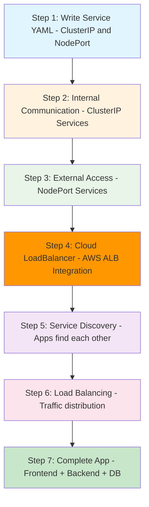

**Build from simple services to complete multi-service applications!**

---

## 🧠 Understanding the Problem: Why Do We Need Services?

### **The Challenge Without Services**
Imagine you have a web application with multiple components:

```mermaid
graph TB
    subgraph "Without Services - Problems"
        FRONTEND1[Frontend Pod - IP: 10.42.0.5]
        API1[API Pod - IP: 10.42.0.8]
        DB1[Database Pod - IP: 10.42.0.12]
        
        FRONTEND1 -.->|Hard-coded IP| API1
        API1 -.->|Hard-coded IP| DB1
    end
    
    subgraph "What Happens When Pods Restart?"
        FRONTEND2[Frontend Pod - IP: 10.42.0.15 NEW IP!]
        API2[API Pod - IP: 10.42.0.22 NEW IP!]
        DB2[Database Pod - IP: 10.42.0.31 NEW IP!]
        
        FRONTEND2 -.->|Broken Connection| API2
        API2 -.->|Broken Connection| DB2
    end
    
    style FRONTEND1 fill:#ffebee
    style API1 fill:#ffebee
    style DB1 fill:#ffebee
    style FRONTEND2 fill:#ffcdd2
    style API2 fill:#ffcdd2
    style DB2 fill:#ffcdd2
```

**Problems Without Services:**
- 🚫 **Pod IPs change** when pods restart
- 🚫 **Hard to scale** - Can't add more pods easily
- 🚫 **No load balancing** - Traffic goes to one pod only
- 🚫 **Complex configuration** - Must track all IP addresses
- 🚫 **Brittle connections** - One pod failure breaks everything

### **The Solution: Services Act as Stable Intermediaries**

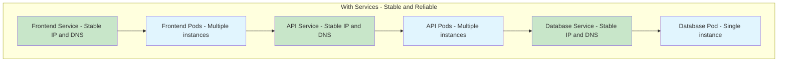

**Benefits With Services:**
- ✅ **Stable endpoints** - Services never change their IP/DNS
- ✅ **Automatic load balancing** - Traffic distributed across pods
- ✅ **Service discovery** - Find services by name, not IP
- ✅ **Health checking** - Only route to healthy pods
- ✅ **Easy scaling** - Add/remove pods without breaking connections

---

## 🌐 Understanding Services - The Foundation

### **What Exactly is a Service?**

Think of a Service as a **smart phone directory** for your applications:

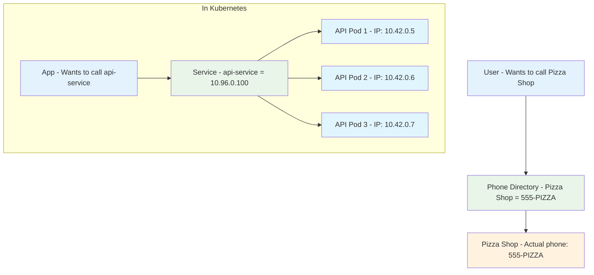

**Key Service Concepts:**
- 🎯 **Abstraction Layer** - Hides complexity of individual pods
- 📱 **Stable Interface** - Same IP and DNS name always
- ⚖️ **Load Balancer** - Distributes traffic automatically
- 🔍 **Service Discovery** - Apps find services by name
- 🏷️ **Label Selector** - Finds pods using labels

### **How Services Find Pods: The Label System**

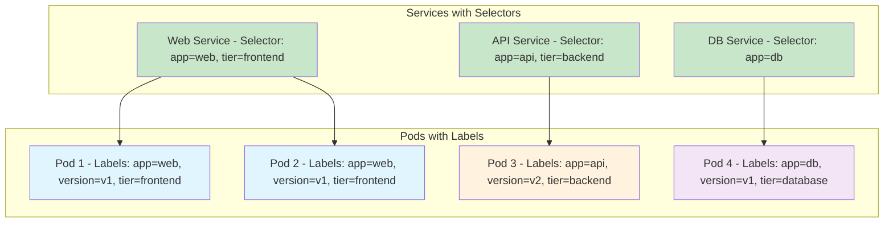

**How Label Selection Works:**
1. **Service defines selector** - Specifies which labels to match
2. **Kubernetes scans all pods** - Looks for matching labels
3. **Creates endpoint list** - Maintains list of matching pod IPs
4. **Updates automatically** - Adds/removes pods as they change
5. **Routes traffic** - Sends requests to healthy endpoints only

---

## 🌐 How Kubernetes Networking Works

### **The Big Picture: Pod-to-Pod Communication**

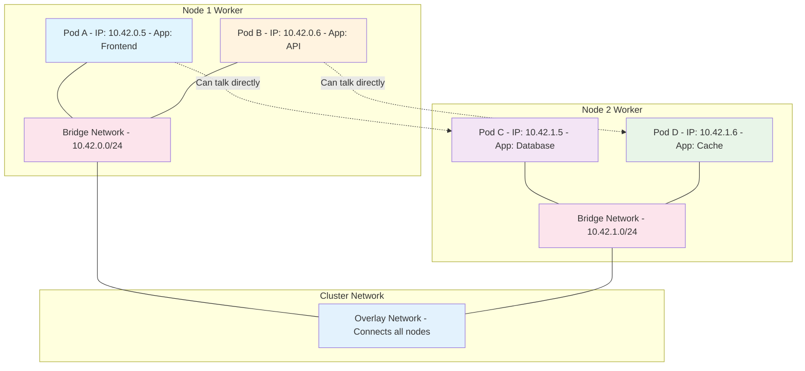

**Kubernetes Networking Principles:**
1. **Every pod gets unique IP** - No port conflicts
2. **Pods can talk to any pod** - Across all nodes
3. **No NAT required** - Direct IP communication
4. **Flat network space** - All pods in same network
5. **Container Network Interface (CNI)** - Handles the complexity

### **Why Pod IPs Are Not Reliable**

```mermaid
graph TB
    subgraph "Time: 9:00 AM"
        POD1[Frontend Pod - IP: 10.42.0.5 - Status: Running]
        POD2[API Pod - IP: 10.42.0.8 - Status: Running]
        
        POD1 -->|Calls API| POD2
    end
    
    subgraph "Time: 9:15 AM - Pod Crashes"
        POD1B[Frontend Pod - IP: 10.42.0.5 - Status: Running]
        POD2B[API Pod - IP: 10.42.0.8 - Status: Crashed]
        
        POD1B -.->|Connection Failed| POD2B
    end
    
    subgraph "Time: 9:16 AM - Kubernetes Restarts Pod"
        POD1C[Frontend Pod - IP: 10.42.0.5 - Status: Running]
        POD2C[API Pod - IP: 10.42.0.15 NEW IP! - Status: Running]
        
        POD1C -.->|Still calling old IP| POD2C
    end
    
    style POD1 fill:#c8e6c9
    style POD2 fill:#c8e6c9
    style POD1B fill:#c8e6c9
    style POD2B fill:#ffcdd2
    style POD1C fill:#c8e6c9
    style POD2C fill:#fff3e0
```

**Pod IP Problems:**
- 🔄 **Pods restart frequently** - Updates, crashes, scaling
- 🎲 **New IP every restart** - Kubernetes assigns randomly
- 💥 **Breaks hard-coded connections** - Apps stop working
- 📈 **Scaling issues** - Can't predict how many pods
- 🔍 **Discovery problems** - How to find new pods?

**Services Solve This:**
- 🎯 **Stable IP and DNS** - Never changes
- 🔄 **Automatic updates** - Tracks pod changes
- ⚖️ **Load balancing** - Distributes across all pods
- 🏥 **Health checking** - Only routes to healthy pods

---

## 🏠 Step 2: ClusterIP Services - Internal Communication

### **Understanding ClusterIP: The Default Service Type**

ClusterIP is like having a **private phone line** inside your office building:

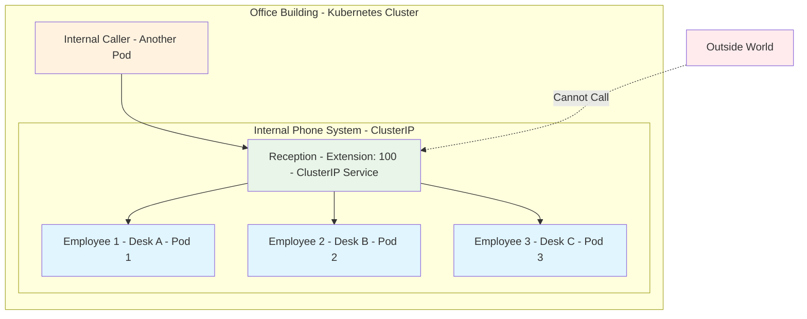

**ClusterIP Characteristics:**
- 🏠 **Internal Only** - Only accessible from within the cluster
- 🎯 **Default Type** - Created automatically if no type specified
- 💰 **Free** - No additional costs
- ⚖️ **Load Balancing** - Distributes traffic across all pods
- 🔍 **DNS Name** - Accessible by service name

### **How ClusterIP Works Behind the Scenes**

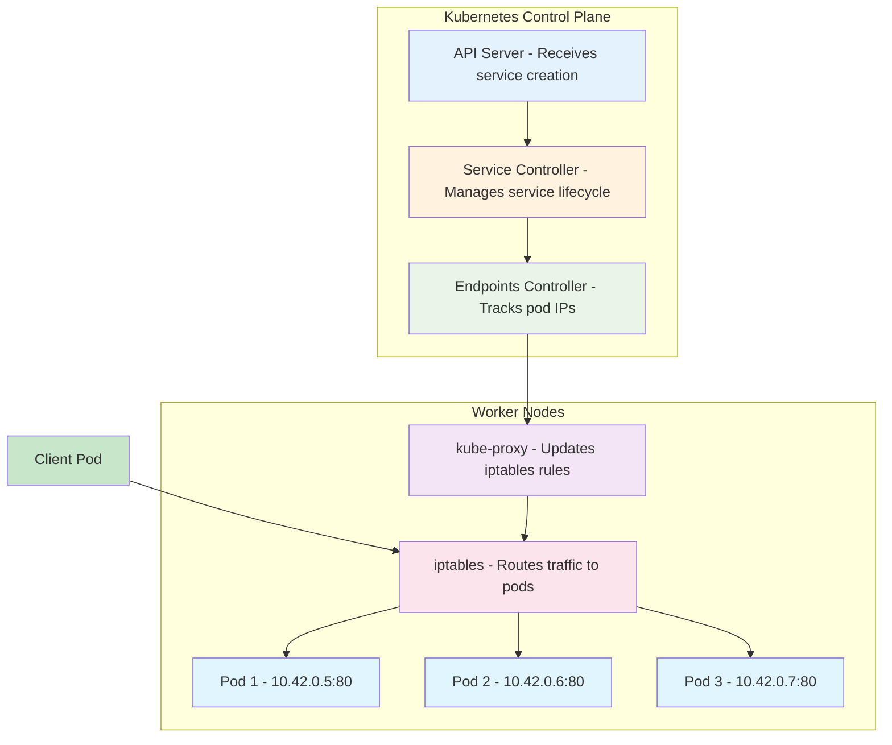

**ClusterIP Process:**
1. **Service Created** - You create a ClusterIP service
2. **IP Allocated** - Kubernetes assigns a virtual IP (10.96.x.x range)
3. **Endpoints Tracked** - Controller finds matching pods
4. **Rules Updated** - kube-proxy updates iptables on all nodes
5. **Traffic Routed** - iptables forwards traffic to healthy pods

### **📝 Step 1: Writing Your First ClusterIP Service**

Let's start with the simplest service - ClusterIP for internal communication:

### **01-clusterip-service.yaml**
```yaml
apiVersion: v1
kind: Service
metadata:
  name: web-service
  labels:
    app: web
spec:
  type: ClusterIP
  ports:
  - port: 80
    targetPort: 80
    protocol: TCP
  selector:
    app: web
    tier: frontend
```

**What each line means:**
- `kind: Service` - We're creating a service
- `name: web-service` - Name of our service
- `type: ClusterIP` - Internal only (default type)
- `port: 80` - Port the service listens on
- `targetPort: 80` - Port on the pod to forward to
- `selector:` - Which pods this service connects to

### **Try it out:**
```bash
# First, create a pod that matches the selector
k run web-pod --image=varunmanik/httpd:blue --labels="app=web,tier=frontend"

# Create the ClusterIP service
k apply -f 01-clusterip-service.yaml

# Check the service
k get services

# Test internal access
k run test --image=busybox --rm -it -- wget -qO- http://web-service

# Clean up
k delete service web-service
k delete pod web-pod
```

---

## 🚪 Step 3: NodePort Services - External Access

### **Understanding NodePort: Opening the Door to the Outside**

NodePort is like having a **public reception desk** that anyone can visit:

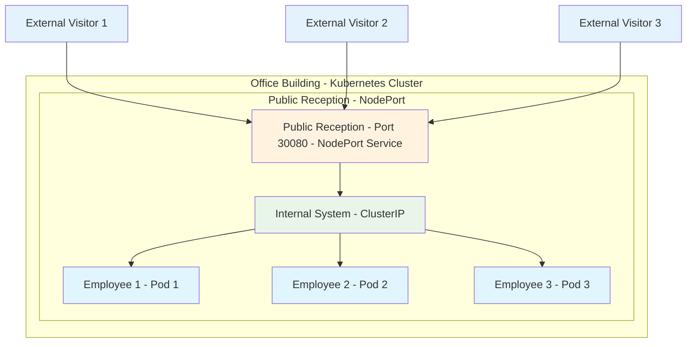

**NodePort Characteristics:**
- 🌍 **External Access** - Accessible from outside the cluster
- 🚪 **Port Range** - Uses ports 30000-32767 on every node
- 💰 **Free** - No cloud provider charges
- 🎯 **Development Friendly** - Great for testing and development
- ⚖️ **Load Balancing** - Still distributes traffic across pods

### **How NodePort Works: The Complete Journey**

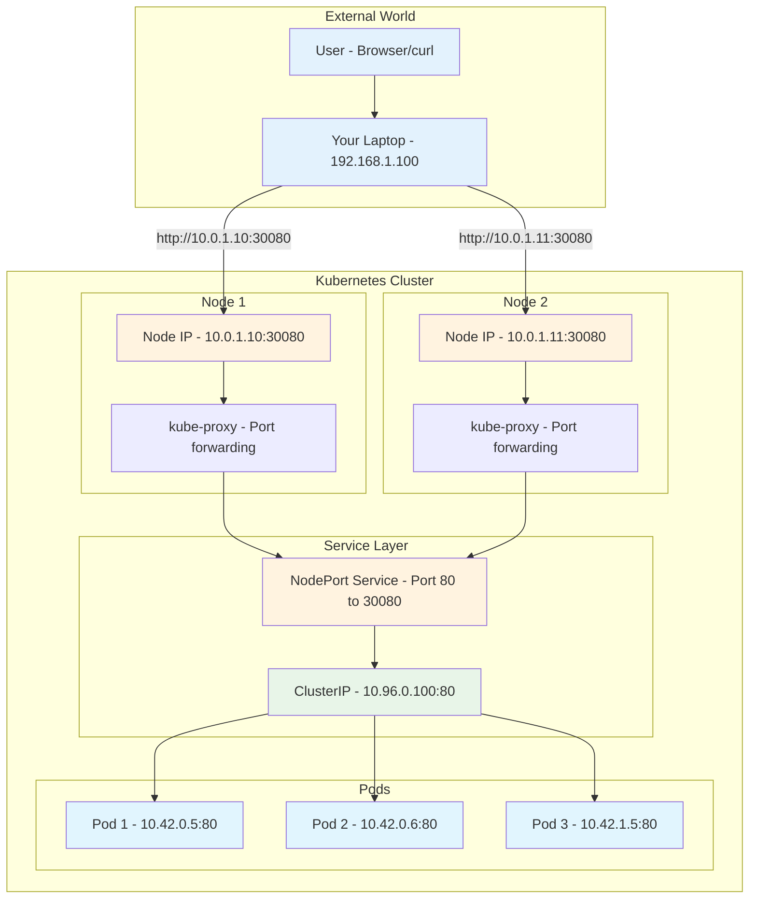

**NodePort Traffic Flow:**
1. **External Request** - User makes request to any node IP:30080
2. **Node Receives** - Any node can receive the request
3. **kube-proxy Routes** - Forwards to NodePort service
4. **Service Load Balances** - Distributes to healthy pods
5. **Pod Responds** - Response travels back same path

### **NodePort Port Allocation: Understanding the Numbers**

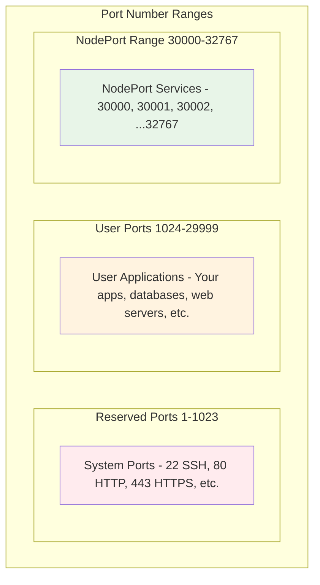

**Why 30000-32767 Range?**
- 🔒 **Avoids Conflicts** - Won't interfere with system or user ports
- 🎯 **Easy to Remember** - Clear separation from other services
- 🔢 **Plenty of Ports** - 2,768 available ports for services
- 🛡️ **Security** - High ports are less likely to be targeted

### **📝 Step 2: Writing Your NodePort Service**

Now let's create a NodePort service for external access:

### **02-nodeport-service.yaml**
```yaml
apiVersion: v1
kind: Service
metadata:
  name: web-nodeport
  labels:
    app: web
spec:
  type: NodePort
  ports:
  - port: 80
    targetPort: 80
    nodePort: 30080
    protocol: TCP
  selector:
    application: web-app
    color: blue
```

**What's new:**
- `type: NodePort` - Allows external access
- `nodePort: 30080` - Specific port on the node (30000-32767 range)
- `selector:` - Matches pods with `application=web-app` and `color=blue`

### **How NodePort Works:**
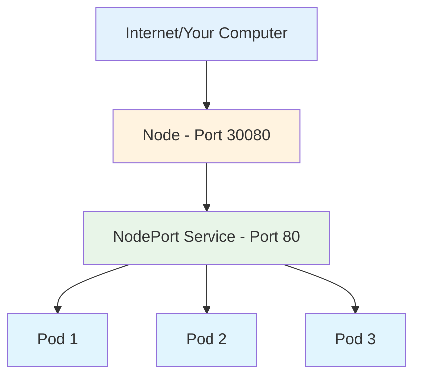

### **Try it out:**
```bash
# Create a pod that matches the selector
k run blue-app --image=varunmanik/httpd:blue --labels="application=web-app,color=blue"

# Create the NodePort service
k apply -f 02-nodeport-service.yaml

# Check the service
k get services

# Access from outside the cluster
curl http://localhost:30080

# Or open in browser: http://localhost:30080

# Clean up
k delete service web-nodeport
k delete pod blue-app
```

---

## ☁️ Step 4: LoadBalancer Services - Production Cloud Integration

### **Understanding LoadBalancer: Enterprise-Grade External Access**

LoadBalancer is like having a **professional call center** with multiple operators:

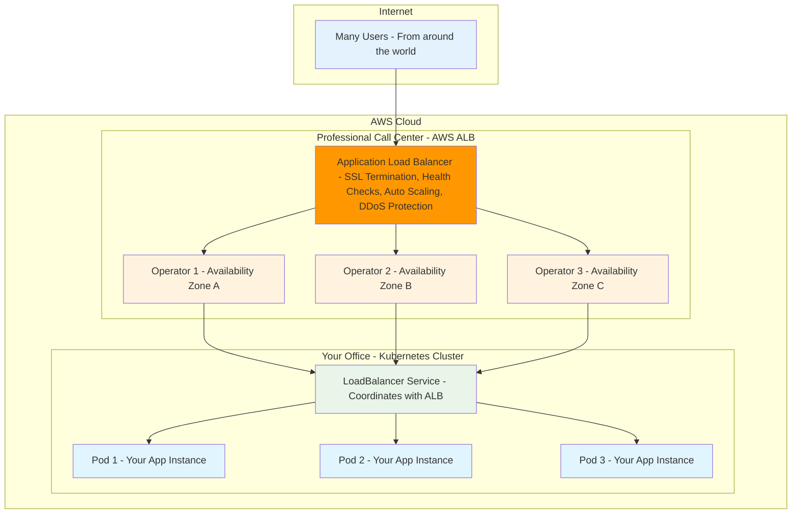

**LoadBalancer vs NodePort: Why Upgrade?**

| Feature | NodePort 🚪 | LoadBalancer ☁️ |
|---------|-------------|-----------------|
| **External Access** | ✅ Node IP:Port | ✅ Dedicated IP/DNS |
| **SSL/HTTPS** | ❌ Manual setup | ✅ Automatic |
| **Health Checks** | ❌ Basic | ✅ Advanced |
| **DDoS Protection** | ❌ None | ✅ Built-in |
| **Auto Scaling** | ❌ Manual | ✅ Automatic |
| **Professional DNS** | ❌ IP addresses | ✅ Custom domains |
| **Cost** | 💰 Free | 💰 ~$16/month |
| **Best For** | 🧪 Development | 🏭 Production |

### **How AWS LoadBalancer Integration Works**

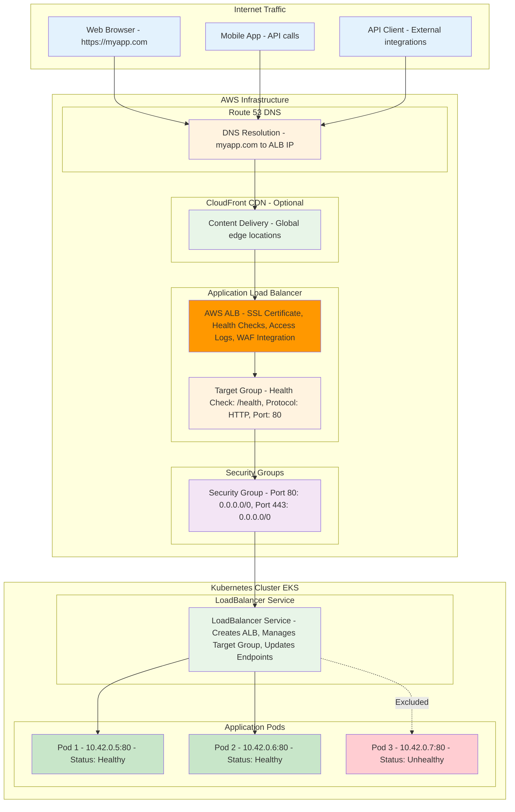

**AWS LoadBalancer Features Explained:**

#### **🔒 SSL/TLS Termination**
- **What it does:** Handles HTTPS certificates automatically
- **Benefit:** Your pods only need HTTP, ALB handles HTTPS
- **Cost saving:** No need for SSL certificates in each pod

#### **🏥 Advanced Health Checks**
- **What it does:** Regularly checks if your pods are healthy
- **How:** Sends HTTP requests to `/health` endpoint
- **Benefit:** Automatically removes unhealthy pods from rotation

#### **📊 CloudWatch Integration**
- **What it does:** Provides detailed metrics and logs
- **Metrics:** Request count, response time, error rates
- **Benefit:** Monitor application performance and troubleshoot issues

#### **🛡️ Security Features**
- **DDoS Protection:** Built-in protection against attacks
- **WAF Integration:** Web Application Firewall for advanced security
- **Security Groups:** Fine-grained network access control

### **LoadBalancer Cost Breakdown (AWS)**

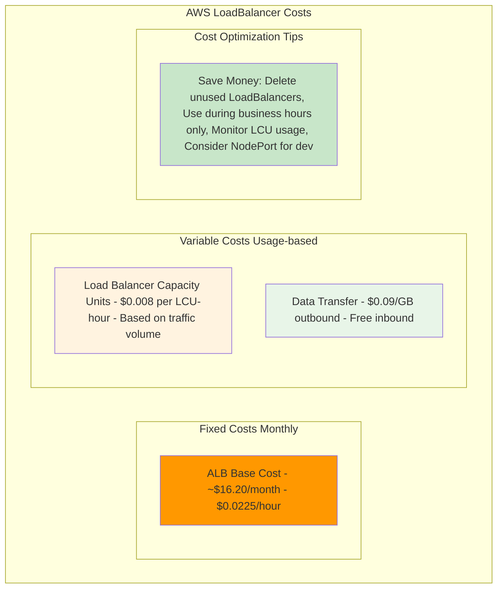

**Example Monthly Cost:**
- **Small App:** ~$20/month (ALB + minimal traffic)
- **Medium App:** ~$50/month (ALB + moderate traffic)
- **Large App:** ~$200+/month (ALB + high traffic)

### **📝 Step 3: Writing Your LoadBalancer Service**

For production applications, you want a proper cloud load balancer with an external IP address:

### **03-loadbalancer-service.yaml**
```yaml
apiVersion: v1
kind: Service
metadata:
  name: web-loadbalancer
  labels:
    app: web
  annotations:
    service.beta.kubernetes.io/aws-load-balancer-type: "alb"
    service.beta.kubernetes.io/aws-load-balancer-scheme: "internet-facing"
    service.beta.kubernetes.io/aws-load-balancer-target-type: "ip"
spec:
  type: LoadBalancer
  ports:
  - port: 80
    targetPort: 80
    protocol: TCP
  selector:
    application: web-app
    color: blue
```

**What's new:**
- `type: LoadBalancer` - Creates cloud load balancer
- `aws-load-balancer-type: "alb"` - Use Application Load Balancer
- `internet-facing` - Accessible from internet
- `target-type: "ip"` - Route directly to pod IPs

### **How AWS LoadBalancer Works:**
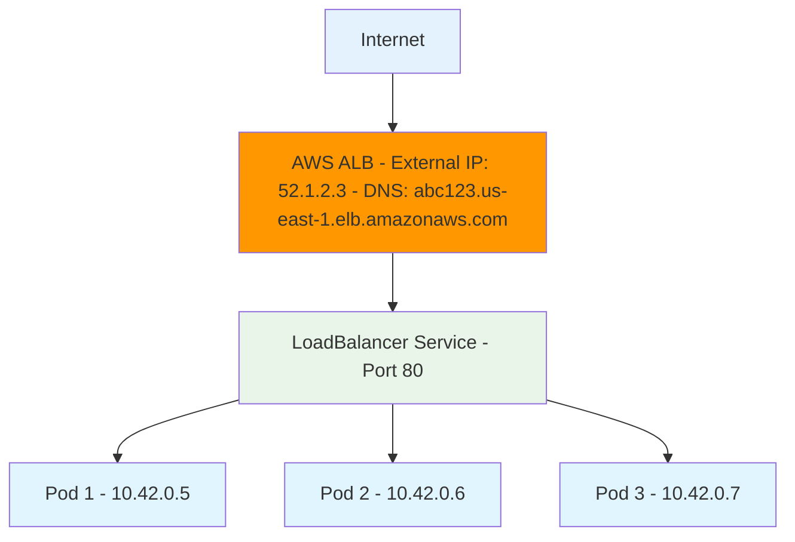

### **AWS LoadBalancer Benefits:**
- 🌍 **External IP Address** - Real internet-accessible IP
- 🔒 **SSL/TLS Termination** - Handle HTTPS certificates
- 🎯 **Health Checks** - Only route to healthy pods
- 📊 **CloudWatch Integration** - Monitoring and metrics
- 🛡️ **Security Groups** - AWS firewall integration
- ⚖️ **Advanced Load Balancing** - Multiple algorithms

### **Try it out (AWS EC2 Required):**
```bash
# Prerequisites: Running on AWS EKS or EC2 with proper IAM roles

# Create a pod that matches the selector
k run blue-app --image=varunmanik/httpd:blue --labels="application=web-app,color=blue"

# Create the LoadBalancer service
k apply -f 03-loadbalancer-service.yaml

# Check the service (this will take 2-3 minutes to provision)
k get services

# Wait for EXTERNAL-IP to show (not <pending>)
k get services -w

# Once you have external IP, test it
# Example: curl http://abc123.us-east-1.elb.amazonaws.com

# Check AWS Console to see the ALB created
# Go to EC2 → Load Balancers to see your new ALB

# Clean up (this will delete the AWS ALB)
k delete service web-loadbalancer
k delete pod blue-app
```

### **AWS LoadBalancer vs Other Types:**
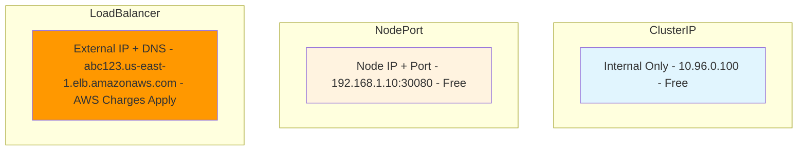

**Cost Considerations:**
- 💰 **ALB Cost**: ~$16/month + $0.008 per LCU-hour
- 💰 **Data Transfer**: Standard AWS data transfer rates
- 💰 **Health Checks**: Included in ALB cost
- 💡 **Tip**: Delete LoadBalancer services when not needed to avoid charges

---

## 🔧 Service Types Explained

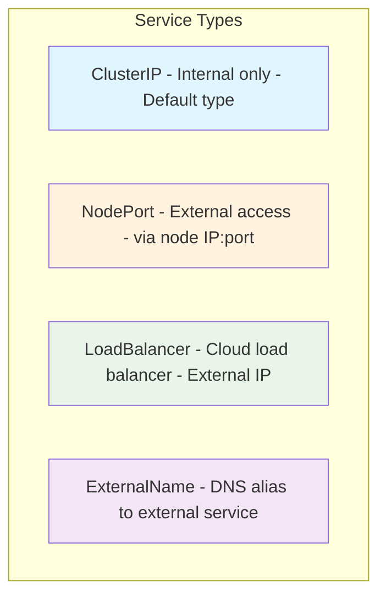

### **When to Use Each Type:**

#### **🏠 ClusterIP (Internal Only)**
- **Use for:** Internal microservices communication
- **Access:** Only from within the cluster
- **Perfect for:** APIs, databases, internal services
- **Default type** - Most common

#### **🚪 NodePort (External Access)**
- **Use for:** Simple external access, development, testing
- **Access:** From outside the cluster via node IP:port
- **Port range:** 30000-32767
- **Good for:** Development environments

#### **☁️ LoadBalancer (Cloud)**
- **Use for:** Production external access
- **Access:** External IP address from cloud provider
- **Requires:** Cloud environment (AWS, GCP, Azure)
- **Best for:** Production applications

#### **☁️ LoadBalancer (Production Cloud)**
- **Use for:** Production external access with enterprise features
- **Access:** External IP address and DNS name from AWS
- **Features:** SSL termination, health checks, CloudWatch integration
- **Cost:** AWS charges apply (~$16/month + usage)
- **Best for:** Production applications requiring high availability
- **Requirements:** AWS EKS cluster or EC2 with proper IAM roles

#### **🔗 ExternalName**
- **Use for:** Integrating with external services
- **Access:** DNS alias to external service
- **No pods involved** - Just DNS mapping

---

## 🔍 Step 5: Service Discovery - How Apps Find Each Other

### **Understanding Service Discovery: The Phone Book of Kubernetes**

Service Discovery is like having a **smart phone book** that updates automatically:

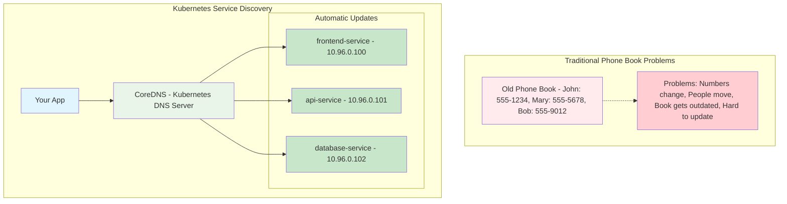

**Service Discovery Benefits:**
- 🔄 **Automatic Updates** - DNS records update when services change
- 🎯 **Simple Names** - Use "api-service" instead of "10.96.0.101"
- 🌐 **Works Everywhere** - Same names work from any pod
- 🔍 **No Configuration** - Built into Kubernetes automatically

### **How DNS Resolution Works in Kubernetes**

```mermaid
graph TB
    subgraph "Your Application Pod"
        APP[Frontend App - Wants to call API]
        
        CODE[Application Code: fetch('http://api-service/users')]
    end
    
    subgraph "DNS Resolution Process"
        STEP1[1. DNS Query - What IP is 'api-service'?]
        STEP2[2. CoreDNS Lookup - Checks service registry]
        STEP3[3. IP Response - Returns 10.96.0.101]
        STEP4[4. HTTP Request - Connects to 10.96.0.101:80]
    end
    
    subgraph "Target Service"
        API_SERVICE[api-service - ClusterIP: 10.96.0.101]
        
        API_POD1[API Pod 1 - 10.42.0.5:8080]
        API_POD2[API Pod 2 - 10.42.0.6:8080]
        
        API_SERVICE --> API_POD1
        API_SERVICE --> API_POD2
    end
    
    APP --> CODE
    CODE --> STEP1
    STEP1 --> STEP2
    STEP2 --> STEP3
    STEP3 --> STEP4
    STEP4 --> API_SERVICE
    
    style APP fill:#e1f5fe
    style CODE fill:#fff3e0
    style STEP1 fill:#e8f5e8
    style STEP2 fill:#e8f5e8
    style STEP3 fill:#e8f5e8
    style STEP4 fill:#e8f5e8
    style API_SERVICE fill:#c8e6c9
    style API_POD1 fill:#e1f5fe
    style API_POD2 fill:#e1f5fe
```

**DNS Resolution Steps:**
1. **App Makes Request** - Code calls "api-service"
2. **DNS Query** - Pod asks "What IP is api-service?"
3. **CoreDNS Responds** - Returns service ClusterIP
4. **Connection Made** - App connects to service IP
5. **Service Routes** - Service forwards to healthy pod

### **DNS Name Formats: From Simple to Specific**

```mermaid
graph TB
    subgraph "DNS Name Hierarchy"
        subgraph "Simple Names Same Namespace"
            SIMPLE[api-service - Works within same namespace]
        end
        
        subgraph "Cross-Namespace Names"
            CROSS[api-service.production - Works across namespaces]
        end
        
        subgraph "Fully Qualified Names"
            FULL[api-service.production.svc.cluster.local - Works everywhere, always]
        end
    end
    
    subgraph "Namespace Examples"
        DEV_NS[development namespace - frontend-service, api-service, db-service]
        
        PROD_NS[production namespace - frontend-service, api-service, db-service]
        
        MONITOR_NS[monitoring namespace - prometheus-service, grafana-service]
    end
    
    SIMPLE --> DEV_NS
    CROSS --> PROD_NS
    FULL --> MONITOR_NS
    
    style SIMPLE fill:#c8e6c9
    style CROSS fill:#fff3e0
    style FULL fill:#e8f5e8
    style DEV_NS fill:#e1f5fe
    style PROD_NS fill:#f3e5f5
    style MONITOR_NS fill:#fce4ec
```

**When to Use Each Format:**
- **Simple Name** (`api-service`) - Same namespace, most common
- **Cross-Namespace** (`api-service.production`) - Different namespace
- **Fully Qualified** (`api-service.production.svc.cluster.local`) - Always works, debugging

### **Service Discovery Methods Comparison**

```mermaid
graph TB
    subgraph "Service Discovery Methods"
        subgraph "DNS Names Recommended"
            DNS_METHOD[DNS Resolution - Easy to use, Human readable, Automatic updates, Works everywhere]
        end
        
        subgraph "Environment Variables Legacy"
            ENV_METHOD[Environment Variables - API_SERVICE_HOST=10.96.0.101, API_SERVICE_PORT=80, Set at pod creation, Don't update automatically]
        end
        
        subgraph "Service Mesh Advanced"
            MESH_METHOD[Service Mesh - Istio, Linkerd, Advanced routing, Security policies, Observability]
        end
    end
    
    subgraph "Comparison"
        COMPARISON[Which to Use? DNS: 99% of cases, Env Vars: Legacy apps, Service Mesh: Complex apps]
    end
    
    DNS_METHOD --> COMPARISON
    ENV_METHOD --> COMPARISON
    MESH_METHOD --> COMPARISON
    
    style DNS_METHOD fill:#c8e6c9
    style ENV_METHOD fill:#fff3e0
    style MESH_METHOD fill:#e8f5e8
    style COMPARISON fill:#e1f5fe
```

### **Real-World Service Discovery Example**

```mermaid
graph TB
    subgraph "E-Commerce Application"
        subgraph "Frontend Tier"
            WEB[web-frontend - React/Angular App]
        end
        
        subgraph "API Tier"
            USER_API[user-service - User management]
            PRODUCT_API[product-service - Product catalog]
            ORDER_API[order-service - Order processing]
            PAYMENT_API[payment-service - Payment processing]
        end
        
        subgraph "Data Tier"
            USER_DB[user-database - PostgreSQL]
            PRODUCT_DB[product-database - MongoDB]
            ORDER_DB[order-database - PostgreSQL]
        end
        
        subgraph "External Services"
            REDIS[redis-cache - Session storage]
            ELASTIC[elasticsearch - Search engine]
        end
    end
    
    WEB -->|fetch('http://user-service/profile')| USER_API
    WEB -->|fetch('http://product-service/search')| PRODUCT_API
    WEB -->|fetch('http://order-service/history')| ORDER_API
    
    USER_API -->|user-database:5432| USER_DB
    PRODUCT_API -->|product-database:27017| PRODUCT_DB
    ORDER_API -->|order-database:5432| ORDER_DB
    
    USER_API -->|redis-cache:6379| REDIS
    PRODUCT_API -->|elasticsearch:9200| ELASTIC
    
    ORDER_API -->|payment-service/charge| PAYMENT_API
    
    style WEB fill:#e1f5fe
    style USER_API fill:#fff3e0
    style PRODUCT_API fill:#fff3e0
    style ORDER_API fill:#fff3e0
    style PAYMENT_API fill:#fff3e0
    style USER_DB fill:#f3e5f5
    style PRODUCT_DB fill:#f3e5f5
    style ORDER_DB fill:#f3e5f5
    style REDIS fill:#e8f5e8
    style ELASTIC fill:#e8f5e8
```

**Service Discovery in Action:**
- **Frontend** calls APIs by service name (user-service, product-service)
- **APIs** connect to databases by service name (user-database, product-database)
- **Services** find each other automatically (order-service → payment-service)
- **No hard-coded IPs** - everything uses DNS names

### **Exercise: Service Discovery in Action**

```mermaid
graph TB
    subgraph "Service Discovery Methods"
        A[DNS Names - my-service.default.svc.cluster.local]
        B[Short Names - my-service (same namespace)]
        C[Environment Variables - MY_SERVICE_SERVICE_HOST]
    end
    
    subgraph "Your App"
        APP[Application] --> A
        APP --> B
        APP --> C
    end
    
    style A fill:#e8f5e8
    style B fill:#c8e6c9
    style C fill:#fff3e0
    style APP fill:#e1f5fe
```

### **Exercise: Service Discovery in Action**
```bash
# Create multiple services
k create deployment frontend --image=varunmanik/httpd:blue --replicas=2
k create deployment api --image=varunmanik/httpd:green --replicas=2
k create deployment database --image=postgres:13 --replicas=1

# Expose them as services
k expose deployment frontend --port=80
k expose deployment api --port=80
k expose deployment database --port=5432

# Test service discovery
k run discovery-test --image=busybox --rm -it -- /bin/sh

# Inside the pod, try these commands:
# nslookup frontend
# nslookup api
# nslookup database
# wget -qO- http://frontend
# wget -qO- http://api
# exit

# Clean up
k delete deployment frontend api database
k delete service frontend api database
```

---

## 🛠️ Hands-On Exercise: Blue-Green Service Switching

This exercise shows how services can switch between different versions of your app:

```bash
# Step 1: Create blue and green versions
k run blue-app --image=varunmanik/httpd:blue --labels="app=web,version=blue"
k run green-app --image=varunmanik/httpd:green --labels="app=web,version=green"

# Step 2: Create a service pointing to blue version
cat <<EOF | k apply -f -
apiVersion: v1
kind: Service
metadata:
  name: web-switch
spec:
  type: NodePort
  ports:
  - port: 80
    targetPort: 80
    nodePort: 30090
  selector:
    app: web
    version: blue
EOF

# Step 3: Test blue version
curl http://localhost:30090
# You should see the blue-themed page

# Step 4: Switch to green version
k patch service web-switch -p '{"spec":{"selector":{"version":"green"}}}'

# Step 5: Test green version
curl http://localhost:30090
# Now you should see the green-themed page!

# Clean up
k delete service web-switch
k delete pod blue-app green-app
```

---

## 🧪 Building a Complete Multi-Service Application

Let's build a realistic 3-tier application with proper networking:

```mermaid
graph TB
    USER[User] --> FRONTEND[Frontend - Web UI]
    FRONTEND --> API[API - Business Logic]
    API --> DB[Database - Data Storage]
    
    subgraph "Services"
        FSVC[Frontend Service - NodePort 30080]
        ASVC[API Service - ClusterIP]
        DSVC[Database Service - ClusterIP]
    end
    
    USER --> FSVC
    FSVC --> FRONTEND
    FRONTEND --> ASVC
    ASVC --> API
    API --> DSVC
    DSVC --> DB
    
    style USER fill:#e3f2fd
    style FRONTEND fill:#e8f5e8
    style API fill:#fff3e0
    style DB fill:#f3e5f5
    style FSVC fill:#c8e6c9
    style ASVC fill:#c8e6c9
    style DSVC fill:#c8e6c9
```

### **Exercise: Complete Application with AWS LoadBalancer**
```bash
# 1. Create Database (Internal only)
k create deployment database --image=postgres:13
k set env deployment/database POSTGRES_DB=myapp POSTGRES_USER=user POSTGRES_PASSWORD=password
k expose deployment database --port=5432

# 2. Create API (Internal only)
k create deployment api --image=varunmanik/httpd:green --replicas=2
k expose deployment api --port=80

# 3. Create Frontend with AWS LoadBalancer (External access)
k create deployment frontend --image=varunmanik/httpd:blue --replicas=3

# Create LoadBalancer service for frontend
cat <<EOF | k apply -f -
apiVersion: v1
kind: Service
metadata:
  name: frontend-lb
  annotations:
    service.beta.kubernetes.io/aws-load-balancer-type: "alb"
    service.beta.kubernetes.io/aws-load-balancer-scheme: "internet-facing"
    service.beta.kubernetes.io/aws-load-balancer-target-type: "ip"
spec:
  type: LoadBalancer
  ports:
  - port: 80
    targetPort: 80
  selector:
    app: frontend
EOF

# 4. Wait for LoadBalancer to be ready (2-3 minutes)
echo "Waiting for LoadBalancer to be ready..."
k get services frontend-lb -w

# 5. Once EXTERNAL-IP appears, test the application
EXTERNAL_IP=$(k get service frontend-lb -o jsonpath='{.status.loadBalancer.ingress[0].hostname}')
echo "Application available at: http://$EXTERNAL_IP"

# 6. Test internal communication
k run test --image=busybox --rm -it -- /bin/sh
# Inside the test pod:
# wget -qO- http://api
# nslookup database
# exit

# 7. Check AWS Console
echo "Check AWS Console → EC2 → Load Balancers to see your ALB"

# 8. Clean up when done (important to avoid AWS charges!)
k delete service frontend-lb
k delete deployment database api frontend
k delete service database api
```

### **Exercise: Complete Application**
```bash
# 1. Create Database (Internal only)
k create deployment database --image=postgres:13
k set env deployment/database POSTGRES_DB=myapp POSTGRES_USER=user POSTGRES_PASSWORD=password
k expose deployment database --port=5432

# 2. Create API (Internal only)
k create deployment api --image=varunmanik/httpd:green --replicas=2
k expose deployment api --port=80

# 3. Create Frontend (External access)
k create deployment frontend --image=varunmanik/httpd:blue --replicas=3
k expose deployment frontend --port=80 --type=NodePort

# 4. Check everything is running
k get all

# 5. Test the application
k get services
# Access frontend via NodePort (e.g., http://localhost:30XXX)

# 6. Test internal communication
k run test --image=busybox --rm -it -- /bin/sh
# Inside the test pod:
# wget -qO- http://api
# nslookup database
# nslookup frontend
# exit

# 7. Clean up when done
k delete deployment database api frontend
k delete service database api frontend
```

---

## ⚖️ Load Balancing in Action

Services automatically load balance traffic across healthy pods:

### **Exercise: See Load Balancing Work**
```bash
# Create deployment with multiple replicas
k create deployment web --image=nginx --replicas=3

# Customize each pod to show different responses
k get pods -l app=web

# For each pod, add a custom response
for pod in $(k get pods -l app=web -o jsonpath='{.items[*].metadata.name}'); do
  k exec $pod -- /bin/sh -c "echo 'Hello from $pod' > /usr/share/nginx/html/index.html"
done

# Create service
k expose deployment web --port=80 --type=NodePort

# Test load balancing (run multiple times)
SERVICE_PORT=$(k get service web -o jsonpath='{.spec.ports[0].nodePort}')
echo "Testing load balancing on port $SERVICE_PORT:"

for i in {1..10}; do
  echo "Request $i:"
  curl -s http://localhost:$SERVICE_PORT
  echo ""
done

# You should see responses from different pods!

# Clean up
k delete deployment web
k delete service web
```

---

## 🔧 Advanced Service Configuration

### **Multi-Port Service Example**
```yaml
apiVersion: v1
kind: Service
metadata:
  name: multi-port-service
spec:
  type: NodePort
  ports:
  - name: http
    port: 80
    targetPort: 8080
    nodePort: 30080
  - name: https
    port: 443
    targetPort: 8443
    nodePort: 30443
  selector:
    app: web-app
```

### **Service with Session Affinity**
```yaml
apiVersion: v1
kind: Service
metadata:
  name: sticky-service
spec:
  type: ClusterIP
  sessionAffinity: ClientIP  # Stick to same pod
  ports:
  - port: 80
    targetPort: 80
  selector:
    app: web-app
```

---

## 🔍 Troubleshooting Services & Networking

### **Common Issues and Solutions**

#### **🚨 Service Not Accessible**
```bash
# 1. Check service exists
k get services

# 2. Check service has endpoints
k get endpoints <service-name>

# 3. If no endpoints, check pod labels
k get pods --show-labels
k describe service <service-name>

# 4. Verify selector matches pod labels
```

#### **🚨 DNS Not Working**
```bash
# Test DNS resolution
k run dns-test --image=busybox --rm -it -- nslookup <service-name>

# Check CoreDNS is running
k get pods -n kube-system -l k8s-app=kube-dns

# Check DNS configuration
k get configmap coredns -n kube-system -o yaml
```

#### **🚨 NodePort Not Accessible**
```bash
# Check service type and port
k get service <service-name>

# Verify port is in valid range (30000-32767)
# Check if port is already in use
netstat -tulpn | grep <port>

# Test from inside cluster first
k run test --image=busybox --rm -it -- wget -qO- http://<service-name>
```

#### **🚨 LoadBalancer Stuck in Pending**
```bash
# Check if you're running on AWS EKS or have proper IAM roles
k describe service <loadbalancer-service-name>

# Check events for error messages
k get events --sort-by=.metadata.creationTimestamp

# Verify AWS Load Balancer Controller is installed
k get pods -n kube-system | grep aws-load-balancer

# Check service annotations are correct
k describe service <service-name> | grep Annotations

# Common issues:
# - Not running on AWS EKS
# - Missing IAM roles for load balancer controller
# - Incorrect annotations
# - Insufficient AWS permissions
```

#### **🚨 LoadBalancer Created but Not Accessible**
```bash
# Check if LoadBalancer has external IP
k get service <service-name>

# Check AWS Security Groups
# Go to AWS Console → EC2 → Security Groups
# Ensure port 80/443 is open from 0.0.0.0/0

# Check target group health in AWS Console
# Go to EC2 → Target Groups → Check health status

# Verify pods are running and healthy
k get pods -l app=<app-name>
k describe pods -l app=<app-name>
```

#### **🚨 Load Balancing Not Working**
```bash
# Check if multiple pods are running and ready
k get pods -l app=<app-name>

# Check service endpoints
k get endpoints <service-name>

# Verify all pods are healthy
k describe pods -l app=<app-name>
```

---

## 📋 Essential Service Commands

### **Create Services**
```bash
# Create ClusterIP service (default)
k expose deployment <name> --port=80

# Create NodePort service
k expose deployment <name> --port=80 --type=NodePort

# Create service with specific NodePort
k expose deployment <name> --port=80 --type=NodePort --node-port=30080

# Create LoadBalancer service (AWS)
k expose deployment <name> --port=80 --type=LoadBalancer

# Create LoadBalancer with annotations
k annotate service <name> service.beta.kubernetes.io/aws-load-balancer-type=alb

# Apply from YAML file
k apply -f service.yaml
```

### **Manage Services**
```bash
# List services
k get services
k get svc                  # Short form

# Service details
k describe service <name>

# Check service endpoints
k get endpoints <service-name>

# Edit service
k edit service <name>

# Delete service
k delete service <name>
```

### **Test Services**
```bash
# Test internal service
k run test --image=busybox --rm -it -- wget -qO- http://<service-name>

# Test DNS resolution
k run test --image=busybox --rm -it -- nslookup <service-name>

# Port forward for local testing
k port-forward service/<service-name> 8080:80

# Check service connectivity from pod
k exec <pod-name> -- curl http://<service-name>
```

---

## 📝 Service YAML Templates

### **Basic ClusterIP Service**
```yaml
apiVersion: v1
kind: Service
metadata:
  name: my-clusterip-service
  labels:
    app: my-app
spec:
  type: ClusterIP  # Default, can be omitted
  ports:
  - port: 80
    targetPort: 8080
    protocol: TCP
  selector:
    app: my-app
    tier: backend
```

### **NodePort Service with Custom Port**
```yaml
apiVersion: v1
kind: Service
metadata:
  name: my-nodeport-service
  labels:
    app: my-app
spec:
  type: NodePort
  ports:
  - port: 80
    targetPort: 8080
    nodePort: 30080  # Optional, auto-assigned if not specified
    protocol: TCP
  selector:
    app: my-app
    tier: frontend
```

### **AWS LoadBalancer Service**
```yaml
apiVersion: v1
kind: Service
metadata:
  name: my-loadbalancer-service
  annotations:
    service.beta.kubernetes.io/aws-load-balancer-type: "alb"
    service.beta.kubernetes.io/aws-load-balancer-scheme: "internet-facing"
    service.beta.kubernetes.io/aws-load-balancer-target-type: "ip"
    service.beta.kubernetes.io/aws-load-balancer-ssl-cert: "arn:aws:acm:region:account:certificate/cert-id"  # Optional SSL
spec:
  type: LoadBalancer
  ports:
  - port: 80
    targetPort: 8080
    protocol: TCP
  - port: 443      # Optional HTTPS
    targetPort: 8080
    protocol: TCP
  selector:
    app: my-app
    tier: frontend
```

### **Multi-Port Service**
```yaml
apiVersion: v1
kind: Service
metadata:
  name: my-multi-port-service
spec:
  type: NodePort
  ports:
  - name: web
    port: 80
    targetPort: 8080
    nodePort: 30080
  - name: api
    port: 8080
    targetPort: 8080
    nodePort: 30081
  selector:
    app: my-app
```

---

## ✅ Knowledge Check

### **Quiz Questions**
1. **Which service type allows external access?**
   - ClusterIP ❌
   - NodePort ✅
   - Both ❌

2. **How do pods find services?**
   - IP addresses ❌
   - DNS names ✅
   - Port numbers ❌

3. **What happens if a service selector doesn't match any pods?**
   - Service fails ❌
   - No endpoints, traffic goes nowhere ✅
   - Kubernetes creates pods automatically ❌

4. **What port range is used for NodePort services?**
   - 1-1000 ❌
   - 30000-32767 ✅
   - 8000-9000 ❌

### **Practical Test**
```bash
# Can you build this complete application?
# 1. Database deployment (1 replica) with ClusterIP service
# 2. API deployment (2 replicas) with ClusterIP service  
# 3. Frontend deployment (3 replicas) with NodePort service
# 4. Test that frontend can reach API
# 5. Test that API can reach database
# 6. Test external access to frontend
# 7. Demonstrate load balancing across API pods
```

---

## ✅ Success Criteria

You're ready for the next section when you can:

- [ ] ✅ Write service YAML files from scratch
- [ ] ✅ Create ClusterIP services for internal communication
- [ ] ✅ Create NodePort services for external access
- [ ] ✅ Use service discovery to connect applications
- [ ] ✅ Understand and demonstrate load balancing
- [ ] ✅ Build complete multi-service applications
- [ ] ✅ Troubleshoot common networking issues
- [ ] ✅ Switch traffic between different app versions

---

## 🚀 Next Steps

**Fantastic!** 🎉 You now understand Kubernetes services and networking completely!

### **What You Accomplished:**
- ✅ **Service YAML Writing** - Created ClusterIP and NodePort services
- ✅ **Internal Communication** - Connected apps within the cluster
- ✅ **External Access** - Exposed apps to the outside world
- ✅ **Service Discovery** - Apps finding each other by name
- ✅ **Load Balancing** - Traffic distribution across multiple pods
- ✅ **Multi-Service Apps** - Built complete 3-tier applications
- ✅ **Blue-Green Switching** - Advanced deployment patterns
- ✅ **Troubleshooting** - Diagnosed and fixed networking issues

### **Ready for More?**
- **[→ Back to Pods](../03-pods/)** - Review pod concepts
- **[→ Next: Final Project](../06-project/)** - Build a complete application

---

## 📚 Quick Reference

### **Service Discovery DNS Names**
```bash
# Same namespace
<service-name>

# Different namespace  
<service-name>.<namespace>

# Full DNS name
<service-name>.<namespace>.svc.cluster.local
```

### **Port Mapping Explained**
- **port**: Service port (what clients connect to)
- **targetPort**: Pod port (where traffic actually goes)
- **nodePort**: External port on nodes (for NodePort services)

### **Common Service Patterns**
```bash
# Internal API service
k expose deployment api --port=80 --type=ClusterIP

# External web service
k expose deployment web --port=80 --type=NodePort

# Database service
k expose deployment db --port=5432 --type=ClusterIP
```

---

*Excellent work! Your applications can now communicate effectively and scale properly.* 🌐🚀
