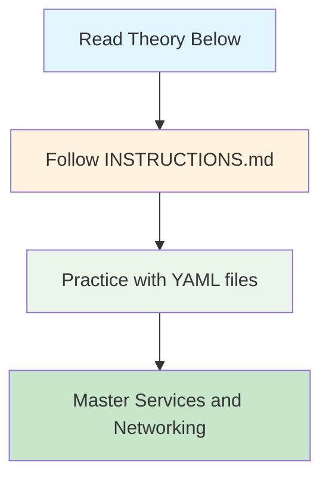
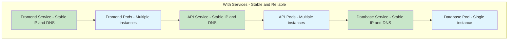
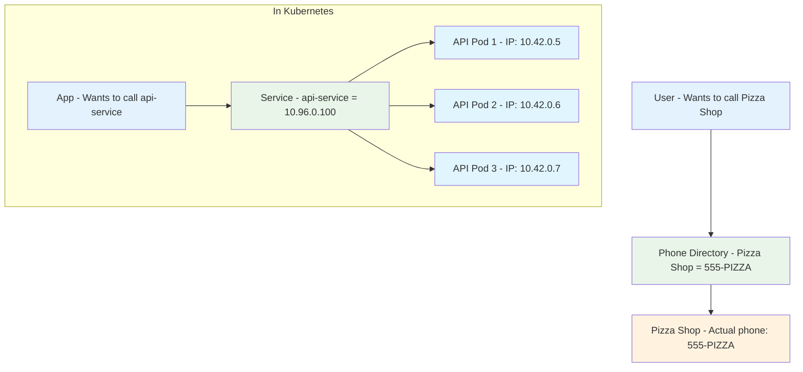
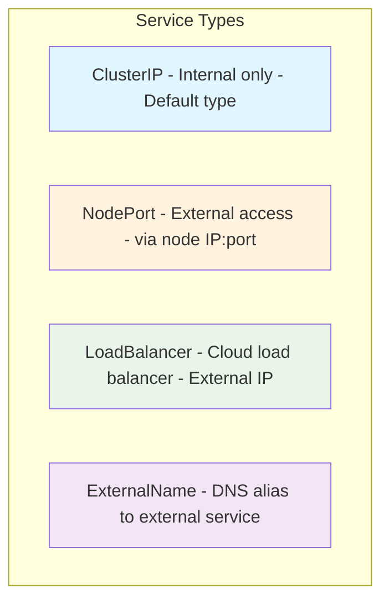
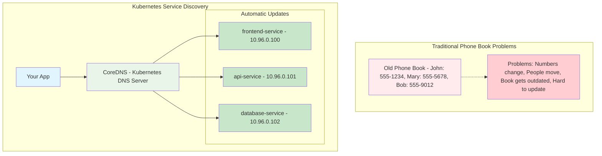

# 🌐 Services & Networking - Complete Guide

<div align="center">


**🎯 Connect to Pods | 🌐 Expose Apps | ⚖️ Load Balance | 🔍 Service Discovery**

</div>

---

## 📥 Get Started

### **Navigate to Services & Networking Directory**
```bash
# Navigate to the services and networking directory
cd cloud-devops-learning-path/Section-2-DevOps/Session-7_Kubernetes/05-services-networking

# List all available files
ls -la *.yaml
```

### **📁 Available Files**
- **📋 [INSTRUCTIONS.md](./INSTRUCTIONS.md)** - Complete hands-on exercises
- **🔧 8 YAML files** - Ready-to-use service examples
- **📚 This README** - Theory and concepts

---

## 🎯 Learning Path



**Start with theory, then practice with hands-on exercises!**

---

## 🧠 Understanding the Problem: Why Do We Need Services?

### **The Challenge Without Services**
Imagine you have a web application with multiple components:

```mermaid
graph TB
    subgraph "Without Services - Problems"
        FRONTEND1[Frontend Pod - IP: 10.42.0.5]
        API1[API Pod - IP: 10.42.0.8]
        DB1[Database Pod - IP: 10.42.0.12]
        
        FRONTEND1 -.->|Hard-coded IP| API1
        API1 -.->|Hard-coded IP| DB1
    end
    
    subgraph "What Happens When Pods Restart?"
        FRONTEND2[Frontend Pod - IP: 10.42.0.15 NEW IP!]
        API2[API Pod - IP: 10.42.0.22 NEW IP!]
        DB2[Database Pod - IP: 10.42.0.31 NEW IP!]
        
        FRONTEND2 -.->|Broken Connection| API2
        API2 -.->|Broken Connection| DB2
    end
    
    style FRONTEND1 fill:#ffebee
    style API1 fill:#ffebee
    style DB1 fill:#ffebee
    style FRONTEND2 fill:#ffcdd2
    style API2 fill:#ffcdd2
    style DB2 fill:#ffcdd2
```



**Problems Without Services:**
- 🚫 **Pod IPs change** when pods restart
- 🚫 **Hard to scale** - Can't add more pods easily
- 🚫 **No load balancing** - Traffic goes to one pod only
- 🚫 **Complex configuration** - Must track all IP addresses
- 🚫 **Brittle connections** - One pod failure breaks everything

### **The Solution: Services Act as Stable Intermediaries**



**Benefits With Services:**
- ✅ **Stable endpoints** - Services never change their IP/DNS
- ✅ **Automatic load balancing** - Traffic distributed across pods
- ✅ **Service discovery** - Find services by name, not IP
- ✅ **Health checking** - Only route to healthy pods
- ✅ **Easy scaling** - Add/remove pods without breaking connections

---

## 🌐 Understanding Services - The Foundation

### **What Exactly is a Service?**

Think of a Service as a **smart phone directory** for your applications:



**Key Service Concepts:**
- 🎯 **Abstraction Layer** - Hides complexity of individual pods
- 📱 **Stable Interface** - Same IP and DNS name always
- ⚖️ **Load Balancer** - Distributes traffic automatically
- 🔍 **Service Discovery** - Apps find services by name
- 🏷️ **Label Selector** - Finds pods using labels

---

## 🔧 Service Types Explained



### **When to Use Each Type:**

#### **🏠 ClusterIP (Internal Only)**
- **Use for:** Internal microservices communication
- **Access:** Only from within the cluster
- **Perfect for:** APIs, databases, internal services
- **File:** `01-clusterip-service.yaml`

#### **🚪 NodePort (External Access)**
- **Use for:** Simple external access, development, testing
- **Access:** From outside the cluster via node IP:port
- **Port range:** 30000-32767
- **File:** `02-nodeport-service.yaml`

#### **☁️ LoadBalancer (Production Cloud)**
- **Use for:** Production external access with enterprise features
- **Access:** External IP address and DNS name from AWS
- **Features:** SSL termination, health checks, CloudWatch integration
- **File:** `03-loadbalancer-service.yaml`

#### **🔗 ExternalName**
- **Use for:** Integrating with external services
- **Access:** DNS alias to external service
- **No pods involved** - Just DNS mapping

---

## 🔍 Service Discovery - How Apps Find Each Other

Service Discovery is like having a **smart phone book** that updates automatically:



### **DNS Name Formats:**
- **Simple Name** (`api-service`) - Same namespace, most common
- **Cross-Namespace** (`api-service.production`) - Different namespace
- **Fully Qualified** (`api-service.production.svc.cluster.local`) - Always works

---

## 🚀 Quick Start Guide

### **1. Start with Hands-On Practice**
```bash
# Open the instructions file
cat INSTRUCTIONS.md

# Or view in your editor
code INSTRUCTIONS.md
```

### **2. Try the Basic Examples**
```bash
# ClusterIP (Internal)
kubectl apply -f 01-clusterip-service.yaml

# NodePort (External)  
kubectl apply -f 02-nodeport-service.yaml

# LoadBalancer (AWS Cloud)
kubectl apply -f 03-loadbalancer-service.yaml
```

### **3. Advanced Examples**
```bash
# Blue-Green Deployment
kubectl apply -f 06-blue-green-service.yaml

# Complete 3-Tier App
kubectl apply -f 07-complete-app.yaml
```

---

## 📋 Available YAML Files

| File | Type | Purpose | Exercise |
|------|------|---------|----------|
| `01-clusterip-service.yaml` | ClusterIP | Internal communication | Exercise 1 |
| `02-nodeport-service.yaml` | NodePort | External access | Exercise 2 |
| `03-loadbalancer-service.yaml` | LoadBalancer | AWS ALB integration | Exercise 3 |
| `04-multi-port-service.yaml` | NodePort | Multiple ports | Exercise 6 |
| `05-session-affinity-service.yaml` | ClusterIP | Sticky sessions | Exercise 7 |
| `06-blue-green-service.yaml` | NodePort | Version switching | Exercise 4 |
| `07-complete-app.yaml` | Mixed | Full 3-tier app | Exercise 5 |
| `08-test-pods.yaml` | Pods | Test pods | All exercises |

---

## ✅ Success Criteria

You're ready for the next section when you can:

- [ ] ✅ Create and test ClusterIP services for internal communication
- [ ] ✅ Create and access NodePort services for external access
- [ ] ✅ Deploy LoadBalancer services on AWS
- [ ] ✅ Use service discovery to connect applications
- [ ] ✅ Implement blue-green deployment switching
- [ ] ✅ Build complete multi-service applications
- [ ] ✅ Troubleshoot common networking issues

---

## 🎯 Next Steps

**Ready to Practice?** 🎉

1. **📋 [Open INSTRUCTIONS.md](./INSTRUCTIONS.md)** - Complete step-by-step exercises
2. **🔧 Practice with YAML files** - Hands-on learning
3. **🌐 Build real applications** - Apply your knowledge

### **After Mastering Services:**
- **[→ Back to Pods](../03-pods/)** - Review pod concepts
- **[→ Next: Final Project](../06-project/)** - Build a complete application

---

## 📚 Quick Reference

### **Essential Commands**
```bash
# Create services
kubectl apply -f <service-file>.yaml

# List services
kubectl get services

# Describe service
kubectl describe service <name>

# Test connectivity
kubectl run test --image=busybox --rm -it -- wget -qO- http://<service-name>

# Clean up
kubectl delete -f <service-file>.yaml
```

### **Service Discovery DNS**
```bash
# Same namespace
<service-name>

# Different namespace  
<service-name>.<namespace>

# Full DNS name
<service-name>.<namespace>.svc.cluster.local
```

---

*Ready to master Kubernetes services? Start with [INSTRUCTIONS.md](./INSTRUCTIONS.md)!* 🚀
