# 6️⃣ Final Project - Todo Application

<div align="center">


**🎯 Complete Application | 🗄️ Database Integration | 🌐 Full Stack**

</div>

---

## 🎯 What We'll Build

A complete Todo application with 3 components:

```mermaid
graph TB
    USER[👨‍💻 User] --> FRONTEND[🎨 Frontend<br/>React/HTML Interface]
    FRONTEND --> API[🔧 API<br/>Node.js Backend]
    API --> DB[🗄️ Database<br/>PostgreSQL]
    
    subgraph "☸️ Kubernetes Services"
        FSVC[Frontend Service<br/>NodePort 30080]
        ASVC[API Service<br/>ClusterIP]
        DSVC[Database Service<br/>ClusterIP]
    end
    
    USER --> FSVC
    FSVC --> FRONTEND
    FRONTEND --> ASVC
    ASVC --> API
    API --> DSVC
    DSVC --> DB
    
    style USER fill:#e3f2fd
    style FRONTEND fill:#e8f5e8
    style API fill:#fff3e0
    style DB fill:#f3e5f5
    style FSVC fill:#c8e6c9
    style ASVC fill:#c8e6c9
    style DSVC fill:#c8e6c9
```



**Features:**
- ✅ Add new todos
- ✅ Mark todos as complete
- ✅ Delete todos
- ✅ Data persists in database
- ✅ Scalable architecture
- ✅ Zero-downtime updates

---

## 🚀 Quick Deploy (5 Minutes!)

### **Option 1: Deploy Everything at Once**
```bash
# Navigate to project directory
cd /path/to/Session-7_Kubernetes/06-project

# Deploy the complete application
kubectl apply -f todo-app-complete.yaml

# Wait for everything to start
kubectl get pods -w

# Access the application
echo "Todo App: http://localhost:30080"
echo "API Health: http://localhost:30081/health"

# 🎉 Your Todo app is running!
```

---

## 📚 Step-by-Step Build

### **Step 1: Deploy Database**
```bash
# Create PostgreSQL database
kubectl apply -f database.yaml

# Wait for database to be ready
kubectl wait --for=condition=ready pod -l app=todo-db --timeout=60s

# Check database is running
kubectl get pods -l app=todo-db
kubectl logs -l app=todo-db
```

### **Step 2: Deploy API Backend**
```bash
# Create Node.js API
kubectl apply -f api.yaml

# Wait for API to be ready
kubectl wait --for=condition=ready pod -l app=todo-api --timeout=60s

# Test API health
kubectl port-forward service/todo-api 8080:3000 &
curl http://localhost:8080/health
# Should return: {"status":"healthy","database":"connected"}

# Stop port forwarding
pkill -f "kubectl port-forward"
```

### **Step 3: Deploy Frontend**
```bash
# Create React frontend
kubectl apply -f frontend.yaml

# Wait for frontend to be ready
kubectl wait --for=condition=ready pod -l app=todo-frontend --timeout=60s

# Check all components
kubectl get all -l project=todo-app
```

### **Step 4: Test the Complete Application**
```bash
# Access the application
echo "Todo App: http://localhost:30080"

# Test API directly
echo "API Health: http://localhost:30081/health"
echo "API Todos: http://localhost:30081/api/todos"

# Open in browser and test:
# 1. Add a new todo
# 2. Mark it as complete
# 3. Delete it
```

---

## 🧪 Understanding the Architecture

### **Database Layer**

```mermaid
graph TB
    subgraph "🗄️ Database Layer"
        DB[PostgreSQL<br/>Persistent storage]
        DBSVC[Database Service<br/>ClusterIP:5432]
        DBDATA[Volume<br/>Data persistence]
    end
    
    DB --> DBDATA
    DBSVC --> DB
    
    style DB fill:#f3e5f5
    style DBSVC fill:#c8e6c9
    style DBDATA fill:#fff3e0
```


**Database Configuration:**
- **Image**: `postgres:13`
- **Database**: `todoapp`
- **User**: `todouser`
- **Password**: `todopass` (in real apps, use secrets!)
- **Port**: `5432`

### **API Layer**


**API Endpoints:**
- `GET /health` - Health check
- `GET /api/todos` - Get all todos
- `POST /api/todos` - Create new todo
- `PUT /api/todos/:id` - Update todo
- `DELETE /api/todos/:id` - Delete todo

### **Frontend Layer**

```mermaid
graph TB
    subgraph "🎨 Frontend Layer"
        FE[React App<br/>User interface]
        FESVC[Frontend Service<br/>NodePort:30080]
        UI[Todo Interface<br/>Add/Edit/Delete]
    end
    
    FE --> UI
    FESVC --> FE
    
    style FE fill:#e8f5e8
    style FESVC fill:#c8e6c9
    style UI fill:#e1f5fe
```


---

## 🔧 Detailed Component Analysis

### **Exercise 1: Explore Database**
```bash
# Connect to database
kubectl exec -it deployment/todo-db -- psql -U todouser -d todoapp

# Inside PostgreSQL:
# \dt                    -- List tables
# SELECT * FROM todos;   -- See todos
# \q                     -- Quit

# Check database logs
kubectl logs -l app=todo-db --tail=20
```

### **Exercise 2: Explore API**
```bash
# Check API logs
kubectl logs -l app=todo-api --tail=20

# Test API endpoints
kubectl port-forward service/todo-api 8080:3000 &

# Test health
curl http://localhost:8080/health

# Get todos
curl http://localhost:8080/api/todos

# Add a todo
curl -X POST http://localhost:8080/api/todos \
  -H "Content-Type: application/json" \
  -d '{"title":"Learn Kubernetes","completed":false}'

# Get todos again
curl http://localhost:8080/api/todos

# Stop port forwarding
pkill -f "kubectl port-forward"
```

### **Exercise 3: Explore Frontend**
```bash
# Check frontend logs
kubectl logs -l app=todo-frontend --tail=20

# Check frontend configuration
kubectl describe deployment todo-frontend

# Access frontend
echo "Frontend: http://localhost:30080"
```

---

## 📈 Scaling the Application

### **Exercise 4: Scale Individual Components**
```bash
# Scale frontend for more users
kubectl scale deployment todo-frontend --replicas=3

# Scale API for more requests
kubectl scale deployment todo-api --replicas=2

# Database stays at 1 (typical for simple setups)
kubectl get pods -l project=todo-app

# Test load balancing
for i in {1..10}; do
  curl -s http://localhost:30081/health | grep -o '"instance":"[^"]*"'
done
```

### **Exercise 5: Update Components**
```bash
# Update API to new version (simulated)
kubectl set image deployment/todo-api api=node:16-alpine

# Watch rolling update
kubectl rollout status deployment/todo-api

# Update frontend
kubectl set image deployment/todo-frontend frontend=nginx:1.21

# Watch rolling update
kubectl rollout status deployment/todo-frontend

# Verify app still works
curl http://localhost:30081/health
```

---

## 🔄 Testing Resilience

### **Exercise 6: Test Self-Healing**
```bash
# Delete a pod and watch it get recreated
kubectl get pods -l app=todo-api

# Delete one API pod
kubectl delete pod -l app=todo-api --field-selector=status.phase=Running | head -1

# Watch new pod being created
kubectl get pods -l app=todo-api -w

# Test app still works
curl http://localhost:30081/health
```

### **Exercise 7: Test Database Persistence**
```bash
# Add some todos via API
curl -X POST http://localhost:30081/api/todos \
  -H "Content-Type: application/json" \
  -d '{"title":"Test persistence","completed":false}'

# Restart database pod
kubectl delete pod -l app=todo-db

# Wait for new pod
kubectl wait --for=condition=ready pod -l app=todo-db --timeout=60s

# Check todos are still there
curl http://localhost:30081/api/todos
```

---

## 🌐 Advanced Features

### **Exercise 8: Add Health Checks**
```bash
# Update API with health checks
cat <<EOF | kubectl apply -f -
apiVersion: apps/v1
kind: Deployment
metadata:
  name: todo-api
  labels:
    app: todo-api
    project: todo-app
spec:
  replicas: 2
  selector:
    matchLabels:
      app: todo-api
  template:
    metadata:
      labels:
        app: todo-api
        project: todo-app
    spec:
      containers:
      - name: api
        image: node:16-alpine
        ports:
        - containerPort: 3000
        env:
        - name: DB_HOST
          value: "todo-db"
        - name: DB_USER
          value: "todouser"
        - name: DB_PASS
          value: "todopass"
        - name: DB_NAME
          value: "todoapp"
        livenessProbe:
          httpGet:
            path: /health
            port: 3000
          initialDelaySeconds: 30
          periodSeconds: 10
        readinessProbe:
          httpGet:
            path: /health
            port: 3000
          initialDelaySeconds: 5
          periodSeconds: 5
        command: ["/bin/sh"]
        args: ["-c", "while true; do echo 'API running'; sleep 30; done"]
EOF

# Check health check status
kubectl describe pod -l app=todo-api | grep -A 5 "Liveness\|Readiness"
```

---

## 🔍 Monitoring and Troubleshooting

### **Exercise 9: Monitor the Application**
```bash
# Check overall status
kubectl get all -l project=todo-app

# Check pod health
kubectl get pods -l project=todo-app -o wide

# Check services
kubectl get services -l project=todo-app

# Check recent events
kubectl get events --sort-by=.metadata.creationTimestamp | tail -10

# Check resource usage (if metrics server available)
kubectl top pods -l project=todo-app
```

### **Exercise 10: Troubleshoot Issues**
```bash
# Simulate API problem
kubectl patch deployment todo-api -p '{"spec":{"template":{"spec":{"containers":[{"name":"api","image":"nginx:broken"}]}}}}'

# Check what happens
kubectl get pods -l app=todo-api

# Check events
kubectl describe pod -l app=todo-api

# Fix the issue
kubectl rollout undo deployment/todo-api

# Verify it's fixed
kubectl get pods -l app=todo-api
curl http://localhost:30081/health
```

---

## 📝 Application Files

### **Database Configuration (database.yaml)**
```yaml
apiVersion: apps/v1
kind: Deployment
metadata:
  name: todo-db
  labels:
    app: todo-db
    project: todo-app
spec:
  replicas: 1
  selector:
    matchLabels:
      app: todo-db
  template:
    metadata:
      labels:
        app: todo-db
        project: todo-app
    spec:
      containers:
      - name: postgres
        image: postgres:13
        env:
        - name: POSTGRES_DB
          value: todoapp
        - name: POSTGRES_USER
          value: todouser
        - name: POSTGRES_PASSWORD
          value: todopass
        ports:
        - containerPort: 5432
        volumeMounts:
        - name: postgres-data
          mountPath: /var/lib/postgresql/data
      volumes:
      - name: postgres-data
        emptyDir: {}
---
apiVersion: v1
kind: Service
metadata:
  name: todo-db
  labels:
    app: todo-db
    project: todo-app
spec:
  ports:
  - port: 5432
    targetPort: 5432
  selector:
    app: todo-db
```

---

## 🎯 Project Challenges

### **Challenge 1: Add Caching**
```bash
# Add Redis cache between API and database
# 1. Deploy Redis
# 2. Update API to use Redis
# 3. Test performance improvement
```

### **Challenge 2: Add Monitoring**
```bash
# Add monitoring dashboard
# 1. Deploy Prometheus (metrics)
# 2. Deploy Grafana (dashboard)
# 3. Create custom dashboards
```

### **Challenge 3: Add Security**
```bash
# Improve security
# 1. Use Kubernetes secrets for passwords
# 2. Add network policies
# 3. Use non-root containers
```

---

## ✅ Success Criteria

You've successfully completed the project when:

- [ ] ✅ All three components (database, API, frontend) are running
- [ ] ✅ You can add, edit, and delete todos through the web interface
- [ ] ✅ Data persists when pods are restarted
- [ ] ✅ You can scale components independently
- [ ] ✅ You can perform rolling updates without downtime
- [ ] ✅ The application recovers from pod failures automatically

---

## 🎉 Congratulations!

**You've built a complete application on Kubernetes!** 🚀

### **What You Accomplished:**
- ✅ **Multi-tier application** with database, API, and frontend
- ✅ **Service communication** between components
- ✅ **Data persistence** with volumes
- ✅ **Scalability** with multiple replicas
- ✅ **Reliability** with health checks and self-healing
- ✅ **Zero-downtime updates** with rolling deployments

### **Skills You've Mastered:**
- ✅ **Kubernetes fundamentals** - Pods, Services, Deployments
- ✅ **Application architecture** - Multi-service design
- ✅ **Scaling strategies** - Manual and automated scaling
- ✅ **Update strategies** - Rolling updates and rollbacks
- ✅ **Troubleshooting** - Debugging and monitoring
- ✅ **Best practices** - Health checks, resource management

---

## 🚀 Next Steps

### **Continue Your Kubernetes Journey:**

1. **Advanced Topics:**
   - Persistent Volumes and Storage Classes
   - ConfigMaps and Secrets management
   - Ingress controllers and SSL/TLS
   - Network policies and security
   - Horizontal Pod Autoscaler (HPA)

2. **Production Readiness:**
   - Monitoring with Prometheus and Grafana
   - Logging with ELK stack
   - CI/CD pipelines with GitOps
   - Backup and disaster recovery

3. **Certification Paths:**
   - Certified Kubernetes Application Developer (CKAD)
   - Certified Kubernetes Administrator (CKA)
   - Certified Kubernetes Security Specialist (CKS)

4. **Advanced Platforms:**
   - Service mesh (Istio, Linkerd)
   - Serverless (Knative)
   - Multi-cluster management
   - Cloud-native development

---

## 📚 Resources for Continued Learning

### **Official Documentation:**
- [Kubernetes Documentation](https://kubernetes.io/docs/)
- [kubectl Cheat Sheet](https://kubernetes.io/docs/reference/kubectl/cheatsheet/)

### **Practice Platforms:**
- [Katacoda Kubernetes Scenarios](https://katacoda.com/courses/kubernetes)
- [Play with Kubernetes](https://labs.play-with-k8s.com/)

### **Community:**
- [Kubernetes Slack](https://kubernetes.slack.com/)
- [CNCF Community](https://community.cncf.io/)

---

## 🧹 Clean Up

When you're done exploring:

```bash
# Delete the todo application
kubectl delete -f todo-app-complete.yaml

# Or delete individual components
kubectl delete deployment todo-frontend todo-api todo-db
kubectl delete service todo-frontend todo-api todo-db

# Verify cleanup
kubectl get all -l project=todo-app
```

---

<div align="center">

## 🎉 **You Did It!**

**You've successfully learned Kubernetes by building a real application!**

This is just the beginning of your cloud-native journey. The skills you've learned here will serve as a solid foundation for building and managing applications at scale.

**Keep practicing, keep learning, and keep building amazing things!** 🚀

---

*Thank you for completing the Kubernetes learning path!*

</div>
