# 6️⃣ Final Project - Todo Application

<div align="center">

**🎯 Build a Complete Todo App | 🗄️ 3-Tier Architecture | 🌐 Real-World Project**

</div>

---

## 🎯 What We'll Build

A complete Todo application with 3 components working together:

```mermaid
graph TB
    USER[👨‍💻 User] --> FRONTEND[🎨 Frontend<br/>Web Interface]
    FRONTEND --> API[🔧 API<br/>Backend Logic]
    API --> DB[🗄️ Database<br/>Data Storage]
    
    subgraph "☸️ Kubernetes Services"
        FSVC[Frontend Service<br/>Port 30080]
        ASVC[API Service<br/>Internal]
        DSVC[Database Service<br/>Internal]
    end
    
    USER --> FSVC
    FSVC --> FRONTEND
    FRONTEND --> ASVC
    ASVC --> API
    API --> DSVC
    DSVC --> DB
    
    style USER fill:#e3f2fd
    style FRONTEND fill:#e8f5e8
    style API fill:#fff3e0
    style DB fill:#f3e5f5
    style FSVC fill:#c8e6c9
    style ASVC fill:#c8e6c9
    style DSVC fill:#c8e6c9
```



**App Features:**
- ✅ Add new todos
- ✅ Mark todos as complete
- ✅ Delete todos
- ✅ Data persists in database

---

## 📁 Project Files

| File | What It Does |
|------|-------------|
| `database.yaml` | PostgreSQL database setup |
| `api.yaml` | Backend API server |
| `frontend.yaml` | Web interface |
| `todo-app-complete.yaml` | All components in one file |
| `deploy.sh` | Automated deployment script |

---

## 🚀 Quick Start (Easy Way)

### **Option 1: Deploy Everything at Once**
```bash
# Deploy the complete application
k apply -f todo-app-complete.yaml

# Check if everything is running
k get pods
k get services

# Access the app
echo "Open your browser: http://localhost:30080"
```

### **Option 2: Use the Deploy Script**
```bash
# Make script executable and run
chmod +x deploy.sh
./deploy.sh

# The script will guide you through the process
```

---

## 🧪 Step-by-Step Deployment (Learning Way)

### **Step 1: Deploy Database**
```bash
# Deploy PostgreSQL database
k apply -f database.yaml

# Wait for database to be ready
k get pods -l app=todo-db -w
# Press Ctrl+C when STATUS shows "Running"
```

### **Step 2: Deploy API Backend**
```bash
# Deploy the API server
k apply -f api.yaml

# Check API is running
k get pods -l app=todo-api
```

### **Step 3: Deploy Frontend**
```bash
# Deploy the web interface
k apply -f frontend.yaml

# Check frontend is running
k get pods -l app=todo-frontend
```

### **Step 4: Access Your App**
```bash
# Get the service URL
k get services todo-frontend

# Open in browser
echo "Your app is ready at: http://localhost:30080"
```

---

## 🔍 Testing Your App

### **Basic Functionality Test**
1. **Open Browser:** Go to `http://localhost:30080`
2. **Add Todo:** Type "Learn Kubernetes" and click Add
3. **Mark Complete:** Click the checkbox next to your todo
4. **Delete Todo:** Click the delete button
5. **Refresh Page:** Your todos should still be there (database persistence)

### **Kubernetes Features Test**
```bash
# Test scaling
k scale deployment todo-frontend --replicas=3
k get pods -l app=todo-frontend

# Test self-healing
k delete pod -l app=todo-api
k get pods -l app=todo-api
# Watch new pod being created

# Test rolling updates
k set image deployment/todo-frontend frontend=nginx:latest
k rollout status deployment/todo-frontend
```

---

## 🔧 Troubleshooting

### **App Not Loading?**
```bash
# Check all pods are running
k get pods

# Check services
k get services

# Check pod logs
k logs -l app=todo-frontend
k logs -l app=todo-api
k logs -l app=todo-db
```

### **Database Connection Issues?**
```bash
# Check database pod
k describe pod -l app=todo-db

# Check API can connect to database
k logs -l app=todo-api | grep -i database
```

### **Port Not Accessible?**
```bash
# Check NodePort service
k get service todo-frontend

# Try port forwarding as alternative
k port-forward service/todo-frontend 8080:80
# Then access: http://localhost:8080
```

---

## 🧪 Experiments to Try

### **1. Scale the Application**
```bash
# Scale frontend to handle more users
k scale deployment todo-frontend --replicas=5

# Scale API for better performance
k scale deployment todo-api --replicas=3

# Check load distribution
k get pods -o wide
```

### **2. Update the Application**
```bash
# Update frontend image
k set image deployment/todo-frontend frontend=nginx:alpine

# Watch rolling update
k rollout status deployment/todo-frontend

# Rollback if needed
k rollout undo deployment/todo-frontend
```

### **3. Simulate Failures**
```bash
# Delete a pod and watch it recreate
k delete pod -l app=todo-frontend

# Delete multiple pods
k delete pods -l app=todo-api

# Watch self-healing in action
k get pods -w
```

---

## 📊 Understanding What You Built

### **Architecture Components**
- **Frontend (React/HTML):** User interface that runs in the browser
- **API (Node.js):** Backend server that handles business logic
- **Database (PostgreSQL):** Stores all the todo data permanently

### **Kubernetes Resources Used**
- **Deployments:** Manage multiple copies of each component
- **Services:** Allow components to find and talk to each other
- **ConfigMaps:** Store configuration settings
- **Secrets:** Store sensitive information like database passwords

### **Real-World Concepts Applied**
- **Microservices:** Each component is independent
- **Service Discovery:** Components find each other by name
- **Load Balancing:** Traffic distributed across multiple pods
- **High Availability:** App keeps running even if pods fail

---

## 🎓 What You Learned

By completing this project, you now understand:

- ✅ **Multi-tier Applications** - How frontend, backend, and database work together
- ✅ **Service Communication** - How Kubernetes services enable component communication
- ✅ **Scaling** - How to handle increased load by adding more pods
- ✅ **Self-Healing** - How Kubernetes automatically recovers from failures
- ✅ **Rolling Updates** - How to update applications without downtime
- ✅ **Troubleshooting** - How to diagnose and fix common issues

---

## 🧹 Cleanup

When you're done experimenting:

```bash
# Remove all project resources
k delete -f todo-app-complete.yaml

# Or remove individual components
k delete -f database.yaml
k delete -f api.yaml
k delete -f frontend.yaml

# Verify cleanup
k get pods
k get services
```

---

## 🚀 Next Steps

**Congratulations!** 🎉 You've successfully deployed a complete application on Kubernetes!

### **Continue Learning:**
- **Explore Ingress** - Learn about advanced routing
- **Add Monitoring** - Set up application monitoring
- **Implement CI/CD** - Automate deployments
- **Learn Helm** - Package and manage Kubernetes applications
- **Study Security** - Implement security best practices

### **Build Your Own Projects:**
- Modify this todo app with new features
- Deploy your own applications using these patterns
- Experiment with different architectures
- Share your learning journey with others

---

## 💡 Pro Tips

1. **Keep Experimenting** - Break things and fix them to learn
2. **Read the Logs** - `kubectl logs` is your best friend for debugging
3. **Use Labels** - They help organize and find resources
4. **Start Simple** - Begin with basic deployments, add complexity gradually
5. **Document Your Learning** - Keep notes of what works and what doesn't

---

<div align="center">

**🎉 You're now a Kubernetes practitioner! 🎉**

*Keep building, keep learning, and keep sharing your knowledge!*

</div>
