# 6️⃣ Final Project - Todo Application

<div align="center">

**🎯 Build a Complete Todo App | 🗄️ 3-Tier Architecture | 🌐 Real-World Project**

</div>

---

## 🎯 Project Objective

### **What You'll Accomplish**

This capstone project brings together everything you've learned about Kubernetes by building a **production-ready Todo application**. You'll deploy a complete 3-tier web application that demonstrates real-world enterprise patterns and best practices.

### **Learning Goals**

By the end of this project, you will have hands-on experience with:

**🏗️ Architecture Design:**
- **Multi-tier Applications** - Understanding how frontend, backend, and database layers work together
- **Microservices Pattern** - Building loosely coupled, independently deployable services
- **Service Communication** - Implementing secure inter-service communication within Kubernetes

**☸️ Kubernetes Mastery:**
- **Complex Deployments** - Managing multiple interconnected applications
- **Service Discovery** - Using Kubernetes DNS for service-to-service communication
- **Configuration Management** - Separating configuration from code using ConfigMaps and Secrets
- **Data Persistence** - Implementing stateful applications with persistent storage

**🚀 Production Practices:**
- **Health Checks** - Implementing liveness and readiness probes for reliability
- **Resource Management** - Setting appropriate CPU and memory limits
- **Scaling Strategies** - Understanding when and how to scale different tiers
- **Troubleshooting** - Diagnosing and resolving real application issues

### **Why This Project Matters**

This isn't just a learning exercise - it's a **real application** that follows industry standards:

- **Enterprise Architecture** - The same patterns used by companies like Netflix, Uber, and Airbnb
- **Cloud-Native Design** - Built specifically for containerized, orchestrated environments
- **Scalable Foundation** - Can handle growth from 10 users to 10 million users
- **Portfolio Worthy** - Demonstrates practical Kubernetes skills to employers

---

## 🏗️ Application Architecture

### **The Big Picture**

Our Todo application follows a **3-tier architecture** - the gold standard for web applications:

```mermaid
graph TB
    subgraph "🌐 Presentation Tier"
        USER[👨‍💻 User Browser]
        FRONTEND[🎨 Frontend Pod<br/>React/HTML Interface<br/>Port 80]
    end
    
    subgraph "🔧 Application Tier"
        API[⚙️ API Pod<br/>Node.js Backend<br/>Business Logic<br/>Port 3000]
    end
    
    subgraph "🗄️ Data Tier"
        DB[💾 Database Pod<br/>PostgreSQL<br/>Data Storage<br/>Port 5432]
    end
    
    subgraph "☸️ Kubernetes Services"
        FSVC[🌐 Frontend Service<br/>NodePort 30080<br/>External Access]
        ASVC[🔗 API Service<br/>ClusterIP<br/>Internal Only]
        DSVC[🔗 Database Service<br/>ClusterIP<br/>Internal Only]
    end
    
    USER --> FSVC
    FSVC --> FRONTEND
    FRONTEND -.->|HTTP API Calls| ASVC
    ASVC --> API
    API -.->|SQL Queries| DSVC
    DSVC --> DB
    
    style USER fill:#e3f2fd
    style FRONTEND fill:#e8f5e8
    style API fill:#fff3e0
    style DB fill:#f3e5f5
    style FSVC fill:#c8e6c9
    style ASVC fill:#ffecb3
    style DSVC fill:#ffecb3
```



### **Component Deep Dive**

**🎨 Frontend (Presentation Tier):**
- **Technology:** React-based web interface served by Nginx
- **Purpose:** Provides user interface for managing todos
- **Kubernetes Resources:** Deployment + NodePort Service
- **Scaling:** Stateless - can scale horizontally without issues
- **Features:** Add todos, mark complete, delete, real-time updates

**⚙️ API Backend (Application Tier):**
- **Technology:** Node.js with Express framework
- **Purpose:** Handles business logic, data validation, and database operations
- **Kubernetes Resources:** Deployment + ClusterIP Service
- **Scaling:** Stateless - multiple instances can run simultaneously
- **Features:** RESTful API, data validation, error handling, database abstraction

**💾 Database (Data Tier):**
- **Technology:** PostgreSQL relational database
- **Purpose:** Persistent storage for todo data
- **Kubernetes Resources:** Deployment + ClusterIP Service + ConfigMap + Secret
- **Scaling:** Stateful - requires careful consideration for scaling
- **Features:** ACID compliance, data persistence, backup capabilities

### **Communication Flow**

**1. User Interaction:**
```
User clicks "Add Todo" → Frontend validates input → Creates HTTP request
```

**2. API Processing:**
```
Frontend → API Service → API Pod → Validates data → Prepares database query
```

**3. Database Operation:**
```
API Pod → Database Service → Database Pod → Executes SQL → Returns result
```

**4. Response Chain:**
```
Database → API Pod → Frontend → User sees updated todo list
```

---

## 📁 Project Files Explained

| File | Component | Purpose | Key Features |
|------|-----------|---------|--------------|
| `database.yaml` | PostgreSQL | Data persistence layer | ConfigMap for init scripts, Secret for credentials, PVC for data |
| `api.yaml` | Node.js API | Business logic layer | Environment variables, health checks, resource limits |
| `frontend.yaml` | React/Nginx | User interface layer | Static file serving, API proxy configuration |
| `todo-app-complete.yaml` | All Components | Complete application | Single-file deployment for quick setup |
| `deploy.sh` | Automation | Deployment script | Automated deployment with validation checks |

### **Configuration Highlights**

**Database Configuration:**
- **Persistent Volume:** Ensures data survives pod restarts
- **Init Scripts:** Automatically creates required tables
- **Security:** Credentials stored in Kubernetes Secrets
- **Health Checks:** Readiness probe ensures database is accepting connections

**API Configuration:**
- **Environment Variables:** Database connection details from ConfigMap
- **Health Endpoints:** `/health` for liveness, `/ready` for readiness
- **Resource Limits:** Prevents resource exhaustion
- **Multiple Replicas:** Can scale based on load

**Frontend Configuration:**
- **Nginx Proxy:** Routes API calls to backend service
- **Static Assets:** Serves HTML, CSS, JavaScript files
- **External Access:** NodePort service for browser access
- **Load Balancing:** Distributes traffic across frontend pods

---

## 🚀 Deployment Options

### **Option 1: Quick Deploy (See It Work Fast)**

Perfect for getting immediate results and understanding the application:

```bash
# Deploy everything at once
kubectl apply -f todo-app-complete.yaml

# Wait for all pods to be ready (this may take 2-3 minutes)
kubectl get pods -w

# Once all pods show "Running" status, access the app
echo "🎉 App ready at: http://localhost:30080"
```

**When to use:** First time deployment, demonstrations, quick testing

### **Option 2: Automated Deploy (Best Practice)**

Uses the deployment script for a guided, production-like experience:

```bash
# Make script executable
chmod +x deploy.sh

# Run automated deployment
./deploy.sh

# The script will:
# - Check prerequisites
# - Deploy components in correct order
# - Wait for each component to be ready
# - Validate the deployment
# - Provide access instructions
```

**When to use:** Learning deployments, understanding dependencies, production-like workflow

### **Option 3: Step-by-Step Deploy (Maximum Learning)**

Deploy each component individually to understand dependencies and troubleshoot issues:

```bash
# Step 1: Deploy Database (Foundation)
kubectl apply -f database.yaml
echo "⏳ Waiting for database to be ready..."
kubectl wait --for=condition=ready pod -l app=todo-db --timeout=300s

# Step 2: Deploy API (Depends on Database)
kubectl apply -f api.yaml
echo "⏳ Waiting for API to be ready..."
kubectl wait --for=condition=ready pod -l app=todo-api --timeout=300s

# Step 3: Deploy Frontend (Depends on API)
kubectl apply -f frontend.yaml
echo "⏳ Waiting for frontend to be ready..."
kubectl wait --for=condition=ready pod -l app=todo-frontend --timeout=300s

# Step 4: Verify Everything Works
kubectl get all
echo "🎉 All components deployed! Access at: http://localhost:30080"
```

**When to use:** Deep learning, troubleshooting, understanding component dependencies

---

## 🧪 Testing Your Application

### **Functional Testing**

**Basic CRUD Operations:**
1. **Create:** Add a new todo "Learn Kubernetes Deployments"
2. **Read:** Verify the todo appears in the list
3. **Update:** Mark the todo as completed
4. **Delete:** Remove the todo from the list

**Data Persistence Test:**
```bash
# Add several todos through the web interface
# Then restart all pods to test data persistence
kubectl delete pods --all

# Wait for pods to restart
kubectl get pods -w

# Refresh browser - your todos should still be there!
```

### **Performance Testing**

**Load Testing:**
```bash
# Scale frontend for better performance
kubectl scale deployment todo-frontend --replicas=3

# Scale API for handling more requests
kubectl scale deployment todo-api --replicas=2

# Monitor resource usage
kubectl top pods
```

**Stress Testing:**
```bash
# Simulate pod failures
kubectl delete pod -l app=todo-api

# Watch automatic recovery
kubectl get pods -w

# Verify application still works during recovery
```

### **Kubernetes Features Testing**

**Service Discovery:**
```bash
# Test internal service communication
kubectl exec -it deployment/todo-api -- nslookup todo-db
kubectl exec -it deployment/todo-frontend -- nslookup todo-api
```

**Rolling Updates:**
```bash
# Update frontend image
kubectl set image deployment/todo-frontend frontend=nginx:alpine

# Watch rolling update process
kubectl rollout status deployment/todo-frontend

# Verify app still works during update
```

**Health Checks:**
```bash
# Check health endpoints
kubectl exec -it deployment/todo-api -- curl localhost:3000/health
kubectl exec -it deployment/todo-api -- curl localhost:3000/ready
```

---

## 🔧 Troubleshooting Guide

### **Common Issues and Solutions**

**❌ Pods Not Starting**
```bash
# Check pod status and events
kubectl get pods
kubectl describe pod <pod-name>

# Common causes:
# - Image pull errors (check image names)
# - Resource constraints (check node resources)
# - Configuration errors (check environment variables)
```

**❌ Application Not Accessible**
```bash
# Verify service configuration
kubectl get services
kubectl describe service todo-frontend

# Check if NodePort is accessible
kubectl get service todo-frontend -o jsonpath='{.spec.ports[0].nodePort}'

# Alternative access method
kubectl port-forward service/todo-frontend 8080:80
# Then access: http://localhost:8080
```

**❌ Database Connection Errors**
```bash
# Check database pod logs
kubectl logs -l app=todo-db

# Verify database service
kubectl get service todo-db

# Test database connectivity from API pod
kubectl exec -it deployment/todo-api -- nc -zv todo-db 5432
```

**❌ API Errors**
```bash
# Check API pod logs
kubectl logs -l app=todo-api

# Verify environment variables
kubectl exec -it deployment/todo-api -- env | grep DB

# Test API endpoints
kubectl exec -it deployment/todo-api -- curl localhost:3000/health
```

### **Advanced Debugging**

**Network Issues:**
```bash
# Check service endpoints
kubectl get endpoints

# Verify pod-to-pod communication
kubectl exec -it deployment/todo-frontend -- ping todo-api
```

**Resource Issues:**
```bash
# Check resource usage
kubectl top nodes
kubectl top pods

# Check resource limits
kubectl describe deployment todo-api | grep -A 5 Limits
```

---

## 🎓 Learning Outcomes

### **Technical Skills Gained**

**Kubernetes Expertise:**
- ✅ **Multi-component Deployments** - Managing complex applications with multiple services
- ✅ **Service Mesh Basics** - Understanding how services communicate within a cluster
- ✅ **Configuration Management** - Using ConfigMaps and Secrets for environment-specific settings
- ✅ **Persistent Storage** - Implementing data persistence for stateful applications
- ✅ **Health Monitoring** - Implementing comprehensive health checks and monitoring

**DevOps Practices:**
- ✅ **Infrastructure as Code** - All configurations defined in YAML files
- ✅ **Automated Deployment** - Using scripts for repeatable deployments
- ✅ **Monitoring and Logging** - Understanding application observability
- ✅ **Troubleshooting** - Systematic approach to diagnosing and fixing issues

**Architecture Understanding:**
- ✅ **Microservices Design** - Building loosely coupled, independently scalable services
- ✅ **API Design** - RESTful API patterns and best practices
- ✅ **Database Integration** - Connecting applications to persistent data stores
- ✅ **Security Considerations** - Implementing basic security practices in Kubernetes

### **Real-World Applications**

This project demonstrates patterns used in:
- **E-commerce Platforms** - Product catalogs, shopping carts, order processing
- **Social Media Apps** - User posts, comments, messaging systems
- **Business Applications** - CRM systems, project management tools, dashboards
- **IoT Platforms** - Device management, data collection, analytics dashboards

---

## 🧪 Advanced Experiments

### **Scaling Experiments**

**Horizontal Pod Autoscaling:**
```bash
# Enable metrics server (if not already enabled)
kubectl apply -f https://github.com/kubernetes-sigs/metrics-server/releases/latest/download/components.yaml

# Create HPA for API
kubectl autoscale deployment todo-api --cpu-percent=50 --min=1 --max=10

# Generate load and watch scaling
kubectl run -i --tty load-generator --rm --image=busybox --restart=Never -- /bin/sh
# Inside the pod: while true; do wget -q -O- http://todo-api:3000/api/todos; done
```

**Database Scaling Considerations:**
```bash
# Scale database (be careful - this is complex for stateful apps)
kubectl scale deployment todo-db --replicas=1  # Keep at 1 for this demo

# In production, you'd use:
# - StatefulSets for ordered deployment
# - Persistent Volume Claims for data
# - Database clustering solutions
```

### **Update Strategies**

**Blue-Green Deployment:**
```bash
# Create a "green" version of the API
kubectl create deployment todo-api-green --image=node:16-alpine

# Switch traffic to green version
kubectl patch service todo-api -p '{"spec":{"selector":{"app":"todo-api-green"}}}'

# Switch back if issues
kubectl patch service todo-api -p '{"spec":{"selector":{"app":"todo-api"}}}'
```

**Canary Deployment:**
```bash
# Deploy canary version (10% of traffic)
kubectl create deployment todo-api-canary --image=node:16-alpine
kubectl scale deployment todo-api-canary --replicas=1
kubectl scale deployment todo-api --replicas=9

# Both deployments will receive traffic through the same service
```

### **Monitoring and Observability**

**Application Metrics:**
```bash
# Check application logs
kubectl logs -f deployment/todo-api
kubectl logs -f deployment/todo-frontend

# Monitor resource usage over time
watch kubectl top pods
```

**Health Check Monitoring:**
```bash
# Continuously monitor health endpoints
watch 'kubectl exec deployment/todo-api -- curl -s localhost:3000/health'
```

---

## 🧹 Cleanup and Resource Management

### **Complete Cleanup**
```bash
# Remove all project resources
kubectl delete -f todo-app-complete.yaml

# Or remove individual components
kubectl delete -f database.yaml
kubectl delete -f api.yaml  
kubectl delete -f frontend.yaml

# Verify cleanup
kubectl get all
kubectl get pvc  # Check for persistent volume claims
```

### **Selective Cleanup**
```bash
# Keep database, restart API and Frontend
kubectl delete -f api.yaml -f frontend.yaml
kubectl apply -f api.yaml -f frontend.yaml

# Scale down without deleting (saves resources)
kubectl scale deployment todo-frontend --replicas=0
kubectl scale deployment todo-api --replicas=0
```

---

## 🚀 Next Steps and Career Path

### **Immediate Next Steps**

**Enhance This Project:**
- Add user authentication and authorization
- Implement todo categories and tags
- Add due dates and reminders
- Create a mobile-responsive design
- Add real-time notifications

**Explore Advanced Kubernetes:**
- **Ingress Controllers** - Advanced routing and SSL termination
- **Helm Charts** - Package management for Kubernetes applications
- **Operators** - Custom controllers for complex applications
- **Service Mesh** - Advanced traffic management with Istio or Linkerd

### **Career Development**

**Certifications to Pursue:**
- **CKA (Certified Kubernetes Administrator)** - Platform management focus
- **CKAD (Certified Kubernetes Application Developer)** - Application development focus
- **CKS (Certified Kubernetes Security Specialist)** - Security focus

**Industry Roles:**
- **DevOps Engineer** - $90K-$150K - Focus on CI/CD and infrastructure automation
- **Site Reliability Engineer** - $120K-$180K - Focus on system reliability and performance
- **Cloud Architect** - $130K-$200K - Focus on designing cloud-native solutions
- **Platform Engineer** - $110K-$170K - Focus on developer experience and tooling

### **Building Your Portfolio**

**Document Your Journey:**
- Create a GitHub repository with your Kubernetes projects
- Write blog posts about your learning experience
- Contribute to open-source Kubernetes projects
- Present at local meetups or conferences

**Expand Your Skills:**
- Learn multiple cloud providers (AWS, GCP, Azure)
- Master Infrastructure as Code (Terraform, Pulumi)
- Understand CI/CD pipelines (Jenkins, GitLab CI, GitHub Actions)
- Explore monitoring and observability (Prometheus, Grafana, Jaeger)

---

## 💡 Pro Tips for Success

### **Development Best Practices**
1. **Start Simple** - Begin with basic functionality, add complexity gradually
2. **Version Everything** - Use specific image tags, not 'latest'
3. **Monitor Continuously** - Set up logging and monitoring from day one
4. **Test Thoroughly** - Implement health checks and automated testing
5. **Document Everything** - Good documentation saves time and prevents errors

### **Kubernetes Best Practices**
1. **Use Namespaces** - Organize resources and implement resource quotas
2. **Set Resource Limits** - Prevent resource exhaustion and improve scheduling
3. **Implement Security** - Use RBAC, network policies, and security contexts
4. **Plan for Failure** - Design for resilience and implement proper backup strategies
5. **Automate Everything** - Use GitOps principles for deployment and management

### **Learning Strategies**
1. **Hands-On Practice** - Build projects, break things, fix them
2. **Join Communities** - Kubernetes Slack, Reddit, local meetups
3. **Read Documentation** - Official Kubernetes docs are excellent
4. **Follow Experts** - Learn from Kubernetes maintainers and practitioners
5. **Teach Others** - Explaining concepts solidifies your understanding

---

<div align="center">

**🎉 Congratulations! You've Built a Production-Ready Kubernetes Application! 🎉**

*You now have the skills to deploy, manage, and scale real-world applications on Kubernetes. This is just the beginning of your cloud-native journey!*

**Keep building, keep learning, and keep sharing your knowledge with the community!**

</div>
