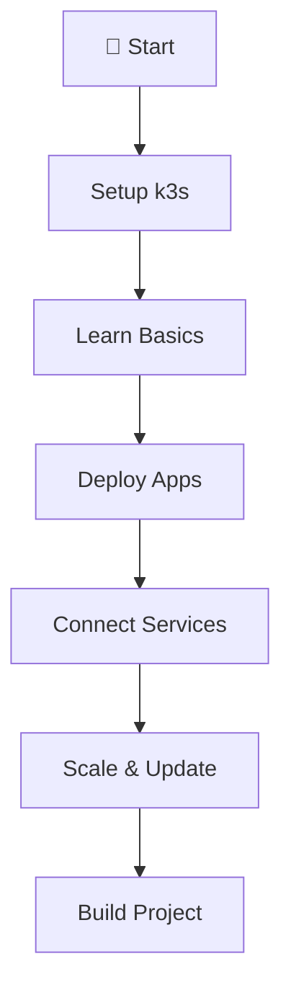
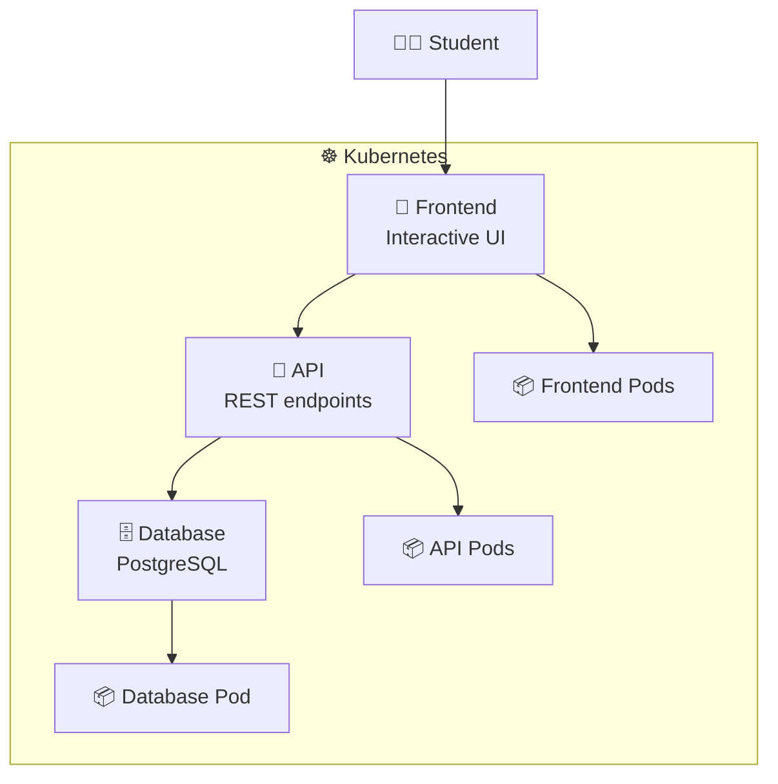

# ☸️ Kubernetes Learning Path - Complete Rebuild Summary

## 🎉 What We Created

I've completely rebuilt the Kubernetes session from scratch with a **student-first approach**. Here's what you now have:

### **📁 New Structure**
```
Session-7_Kubernetes/
├── README.md                    # Main overview with Mermaid diagrams
├── 01-setup/                    # Quick k3s installation
├── 02-basics/                   # Pods, Services, Labels
├── 03-deployments/              # Managing multiple pods
├── 04-networking/               # Service communication
├── 05-scaling/                  # Scaling and updates
├── 06-project/                  # Complete Todo application
└── yaml-files/                  # Preserved original YAML files
```

---

## 🎯 Key Improvements

### **1. Student-Friendly Approach**
- ✅ **Simple language** - No overwhelming jargon
- ✅ **Progressive learning** - Each section builds on previous
- ✅ **Visual diagrams** - Mermaid charts explain concepts
- ✅ **Hands-on focus** - Learn by doing, not just reading
- ✅ **Real examples** - Using varunmanik/httpd:blue and varunmanik/httpd:green

### **2. Mermaid Diagrams Throughout**


### **3. Complete Project**
- 🎨 **Frontend** - Interactive HTML/CSS/JavaScript interface
- 🔧 **API** - Simulated Node.js backend with nginx
- 🗄️ **Database** - PostgreSQL with persistence
- 🌐 **Services** - Full networking and communication
- 📈 **Scaling** - Demonstrates all concepts learned

---

## 📚 Learning Journey (Progressive Path)

| Step | Topic | Focus | What Students Learn |
|------|-------|-------|---------------------|
| **1️⃣** | Setup | Quick start | Install k3s, verify cluster |
| **2️⃣** | Basics | Hands-on | Pods, Services, Labels, kubectl |
| **3️⃣** | Deployments | Practical | Managing multiple pods, scaling |
| **4️⃣** | Networking | Interactive | Service discovery, communication |
| **5️⃣** | Scaling | Advanced | Updates, rollbacks, health checks |
| **6️⃣** | Project | Complete | Complete Todo application |

---

## 🚀 What Students Will Build

### **Final Project: Todo Application**


**Features:**
- ✅ Add/edit/delete todos
- ✅ Data persistence
- ✅ Health monitoring
- ✅ Scaling demonstration
- ✅ Rolling updates
- ✅ Service communication

---

## 🎓 Learning Outcomes

### **Technical Skills**
- ✅ **Kubernetes fundamentals** - Pods, Services, Deployments
- ✅ **kubectl mastery** - Essential commands and troubleshooting
- ✅ **Application architecture** - Multi-service design patterns
- ✅ **Scaling strategies** - Manual and automated approaches
- ✅ **Update patterns** - Rolling updates, rollbacks, blue-green
- ✅ **Networking** - Service discovery, load balancing
- ✅ **Monitoring** - Health checks, logging, debugging

### **Practical Experience**
- ✅ **Real application deployment** - Complete 3-tier app
- ✅ **Production patterns** - Health checks, resource limits
- ✅ **Troubleshooting skills** - Debug common issues
- ✅ **Best practices** - Security, reliability, scalability

---

## 🔧 Key Features

### **1. Quick Start Options**
```bash
# Super quick (5 minutes)
./01-setup/quick-setup.sh
kubectl apply -f 06-project/todo-app-complete.yaml

# Step by step (2 hours)
# Follow each section in order
```

### **2. Interactive Learning**
- 🧪 **Hands-on exercises** in every section
- 🔍 **Troubleshooting guides** for common issues
- 📊 **Progress tracking** with success criteria
- 🎯 **Knowledge checks** to verify understanding

### **3. Real-World Examples**
- 🔄 **Blue-green deployments** with custom images
- 📈 **Load balancing** demonstrations
- 🔧 **Health checks** and monitoring
- 🗄️ **Database integration** with persistence

---

## 📦 Preserved Content

### **YAML Files Kept**
All original YAML files are preserved in the `yaml-files/` directory:
- ✅ Pod definitions with custom images
- ✅ Service configurations
- ✅ Deployment manifests
- ✅ Multi-container examples
- ✅ Blue-green deployment files

### **Enhanced with New Content**
- 🆕 **Complete application YAML** files
- 🆕 **ConfigMaps** for application configuration
- 🆕 **Health checks** and monitoring
- 🆕 **Deployment scripts** for easy setup

---

## 🎯 Student Success Path

### **Beginner (Never used Kubernetes)**
1. Start with **01-setup** - Get cluster running
2. Follow **02-basics** - Understand core concepts
3. Try **06-project** - See complete application
4. Go back and complete all sections

### **Intermediate (Some Docker experience)**
1. Quick setup with **01-setup**
2. Jump to **03-deployments** - Learn scaling
3. Complete **04-networking** - Service communication
4. Build **06-project** - Apply all concepts

### **Advanced (Want to review/teach)**
1. Review **README.md** - See complete overview
2. Use **06-project** - Demonstrate capabilities
3. Customize examples for specific use cases

---

## 🌟 Why This Approach Works

### **1. Learning by Doing**
- Students deploy real applications from day one
- Every concept is immediately applied
- Mistakes become learning opportunities
- Success builds confidence

### **2. Progressive Complexity**
- Start simple (single pod)
- Add layers (services, deployments)
- Build complete systems (multi-service apps)
- Apply advanced patterns (scaling, updates)

### **3. Visual Learning**
- Mermaid diagrams explain architecture
- ASCII art shows relationships
- Step-by-step flows guide progress
- Visual feedback confirms understanding

### **4. Practical Focus**
- No theoretical concepts without application
- Real-world patterns and examples
- Industry-standard tools and practices
- Portfolio-ready project outcomes

---

## 🚀 Getting Started

### **For Students:**
```bash
# Clone the repository
git clone <repository-url>
cd Section-2-DevOps/Session-7_Kubernetes

# Start learning
cat README.md  # Overview
cd 01-setup && cat README.md  # Begin here
```

### **For Instructors:**
- Each section has clear learning objectives
- Success criteria help track progress
- Troubleshooting guides reduce support load
- Mermaid diagrams work great in presentations

### **For Self-Learners:**
- Complete path from zero to production
- Self-paced with clear milestones
- Real project for portfolio
- Foundation for advanced topics

---

## 🎉 Success Metrics

Students who complete this path will:

- ✅ **Deploy applications** confidently on Kubernetes
- ✅ **Troubleshoot issues** using kubectl and logs
- ✅ **Scale applications** based on demand
- ✅ **Perform updates** without downtime
- ✅ **Understand architecture** of cloud-native apps
- ✅ **Have portfolio project** to show employers

---

<div align="center">

## 🎓 **Ready to Transform Kubernetes Learning?**

**This new approach makes Kubernetes accessible, practical, and engaging for students at all levels.**

**Start the journey: [Session-7_Kubernetes/README.md](./README.md)**

---

*Created with ❤️ for students who learn best by building real things*

</div>
