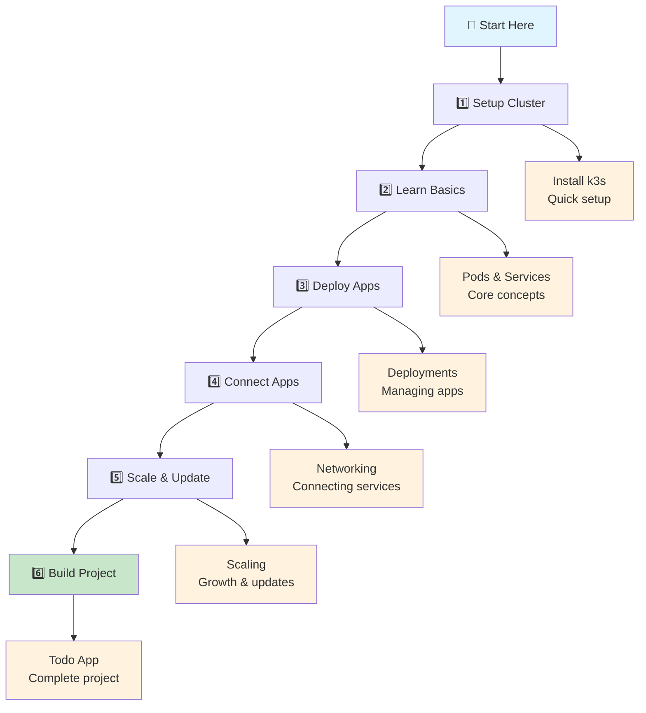
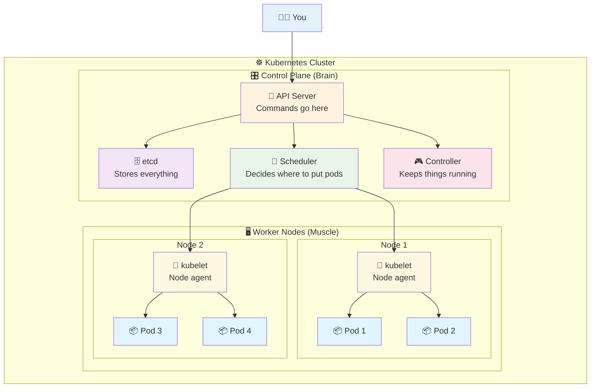
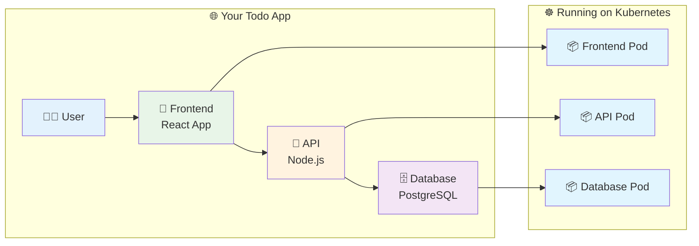

# ☸️ Kubernetes for Students - Simple & Practical

<div align="center">


**🎯 Learn by Doing | 🚀 Simple Projects | 📚 Step by Step**

</div>

---

## 🎯 What is Kubernetes?

Think of Kubernetes as a **smart manager** for your applications:

```
🏢 Traditional Way (Manual)          ☸️ Kubernetes Way (Automated)
┌─────────────────────┐             ┌─────────────────────┐
│ 👨‍💻 You manually:      │             │ 🤖 Kubernetes does:  │
│                     │             │                     │
│ • Start containers  │             │ • Starts containers │
│ • Monitor health    │    ───►     │ • Monitors health   │
│ • Restart if crash  │             │ • Restarts if crash │
│ • Scale up/down     │             │ • Scales up/down    │
│ • Load balance      │             │ • Load balances     │
└─────────────────────┘             └─────────────────────┘
```

**Why Kubernetes?**
- 🔄 **Auto-healing** - Restarts crashed containers
- 📈 **Auto-scaling** - Adds more containers when busy
- 🌐 **Load balancing** - Spreads traffic evenly
- 🚀 **Easy deployment** - Deploy with simple commands
- 📦 **Consistent** - Same way everywhere (dev, test, prod)

---

## 🗺️ Learning Journey



**Complete Learning Path** 📚

---

## 📚 Simple Learning Path

<table>
<tr>
<th width="10%">Step</th>
<th width="25%">Topic</th>
<th width="45%">What You'll Learn</th>
<th width="20%">Focus</th>
</tr>

<tr>
<td><strong><a href="./01-setup/">1️⃣</a></strong></td>
<td><strong>Cluster Setup</strong></td>
<td>Install k3s, verify it works, run first pod</td>
<td>Quick start</td>
</tr>

<tr>
<td><strong><a href="./02-basics/">2️⃣</a></strong></td>
<td><strong>Kubernetes Basics</strong></td>
<td>Pods, Services, Labels - the building blocks</td>
<td>Hands-on</td>
</tr>

<tr>
<td><strong><a href="./03-deployments/">3️⃣</a></strong></td>
<td><strong>Deploy Applications</strong></td>
<td>Deployments, ReplicaSets, managing multiple pods</td>
<td>Practical</td>
</tr>

<tr>
<td><strong><a href="./04-networking/">4️⃣</a></strong></td>
<td><strong>Connect Applications</strong></td>
<td>Services, networking, how apps talk to each other</td>
<td>Interactive</td>
</tr>

<tr>
<td><strong><a href="./05-scaling/">5️⃣</a></strong></td>
<td><strong>Scale & Update</strong></td>
<td>Scaling up/down, rolling updates, zero downtime</td>
<td>Advanced</td>
</tr>

<tr>
<td><strong><a href="./06-project/">6️⃣</a></strong></td>
<td><strong>Simple Project</strong></td>
<td>Build a complete Todo app with database</td>
<td>Project</td>
</tr>

</table>

---

## 🏗️ Kubernetes Architecture (Simple View)



**Simple Explanation:**
- **You** send commands to the **API Server**
- **API Server** stores info in **etcd** database
- **Scheduler** decides which **Node** should run your app
- **kubelet** on each node actually runs your **Pods**
- **Controller** makes sure everything keeps running

---

## 🚀 Quick Start (5 Minutes!)

### **Option 1: Super Quick**
```bash
# 1. Install k3s (lightweight Kubernetes)
curl -sfL https://get.k3s.io | sh -

# 2. Check it works
sudo k3s kubectl get nodes

# 3. Run your first app
sudo k3s kubectl create deployment hello --image=nginx

# 4. Check it's running
sudo k3s kubectl get pods

# 🎉 You're running Kubernetes!
```

### **Option 2: Follow the Guide**
1. **[Start with Setup →](./01-setup/)** - Install and verify
2. **[Learn the Basics →](./02-basics/)** - Understand core concepts
3. **[Build Something →](./06-project/)** - Create a real project

---

## 🎯 What You'll Build

By the end of this course, you'll have built a **complete Todo application**:



**Features:**
- ✅ Add/delete todos
- ✅ Mark as complete
- ✅ Data persists in database
- ✅ Scales automatically
- ✅ Updates without downtime

---

## 🛠️ Prerequisites

### **What You Need:**
- 💻 **Computer** - Linux, Mac, or Windows with WSL2
- 🌐 **Internet** - To download images
- ⏱️ **2 hours** - To complete everything
- 🧠 **Curiosity** - Willingness to learn!

### **What You DON'T Need:**
- ❌ Prior Kubernetes experience
- ❌ Docker expertise (we'll explain as we go)
- ❌ Complex setup
- ❌ Expensive cloud accounts

---

## 📖 Key Concepts (Simple)

### **Pod** 📦
- **What**: Smallest unit in Kubernetes
- **Think**: A box that holds your app
- **Example**: One web server in a pod

### **Service** 🌐
- **What**: Way to access your pods
- **Think**: Phone number for your app
- **Example**: Load balancer for web servers

### **Deployment** 🚀
- **What**: Manages multiple pods
- **Think**: Manager that keeps apps running
- **Example**: Ensures 3 web servers are always running

### **Namespace** 🏠
- **What**: Separate areas in cluster
- **Think**: Different rooms in a house
- **Example**: dev, test, prod environments

---

## 🎓 Learning Outcomes

After completing this course, you will:

### **Technical Skills**
- ✅ **Install and configure** Kubernetes (k3s)
- ✅ **Deploy applications** using pods and deployments
- ✅ **Connect applications** using services
- ✅ **Scale applications** up and down
- ✅ **Update applications** without downtime
- ✅ **Troubleshoot** common issues

### **Practical Experience**
- ✅ **Built a complete application** from scratch
- ✅ **Used real-world patterns** and best practices
- ✅ **Worked with databases** in Kubernetes
- ✅ **Implemented networking** between services
- ✅ **Applied scaling strategies**

### **Career Readiness**
- ✅ **Portfolio project** to show employers
- ✅ **Hands-on experience** with industry tools
- ✅ **Understanding** of container orchestration
- ✅ **Foundation** for advanced Kubernetes topics

---

## 🚀 Ready to Start?

Choose your path:

<div align="center">

### 🏃‍♂️ **I want to jump right in!**
**[→ Quick Start Setup](./01-setup/)**

### 📚 **I want to understand first**
**[→ Learn the Basics](./02-basics/)**

### 🛠️ **I want to build something**
**[→ Go to Project](./06-project/)**

</div>

---

## 💡 Tips for Success

### **Learning Strategy**
1. **Follow in order** - Each step builds on the previous
2. **Type commands yourself** - Don't just copy-paste
3. **Experiment** - Try changing things to see what happens
4. **Ask questions** - Use the troubleshooting sections

### **Common Mistakes to Avoid**
- ❌ Skipping the setup verification
- ❌ Not waiting for pods to be ready
- ❌ Forgetting to check pod logs when things fail
- ❌ Not cleaning up resources between exercises

### **Getting Help**
- 📖 Each section has troubleshooting tips
- 🔍 Use `kubectl describe` to see what's happening
- 📝 Check pod logs with `kubectl logs`
- 🌐 Kubernetes documentation is excellent

---

<div align="center">

## 🎉 **Let's Build Something Amazing!**

**Start your Kubernetes journey today and join millions of developers using the world's most popular container orchestration platform.**

[🚀 **Start Learning Now** →](./01-setup/)

---

**⭐ Star this repository if you find it helpful!**  
**🔄 Share with friends who want to learn Kubernetes!**  
**🤝 Contribute improvements and suggestions!**

---

*Created with ❤️ for students who want to learn by doing*

</div>
