# ☸️ Kubernetes for Students - Simple & Practical

<div align="center">


**🎯 Learn by Doing | 🚀 Simple Projects | 📚 Step by Step**

</div>

---

## 🎯 What is Kubernetes?

Think of Kubernetes as a **smart manager** for your applications:

```
🏢 Traditional Way (Manual)          ☸️ Kubernetes Way (Automated)
┌─────────────────────┐             ┌─────────────────────┐
│ 👨‍💻 You manually:      │             │ 🤖 Kubernetes does:  │
│                     │             │                     │
│ • Start containers  │             │ • Starts containers │
│ • Monitor health    │    ───►     │ • Monitors health   │
│ • Restart if crash  │             │ • Restarts if crash │
│ • Scale up/down     │             │ • Scales up/down    │
│ • Load balance      │             │ • Load balances     │
└─────────────────────┘             └─────────────────────┘
```

**Why Kubernetes?**
- 🔄 **Auto-healing** - Restarts crashed containers
- 📈 **Auto-scaling** - Adds more containers when busy
- 🌐 **Load balancing** - Spreads traffic evenly
- 🚀 **Easy deployment** - Deploy with simple commands
- 📦 **Consistent** - Same way everywhere (dev, test, prod)

---

## 🗺️ Learning Journey

```mermaid
graph TD
    A[🏁 Start Here] --> B[1️⃣ Setup Cluster]
    B --> C[2️⃣ Learn Concepts]
    C --> D[3️⃣ Deploy Pods]
    D --> E[4️⃣ Scale Applications]
    E --> F[5️⃣ Connect Services]
    F --> G[6️⃣ Build Project]
    
    style A fill:#e3f2fd
    style B fill:#e8f5e8
    style C fill:#fff3e0
    style D fill:#f3e5f5
    style E fill:#e1f5fe
    style F fill:#c8e6c9
    style G fill:#ffecb3
```



---

## 📚 Course Structure

### **🎓 Complete Learning Path**

| Section | Topic | What You'll Learn | Time |
|---------|-------|------------------|------|
| **[01-setup](./01-setup/)** | Kubernetes Setup | Install and configure K3s cluster | 30 min |
| **[02-k8s-concepts](./02-k8s-concepts/)** | Core Concepts | Understand Kubernetes fundamentals | 45 min |
| **[03-pods](./03-pods/)** | Pods & Basics | Deploy your first applications | 60 min |
| **[04-deployment-and-scaling](./04-deployment-and-scaling/)** | Deployments & Scaling | Manage applications at scale | 90 min |
| **[05-services-networking](./05-services-networking/)** | Services & Networking | Connect applications together | 75 min |
| **[06-project](./06-project/)** | Final Project | Build complete Todo application | 120 min |

**Total Learning Time:** ~7 hours of hands-on practice

---

## 🚀 Quick Start Guide

### **Prerequisites**
- **Linux/macOS/Windows with WSL2**
- **4GB RAM minimum** (8GB recommended)
- **10GB free disk space**
- **Internet connection** for downloading images

### **Option 1: Fast Track (Experienced Users)**
```bash
# Clone repository
git clone https://github.com/manikcloud/cloud-devops-learning-path.git
cd cloud-devops-learning-path/Section-2-DevOps/Session-7_Kubernetes

# Quick setup
cd 01-setup && ./k3s-setup.sh

# Jump to project
cd ../06-project && kubectl apply -f todo-app-complete.yaml
```

### **Option 2: Learning Path (Recommended for Students)**
```bash
# Start from the beginning
cd 01-setup
# Follow the README step by step

# Then progress through each section:
# 02-k8s-concepts → 03-pods → 04-deployment-and-scaling → 05-services-networking → 06-project
```

---

## 📖 Section Details

### **[1️⃣ Setup](./01-setup/) - Get Kubernetes Running**
**What:** Install K3s (lightweight Kubernetes) on your machine
**Why:** You need a cluster to practice on
**Time:** 30 minutes

**You'll Learn:**
- How to install Kubernetes locally
- Basic kubectl commands
- How to verify your cluster is working
- Troubleshooting common setup issues

**Key Commands:**
```bash
# Install K3s
curl -sfL https://get.k3s.io | sh -

# Check cluster status
kubectl get nodes
kubectl get pods --all-namespaces
```

### **[2️⃣ Kubernetes Concepts](./02-k8s-concepts/) - Understand the Fundamentals**
**What:** Learn core Kubernetes concepts with simple analogies
**Why:** Understanding concepts makes everything else easier
**Time:** 45 minutes

**You'll Learn:**
- What are Pods, Services, and Deployments
- How Kubernetes components work together
- Real-world analogies (restaurant, office building, etc.)
- Why each component exists and when to use it

**Key Concepts:**
- **Pod** = Lunch box (holds your app)
- **Service** = Phone number (stable address)
- **Deployment** = Manager (keeps things running)

### **[3️⃣ Pods](./03-pods/) - Deploy Your First Applications**
**What:** Create and manage individual application instances
**Why:** Pods are the basic building blocks of Kubernetes
**Time:** 60 minutes

**You'll Learn:**
- Create pods using kubectl and YAML
- Understand pod lifecycle and states
- Work with labels and selectors
- Debug pod issues and view logs
- Multi-container pod patterns

**Hands-On Projects:**
- Deploy Nginx web server
- Create database pod
- Build multi-container application
- Practice troubleshooting

### **[4️⃣ Deployment and Scaling](./04-deployment-and-scaling/) - Manage Applications at Scale**
**What:** Deploy multiple copies of applications and manage updates
**Why:** Production apps need reliability and scalability
**Time:** 90 minutes

**You'll Learn:**
- Create and manage Deployments
- Scale applications up and down
- Perform rolling updates with zero downtime
- Rollback failed deployments
- Configure health checks and resource limits

**Real-World Skills:**
- Blue-green deployments
- Canary releases
- Auto-healing applications
- Resource management

### **[5️⃣ Services and Networking](./05-services-networking/) - Connect Applications**
**What:** Enable communication between applications and external access
**Why:** Applications need to talk to each other and serve users
**Time:** 75 minutes

**You'll Learn:**
- Different service types (ClusterIP, NodePort, LoadBalancer)
- Service discovery and DNS
- Load balancing and traffic distribution
- Ingress controllers for advanced routing
- Network policies for security

**Practical Applications:**
- Expose web applications to users
- Connect frontend to backend APIs
- Database connectivity patterns
- External service integration

### **[6️⃣ Final Project](./06-project/) - Build Complete Todo Application**
**What:** Deploy a full-stack application with database, API, and frontend
**Why:** Demonstrate real-world Kubernetes skills
**Time:** 120 minutes

**You'll Build:**
- **Frontend:** React web interface
- **Backend:** Node.js API server
- **Database:** PostgreSQL data storage
- **Services:** Complete networking setup

**Production Skills:**
- Multi-tier architecture
- Service communication
- Data persistence
- Health monitoring
- Scaling strategies

---

## 🎯 Learning Outcomes

By completing this course, you will:

### **Technical Skills**
- ✅ **Deploy applications** on Kubernetes clusters
- ✅ **Scale applications** based on demand
- ✅ **Update applications** without downtime
- ✅ **Troubleshoot issues** systematically
- ✅ **Configure networking** between services
- ✅ **Manage persistent data** for stateful applications

### **Professional Skills**
- ✅ **Container orchestration** expertise
- ✅ **Cloud-native architecture** understanding
- ✅ **DevOps practices** implementation
- ✅ **Production deployment** experience
- ✅ **Problem-solving** in distributed systems

### **Career Preparation**
- ✅ **Portfolio projects** to showcase skills
- ✅ **Industry-standard practices** knowledge
- ✅ **Certification preparation** (CKA, CKAD)
- ✅ **Interview readiness** for DevOps roles

---

## 🛠️ Tools and Technologies

### **Core Technologies**
- **Kubernetes (K3s)** - Container orchestration platform
- **Docker** - Container runtime and image management
- **kubectl** - Kubernetes command-line interface
- **YAML** - Configuration and deployment files

### **Application Stack**
- **React/HTML** - Frontend web interfaces
- **Node.js** - Backend API development
- **PostgreSQL** - Relational database
- **Nginx** - Web server and reverse proxy

### **Development Tools**
- **VS Code** - Recommended code editor
- **Git** - Version control system
- **curl/wget** - API testing tools
- **Linux commands** - System administration

---

## 📈 Difficulty Progression

```mermaid
graph LR
    A[🌱 Beginner<br/>Setup & Concepts] --> B[🌿 Intermediate<br/>Pods & Services]
    B --> C[🌳 Advanced<br/>Deployments & Scaling]
    C --> D[🏆 Expert<br/>Complete Project]
    
    style A fill:#e8f5e8
    style B fill:#fff3e0
    style C fill:#ffecb3
    style D fill:#c8e6c9
```



### **Beginner Level (Sections 1-2)**
- Basic concepts and setup
- Simple commands and operations
- Guided step-by-step instructions
- Lots of explanation and context

### **Intermediate Level (Sections 3-4)**
- Hands-on application deployment
- Problem-solving exercises
- Multiple approaches to solutions
- Real-world scenarios

### **Advanced Level (Sections 5-6)**
- Complex multi-component applications
- Production-ready configurations
- Performance and scaling considerations
- Independent problem-solving

---

## 🎓 Certification Preparation

This course prepares you for:

### **CKAD (Certified Kubernetes Application Developer)**
- **Focus:** Application deployment and management
- **Salary Range:** $95K - $140K
- **Skills Covered:** 85% of exam topics

### **CKA (Certified Kubernetes Administrator)**
- **Focus:** Cluster administration and management
- **Salary Range:** $110K - $160K
- **Skills Covered:** 60% of exam topics

### **Industry Certifications**
- **AWS Certified DevOps Engineer**
- **Google Cloud Professional Cloud Architect**
- **Microsoft Azure DevOps Engineer**

---

## 🤝 Getting Help

### **When You're Stuck**
1. **Check the troubleshooting section** in each module
2. **Review the logs** using `kubectl logs`
3. **Describe resources** using `kubectl describe`
4. **Ask for help** in the community

### **Community Support**
- **GitHub Issues** - Report bugs or ask questions
- **Kubernetes Slack** - Join #kubernetes-users channel
- **Stack Overflow** - Search existing questions
- **Reddit r/kubernetes** - Community discussions

### **Additional Resources**
- **Official Kubernetes Documentation** - kubernetes.io
- **Kubernetes by Example** - kubernetesbyexample.com
- **Play with Kubernetes** - labs.play-with-k8s.com

---

## 📊 Success Metrics

Track your progress:

- [ ] ✅ **Setup Complete** - Kubernetes cluster running
- [ ] ✅ **Concepts Understood** - Can explain pods, services, deployments
- [ ] ✅ **First Pod Deployed** - Successfully running application
- [ ] ✅ **Scaling Mastered** - Can scale applications up/down
- [ ] ✅ **Services Connected** - Applications communicating
- [ ] ✅ **Project Completed** - Full-stack application deployed

---

## 🚀 What's Next?

After completing this course:

### **Advanced Kubernetes Topics**
- **Helm** - Package manager for Kubernetes
- **Operators** - Custom controllers for complex applications
- **Service Mesh** - Advanced networking with Istio/Linkerd
- **GitOps** - Automated deployments with ArgoCD/Flux

### **Cloud Platforms**
- **Amazon EKS** - Managed Kubernetes on AWS
- **Google GKE** - Managed Kubernetes on Google Cloud
- **Azure AKS** - Managed Kubernetes on Microsoft Azure

### **Career Paths**
- **DevOps Engineer** - Focus on CI/CD and automation
- **Site Reliability Engineer** - Focus on system reliability
- **Cloud Architect** - Focus on cloud-native design
- **Platform Engineer** - Focus on developer experience

---

<div align="center">

## 🎉 Ready to Start Your Kubernetes Journey?

**[🚀 Begin with Setup →](./01-setup/)**

*Transform from beginner to Kubernetes practitioner in just 7 hours of hands-on learning!*

---

**⭐ Star this repository if you find it helpful!**  
**🔄 Share with others who want to learn Kubernetes!**  
**🤝 Contribute improvements and suggestions!**

</div>

---

*Last Updated: January 2025 | Created with ❤️ for students learning Kubernetes*
