# 📚 Module 1: Introduction & History ()

**🎯 Foundation Knowledge | 📖 Terraform Origins | 🚀 Why IaC Matters**

---

## 🎯 **Learning Objectives**

By the end of this module, you'll understand:
- ✅ What Infrastructure as Code (IaC) means
- ✅ Terraform's history and evolution
- ✅ Problems Terraform solves
- ✅ Key benefits over manual infrastructure management

---

## 🤔 **What is Infrastructure as Code (IaC)?**

### **Simple Definition**
Infrastructure as Code is the practice of managing and provisioning computing infrastructure through machine-readable definition files, rather than physical hardware configuration or interactive configuration tools.

### **Traditional vs IaC Approach**

---

## 📖 **Terraform History & Evolution**

### **The Journey from 2014 to Today**

### **Key Milestones & Statistics**

| Year | Milestone | Impact |
|------|-----------|--------|
| **2014** | Initial Creation | Foundation laid by Mitchell Hashimoto |
| **2015** | First Release | Open source community begins |
| **2017** | 1 Million Downloads | Mainstream adoption starts |
| **2019** | 10 Million Downloads | Enterprise adoption accelerates |
| **2021** | 100 Million Downloads | Industry standard established |
| **2023** | 500+ Million Downloads | Dominant IaC tool globally |

---

## 👨‍💻 **Meet the Founders**

### **Mitchell Hashimoto - Creator & Visionary**
- **Background**: Co-founder of HashiCorp
- **Previous Work**: Created Vagrant, Consul, Vault
- **Vision**: "Infrastructure should be as easy to manage as application code"
- **Philosophy**: Developer-first approach to operations

### **Armon Dadgar - Co-founder**
- **Expertise**: Distributed systems and infrastructure
- **Contribution**: Core architecture and scalability
- **Focus**: Enterprise-grade reliability and performance

### **The HashiCorp Philosophy**
> "We believe infrastructure should be automated, secure, and easy to understand. Terraform embodies these principles by making infrastructure programmable."

---

## 🚀 **Why Terraform? The Problems It Solves**

### **Problem 1: Manual Infrastructure is Slow & Error-Prone**

```mermaid
graph LR
    subgraph "Manual Process"
        A[Login to Console] --> B[Navigate UI]
        B --> C[Fill Forms]
        C --> D[Click Submit]
        D --> E[Wait & Hope]
        E --> F[Repeat for Each Resource]
    end
    
    subgraph "Terraform Process"
        G[Write Code] --> H[terraform plan]
        H --> I[Review Changes]
        I --> J[terraform apply]
        J --> K[All Resources Created]
    end
    
    F -.->|"❌ 2-3 hours<br/>Error-prone"| K
    K -.->|"✅ 5-<br/>Reliable"| F
```

### **Problem 2: Configuration Drift**

### **Problem 3: Lack of Version Control**

| Aspect | Manual Infrastructure | Terraform IaC |
|--------|----------------------|----------------|
| **Change Tracking** | ❌ No history | ✅ Git commits |
| **Rollback Capability** | ❌ Manual recreation | ✅ Previous version |
| **Team Collaboration** | ❌ Knowledge silos | ✅ Code reviews |
| **Documentation** | ❌ Outdated docs | ✅ Self-documenting |
| **Audit Trail** | ❌ No visibility | ✅ Complete history |

---

## 🌟 **Key Benefits of Terraform**

### **1. Repeatability & Consistency**

### **2. Speed & Efficiency**
- **Manual Setup**: 2-3 hours for basic infrastructure
- **Terraform**: 5- for the same infrastructure
- **Scaling**: Linear time increase vs exponential manual effort

### **3. Multi-Cloud Capability**

### **4. Cost Optimization**
- **Resource Lifecycle Management**: Automatic cleanup
- **Right-Sizing**: Consistent resource specifications
- **Environment Management**: Easy dev/staging/prod separation
- **Waste Reduction**: No forgotten resources running

### **5. Risk Reduction**
- **Preview Changes**: `terraform plan` shows what will happen
- **Rollback Capability**: Return to previous working state
- **Validation**: Syntax and logic checking before deployment
- **Incremental Changes**: Small, controlled modifications

---

## 🆚 **Terraform vs Alternatives**

### **Comparison Matrix**

| Feature | Terraform | CloudFormation | Pulumi | Ansible | Manual |
|---------|-----------|----------------|--------|---------|--------|
| **Multi-Cloud** | ✅ Yes | ❌ AWS Only | ✅ Yes | ✅ Yes | ❌ No |
| **Learning Curve** | ⭐⭐⭐ Medium | ⭐⭐⭐ Medium | ⭐⭐⭐⭐ Hard | ⭐⭐ Easy | ⭐ Easy |
| **State Management** | ✅ Built-in | ✅ Managed | ✅ Built-in | ❌ Limited | ❌ None |
| **Community** | 🌟 Huge | 📊 Large | 📈 Growing | 🌟 Huge | ❌ None |
| **Language** | HCL | JSON/YAML | Multiple | YAML | N/A |
| **Preview Changes** | ✅ Yes | ✅ Yes | ✅ Yes | ❌ Limited | ❌ No |
| **Rollback** | ✅ Yes | ✅ Yes | ✅ Yes | ❌ Limited | ❌ Manual |

### **When to Choose Terraform**
- ✅ **Multi-cloud strategy** or cloud-agnostic approach
- ✅ **Team collaboration** on infrastructure
- ✅ **Complex infrastructure** with many dependencies
- ✅ **Compliance requirements** for change tracking
- ✅ **Scaling infrastructure** across environments
- ✅ **Learning industry standards** for career growth

---

## 🎯 **Real-World Impact**

### **Success Stories**

#### **Startup to Scale**
- **Before**: 2-person team spending 40% of time on infrastructure
- **After**: Same team focuses 90% on product development
- **Result**: 3x faster feature delivery, 50% cost reduction

#### **Enterprise Transformation**
- **Before**: 6-month infrastructure projects, high failure rate
- **After**: 2-week infrastructure delivery, 99% success rate
- **Result**: $2M annual savings, 10x deployment frequency

#### **Multi-Cloud Migration**
- **Before**: Vendor lock-in, manual processes across clouds
- **After**: Unified infrastructure management, easy cloud switching
- **Result**: 30% cost optimization, improved disaster recovery

---

## 🔍 **What Makes Terraform Special?**

### **The Terraform Advantage**

### **Core Principles**
1. **Declarative**: Describe what you want, not how to get it
2. **Immutable**: Replace rather than modify resources
3. **Idempotent**: Same operation produces same result
4. **Composable**: Build complex infrastructure from simple components

---

## ✅ **Module 1 Checkpoint**

### **Knowledge Check**
Before moving to Module 2, ensure you can answer:

- [ ] What is Infrastructure as Code?
- [ ] Who created Terraform and when?
- [ ] What problems does Terraform solve?
- [ ] How is Terraform different from manual infrastructure management?
- [ ] What are the key benefits of using Terraform?
- [ ] When would you choose Terraform over alternatives?

### **Key Takeaways**
- 🎯 **Terraform transforms** infrastructure management from manual to automated
- 📈 **Proven track record** with 500+ million downloads and enterprise adoption
- 🌐 **Multi-cloud capability** prevents vendor lock-in
- ⚡ **Speed and reliability** improvements are dramatic
- 🔄 **Version control integration** enables proper change management

---

### 🚀 **Ready for Architecture Deep Dive?**

**Next Module: [02 - Architecture Overview](../02-architecture-overview/README.md)**

*Understanding how Terraform works under the hood*

---

**Module Duration**:   
**Difficulty**: Beginner  
**Prerequisites**: None
