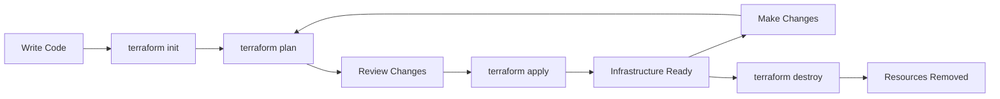

# 🔧 02: Terraform Installation & Workflows

<div align="center">


**🎯 Install Terraform | 🚀 Learn Basic Commands | 📊 Create First Resources**

</div>

---

## 📋 **What You'll Learn**

- ✅ **Install Terraform** on your system
- ✅ **Master basic commands** and workflow
- ✅ **Create your first AWS resources** with code
- ✅ **Understand Terraform lifecycle** (plan, apply, destroy)

---

## 🚀 **Quick Start**

### **Clone and Setup:**
```bash
# 1. Clone repository
git clone https://github.com/manikcloud/cloud-devops-learning-path.git

# 2. Navigate to this section
cd cloud-devops-learning-path/Section-2-DevOps/Session-8_terraform_and_infra_automation/02_installation_workflows

# 3. Run installation script
chmod +x setup.sh
./setup.sh

# 4. Verify installation
terraform version
```

---

## 🛠️ **Installation Guide**

### **Automated Installation (Recommended):**
```bash
# Use the provided setup script
./setup.sh
```

### **Manual Installation:**

#### **Ubuntu/Debian:**
```bash
# Add HashiCorp GPG key
wget -O- https://apt.releases.hashicorp.com/gpg | sudo gpg --dearmor -o /usr/share/keyrings/hashicorp-archive-keyring.gpg

# Add HashiCorp repository
echo "deb [signed-by=/usr/share/keyrings/hashicorp-archive-keyring.gpg] https://apt.releases.hashicorp.com $(lsb_release -cs) main" | sudo tee /etc/apt/sources.list.d/hashicorp.list

# Update and install
sudo apt update
sudo apt install terraform

# Verify installation
terraform version
```

#### **macOS:**
```bash
# Using Homebrew
brew tap hashicorp/tap
brew install hashicorp/tap/terraform

# Verify installation
terraform version
```

#### **Windows:**
```powershell
# Using Chocolatey
choco install terraform

# Verify installation
terraform version
```

---

## ⚙️ **AWS Configuration**

### **Configure AWS CLI:**
```bash
# Install AWS CLI (if not installed)
sudo apt install awscli  # Ubuntu
brew install awscli      # macOS

# Configure credentials
aws configure

# Enter your credentials:
# AWS Access Key ID: [Your Access Key]
# AWS Secret Access Key: [Your Secret Key]
# Default region name: us-east-1
# Default output format: json

# Verify configuration
aws sts get-caller-identity
```

### **Alternative: Environment Variables:**
```bash
# Set environment variables (alternative to aws configure)
export AWS_ACCESS_KEY_ID="your-access-key"
export AWS_SECRET_ACCESS_KEY="your-secret-key"
export AWS_DEFAULT_REGION="us-east-1"
```

---

## 🎯 **Your First Terraform Project**

### **Project Structure:**
```
02_installation_workflows/
├── README.md           # This guide
├── setup.sh           # Installation script
├── main.tf            # Main Terraform configuration
├── variables.tf       # Variable definitions
├── outputs.tf         # Output definitions
└── terraform.tfvars   # Variable values
```

### **Step 1: Initialize Terraform**
```bash
# Initialize Terraform (downloads providers)
terraform init

# Expected output:
# Terraform has been successfully initialized!
```

### **Step 2: Review Configuration**
```bash
# Check the main.tf file
cat main.tf

# Validate configuration
terraform validate

# Format code (optional)
terraform fmt
```

### **Step 3: Plan Infrastructure**
```bash
# Create execution plan
terraform plan

# Expected output shows:
# + aws_instance.web_server will be created
# + aws_security_group.web_sg will be created
```

### **Step 4: Apply Configuration**
```bash
# Apply the configuration
terraform apply

# Type 'yes' when prompted
# Wait for resources to be created (2-3 minutes)
```

### **Step 5: Verify Resources**
```bash
# Check created resources
terraform show

# List all resources
terraform state list

# Get outputs
terraform output
```

### **Step 6: Test Your Web Server**
```bash
# Get the public IP from outputs
PUBLIC_IP=$(terraform output -raw instance_public_ip)

# Test the web server
curl http://$PUBLIC_IP

# Expected: "Hello from Terraform!"
```

---

## 📊 **Understanding the Configuration**

### **Main Configuration (main.tf):**
The main.tf file creates:
- **EC2 Instance** - A simple web server
- **Security Group** - Allows HTTP and SSH access
- **User Data Script** - Installs and starts Apache

### **Variables (variables.tf):**
Defines configurable parameters:
- Instance type (default: t3.micro)
- Region (default: us-east-1)
- Key pair name (optional)

### **Outputs (outputs.tf):**
Displays useful information:
- Instance public IP
- Instance ID
- Security group ID

---

## 🔄 **Terraform Workflow**

### **The Terraform Lifecycle:**



### **Essential Commands:**

#### **Initialization:**
```bash
# Initialize working directory
terraform init

# Upgrade providers
terraform init -upgrade
```

#### **Planning:**
```bash
# Create execution plan
terraform plan

# Save plan to file
terraform plan -out=tfplan

# Plan with specific variables
terraform plan -var="instance_type=t3.small"
```

#### **Applying:**
```bash
# Apply configuration
terraform apply

# Apply saved plan
terraform apply tfplan

# Apply with auto-approve
terraform apply -auto-approve
```

#### **Inspection:**
```bash
# Show current state
terraform show

# List resources
terraform state list

# Show specific resource
terraform state show aws_instance.web_server

# Get outputs
terraform output
terraform output instance_public_ip
```

#### **Cleanup:**
```bash
# Destroy all resources
terraform destroy

# Destroy specific resource
terraform destroy -target=aws_instance.web_server
```

---

## 🔍 **Troubleshooting**

### **Common Issues:**

#### **Authentication Errors:**
```bash
# Error: No valid credential sources found
# Solution: Configure AWS credentials
aws configure

# Or set environment variables
export AWS_ACCESS_KEY_ID="your-key"
export AWS_SECRET_ACCESS_KEY="your-secret"
```

#### **Permission Errors:**
```bash
# Error: UnauthorizedOperation
# Solution: Ensure your AWS user has necessary permissions:
# - EC2FullAccess (for learning)
# - Or specific permissions for EC2, VPC, Security Groups
```

#### **Region Issues:**
```bash
# Error: InvalidAMIID.NotFound
# Solution: Check if AMI exists in your region
aws ec2 describe-images --image-ids ami-0c02fb55956c7d316 --region us-east-1
```

#### **State Lock Issues:**
```bash
# Error: Error acquiring the state lock
# Solution: Force unlock (use carefully)
terraform force-unlock <lock-id>
```

### **Debugging Commands:**
```bash
# Enable debug logging
export TF_LOG=DEBUG
terraform plan

# Check Terraform version
terraform version

# Validate configuration
terraform validate

# Check provider versions
terraform providers
```

---

## 🧪 **Hands-On Exercises**

### **Exercise 1: Modify Instance Type**
```bash
# 1. Edit terraform.tfvars
echo 'instance_type = "t3.small"' >> terraform.tfvars

# 2. Plan the change
terraform plan

# 3. Apply the change
terraform apply
```

### **Exercise 2: Add Tags**
```bash
# 1. Edit main.tf to add more tags
# 2. Plan and apply changes
terraform plan
terraform apply
```

### **Exercise 3: Multiple Instances**
```bash
# 1. Modify main.tf to create 2 instances
# 2. Use count parameter
# 3. Apply changes
terraform apply
```

---

## 📁 **File Contents**

### **setup.sh - Installation Script:**
Automated script that:
- Detects your operating system
- Installs Terraform using appropriate method
- Verifies installation
- Checks AWS CLI configuration

### **main.tf - Main Configuration:**
Creates:
- AWS provider configuration
- Security group with HTTP/SSH access
- EC2 instance with Apache web server
- User data script for web server setup

### **variables.tf - Variable Definitions:**
Defines:
- Instance type variable
- Region variable
- Key pair variable (optional)

### **outputs.tf - Output Values:**
Outputs:
- Instance public IP address
- Instance ID
- Security group ID

### **terraform.tfvars - Variable Values:**
Sets:
- Default instance type
- Region preference
- Any custom values

---

## 🎓 **Learning Outcomes**

After completing this section, you will:

### **Technical Skills:**
- ✅ Install Terraform on any system
- ✅ Configure AWS provider and credentials
- ✅ Write basic Terraform configurations
- ✅ Use variables and outputs effectively
- ✅ Understand Terraform state management

### **Practical Knowledge:**
- ✅ Plan infrastructure changes safely
- ✅ Apply and destroy resources
- ✅ Troubleshoot common issues
- ✅ Use Terraform CLI effectively

---

## 🧹 **Cleanup**

```bash
# Destroy all resources
terraform destroy

# Confirm with 'yes'
# Wait for resources to be destroyed

# Verify cleanup
aws ec2 describe-instances --filters "Name=tag:Name,Values=terraform-web-server"
```

---

<div align="center">

### 🎯 **Ready for Advanced Concepts?**

**Next: [03 Configuration Management](../03_configuration_management/README.md)**

*Learn variables, modules, and advanced Terraform features!*

</div>
