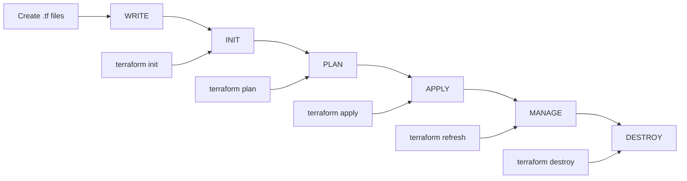

# 🔧 Terraform Installation & Workflows

<div align="center">


**🎯 Master Terraform Setup | 🚀 Learn Core Workflows | 📊 Best Practices**

</div>

---

## 📋 Prerequisites

- AWS account with Free Tier access
- Computer with internet connection
- Basic command line knowledge
- Text editor or IDE (VS Code recommended)

---

## 🛠️ Step 1: Install AWS CLI

### **Linux/macOS Installation:**
```bash
# Download AWS CLI v2
curl "https://awscli.amazonaws.com/awscli-exe-linux-x86_64.zip" -o "awscliv2.zip"

# Unzip the installer
unzip awscliv2.zip

# Run the installer
sudo ./aws/install

# Verify installation
aws --version
```

### **Windows Installation:**
1. Download AWS CLI MSI installer from: https://awscli.amazonaws.com/AWSCLIV2.msi
2. Run the installer
3. Open Command Prompt and verify: `aws --version`

---

## 🔑 Step 2: Configure AWS CLI

### **Get Your AWS Access Keys**

1. Login to AWS Console
2. Go to **IAM → Users → Your Username**
3. **Security Credentials** tab
4. **Create Access Key → Command Line Interface (CLI)**
5. Download or copy the keys

### **Configure AWS CLI**

#### **Method 1: Interactive Configuration**
```bash
aws configure
```

You'll be prompted to enter:
- **AWS Access Key ID**: Your access key
- **AWS Secret Access Key**: Your secret key
- **Default region name**: e.g., `us-east-1`
- **Default output format**: `json` (recommended)

#### **Method 2: Environment Variables**
```bash
export AWS_ACCESS_KEY_ID="your-access-key"
export AWS_SECRET_ACCESS_KEY="your-secret-key"
export AWS_DEFAULT_REGION="us-east-1"
```

### **Verify AWS CLI Configuration**

```bash
# Test AWS CLI connection
aws sts get-caller-identity

# List available regions
aws ec2 describe-regions --output table

# Check your default region
aws configure get region
```

---

## 🏗️ Step 3: Install Terraform

### **Linux Installation:**
```bash
# Add HashiCorp GPG key
wget -O- https://apt.releases.hashicorp.com/gpg | sudo gpg --dearmor -o /usr/share/keyrings/hashicorp-archive-keyring.gpg

# Add HashiCorp repository
echo "deb [signed-by=/usr/share/keyrings/hashicorp-archive-keyring.gpg] https://apt.releases.hashicorp.com $(lsb_release -cs) main" | sudo tee /etc/apt/sources.list.d/hashicorp.list

# Update and install
sudo apt update && sudo apt install terraform

# Verify installation
terraform --version
```

### **macOS Installation:**
```bash
# Using Homebrew
brew tap hashicorp/tap
brew install hashicorp/tap/terraform

# Verify installation
terraform --version
```

### **Windows Installation:**
1. Download Terraform from: https://www.terraform.io/downloads
2. Extract the executable to a directory in your PATH
3. Verify: `terraform --version`

---

## 🔄 Terraform Core Workflow

### **The Terraform Lifecycle:**



### **Essential Terraform Commands:**

| Command | Purpose | Example |
|---------|---------|---------|
| `terraform init` | Initialize project | Downloads providers |
| `terraform plan` | Preview changes | Shows what will be created |
| `terraform apply` | Apply changes | Creates/updates resources |
| `terraform destroy` | Delete resources | Removes all resources |
| `terraform show` | Show current state | Displays resource details |
| `terraform output` | Show outputs | Displays output values |

---

## 🚀 Step 4: Your First Terraform Project

### **Project Setup:**

```bash
# Create project directory
mkdir my-first-terraform
cd my-first-terraform

# Create main configuration file
touch main.tf
```

### **Basic Terraform Configuration:**

Create `main.tf`:
```hcl
# Configure Terraform and AWS Provider
terraform {
  required_providers {
    aws = {
      source  = "hashicorp/aws"
      version = "~> 5.0"
    }
  }
}

# Configure AWS Provider
provider "aws" {
  region = "us-east-1"
}

# Get the latest Amazon Linux 2 AMI
data "aws_ami" "amazon_linux" {
  most_recent = true
  owners      = ["amazon"]

  filter {
    name   = "name"
    values = ["amzn2-ami-hvm-*-x86_64-gp2"]
  }
}

# Create Security Group
resource "aws_security_group" "web_sg" {
  name        = "terraform-web-sg"
  description = "Security group for web server"

  # Allow HTTP
  ingress {
    from_port   = 80
    to_port     = 80
    protocol    = "tcp"
    cidr_blocks = ["0.0.0.0/0"]
  }

  # Allow SSH
  ingress {
    from_port   = 22
    to_port     = 22
    protocol    = "tcp"
    cidr_blocks = ["0.0.0.0/0"]
  }

  # Allow all outbound traffic
  egress {
    from_port   = 0
    to_port     = 0
    protocol    = "-1"
    cidr_blocks = ["0.0.0.0/0"]
  }

  tags = {
    Name = "terraform-web-sg"
  }
}

# Create EC2 Instance
resource "aws_instance" "web_server" {
  ami                    = data.aws_ami.amazon_linux.id
  instance_type          = "t2.micro"
  vpc_security_group_ids = [aws_security_group.web_sg.id]
  
  user_data = <<-EOF
    #!/bin/bash
    yum update -y
    amazon-linux-extras install nginx1 -y
    systemctl start nginx
    systemctl enable nginx
    
    # Create simple website
    cat > /var/www/html/index.html << 'HTML'
    <html>
    <head><title>Hello Terraform!</title></head>
    <body style="font-family: Arial; text-align: center; padding: 50px;">
        <h1>🚀 Hello from Terraform!</h1>
        <p>This website is deployed using Infrastructure as Code</p>
        <p>Powered by Terraform & AWS</p>
    </body>
    </html>
HTML
    
    systemctl restart nginx
  EOF

  tags = {
    Name = "terraform-web-server"
  }
}

# Output the public IP and website URL
output "public_ip" {
  description = "Public IP address of the web server"
  value       = aws_instance.web_server.public_ip
}

output "website_url" {
  description = "URL to access the website"
  value       = "http://${aws_instance.web_server.public_ip}"
}
```

---

## 🎯 Step 5: Deploy Your Infrastructure

### **Initialize Terraform:**
```bash
terraform init
```

This command:
- Downloads the AWS provider
- Initializes the backend
- Prepares the working directory

### **Plan the Deployment:**
```bash
terraform plan
```

This command:
- Shows what resources will be created
- Validates the configuration
- Estimates costs (if configured)

### **Apply the Configuration:**
```bash
terraform apply
```

This command:
- Creates the resources
- Updates the state file
- Shows the outputs

### **Access Your Website:**
After deployment, you'll see:
```
Outputs:
public_ip = "54.123.45.67"
website_url = "http://54.123.45.67"
```

Copy the website URL and open it in your browser!

---

## 🧹 Step 6: Clean Up Resources

**⚠️ Important: Always clean up to avoid charges!**

```bash
terraform destroy
```

Type `yes` when prompted to confirm destruction.

---

## 🔧 Troubleshooting

### **Common Issues:**

#### **1. AWS CLI not configured:**
```bash
aws configure list
aws sts get-caller-identity
```

#### **2. Terraform not initialized:**
```bash
terraform init
```

#### **3. Permission errors:**
- Check AWS IAM permissions
- Verify access keys are correct
- Ensure user has EC2 permissions

#### **4. State file issues:**
```bash
terraform refresh
terraform state list
```

#### **5. Website not loading:**
- Wait 2-3 minutes for setup to complete
- Check security group allows port 80
- Verify instance is running

---

## 📊 Terraform Best Practices

### **File Organization:**
```
project/
├── main.tf          # Main configuration
├── variables.tf     # Input variables
├── outputs.tf       # Output values
├── terraform.tfvars # Variable values
└── .gitignore       # Git ignore file
```

### **Version Control:**
```bash
# Create .gitignore
echo "*.tfstate*" >> .gitignore
echo "*.tfvars" >> .gitignore
echo ".terraform/" >> .gitignore
```

### **Security Best Practices:**
- Never commit `.tfstate` files
- Use variables for sensitive data
- Implement least privilege access
- Use remote state for teams

---

## 🎓 What You Learned

✅ **Terraform Installation** - Set up Terraform on your system
✅ **AWS CLI Configuration** - Connect Terraform to AWS
✅ **Core Workflow** - Write → Plan → Apply → Destroy
✅ **Infrastructure as Code** - Manage infrastructure with code
✅ **Best Practices** - Security and organization patterns

---

## 🚀 Next Steps

1. **Explore Variables** - Make configurations flexible
2. **Learn Modules** - Create reusable components
3. **Remote State** - Store state in S3
4. **Advanced Resources** - VPCs, Load Balancers, RDS
5. **CI/CD Integration** - Automate deployments

---

*Master Terraform workflows and transform your infrastructure management!* 🚀
