# ⚡ Module 3: Basic Commands ()

<div align="center">


**🎯 Master CLI | 🔧 Essential Commands | 🚀 Workflow Mastery**

</div>

---

## 🎯 **Learning Objectives**

By the end of this module, you'll master:
- ✅ Essential Terraform CLI commands
- ✅ Command options and flags
- ✅ Safe deployment workflows
- ✅ Troubleshooting common issues
- ✅ Best practices for command usage

---

## 🔧 **Essential Commands Overview**

### **Core Workflow Commands**


### **Command Categories**

| Category | Commands | Purpose |
|----------|----------|---------|
| **Initialization** | `init` | Set up working directory |
| **Planning** | `plan`, `validate` | Preview and validate changes |
| **Execution** | `apply`, `destroy` | Make infrastructure changes |
| **Inspection** | `show`, `output`, `state` | Examine current state |
| **Maintenance** | `fmt`, `refresh`, `import` | Code quality and state management |

---

## 🚀 **1. terraform init**

### **Purpose**
Initialize a Terraform working directory and prepare it for other commands.

### **What it does:**


### **Basic Usage**
```bash
# Initialize current directory
terraform init

# Initialize with backend configuration
terraform init -backend-config="bucket=my-terraform-state"

# Reinitialize (upgrade providers)
terraform init -upgrade
```

### **Common Options**

| Option | Purpose | Example |
|--------|---------|---------|
| `-upgrade` | Upgrade providers to latest versions | `terraform init -upgrade` |
| `-reconfigure` | Reconfigure backend ignoring existing config | `terraform init -reconfigure` |
| `-backend=false` | Skip backend initialization | `terraform init -backend=false` |
| `-get=false` | Skip module download | `terraform init -get=false` |

### **Output Example**
```
Initializing the backend...

Initializing provider plugins...
- Finding hashicorp/aws versions matching "~> 5.0"...
- Installing hashicorp/aws v5.31.0...
- Installed hashicorp/aws v5.31.0 (signed by HashiCorp)

Terraform has created a lock file .terraform.lock.hcl to record the provider
selections it made above. Include this file in your version control repository
so that Terraform can guarantee to make the same selections by default when
you run "terraform init" in the future.

Terraform has been successfully initialized!
```

---

## 📋 **2. terraform plan**

### **Purpose**
Create an execution plan showing what Terraform will do before making changes.

### **Planning Process**


### **Basic Usage**
```bash
# Create and display plan
terraform plan

# Save plan to file
terraform plan -out=tfplan

# Plan with specific variable file
terraform plan -var-file="prod.tfvars"

# Plan for destroy
terraform plan -destroy
```

### **Plan Output Symbols**
```
+ create       # New resource will be created
~ update       # Existing resource will be updated
- destroy      # Existing resource will be destroyed
+/- replace    # Resource will be destroyed and recreated
<= read        # Data source will be read
```

### **Example Plan Output**
```
Terraform will perform the following actions:

  # aws_instance.web will be created
  + resource "aws_instance" "web" {
      + ami                    = "ami-0c02fb55956c7d316"
      + instance_type          = "t2.micro"
      + id                     = (known after apply)
      + public_ip              = (known after apply)
      + vpc_security_group_ids = (known after apply)
    }

Plan: 1 to add, 0 to change, 0 to destroy.
```

---

## ✅ **3. terraform apply**

### **Purpose**
Apply the changes required to reach the desired state of the configuration.

### **Apply Process**


### **Basic Usage**
```bash
# Apply with confirmation prompt
terraform apply

# Apply without confirmation
terraform apply -auto-approve

# Apply saved plan
terraform apply tfplan

# Apply with variable
terraform apply -var="instance_type=t2.small"
```

### **Common Options**

| Option | Purpose | Example |
|--------|---------|---------|
| `-auto-approve` | Skip confirmation prompt | `terraform apply -auto-approve` |
| `-var` | Set variable value | `terraform apply -var="region=us-east-1"` |
| `-var-file` | Use variable file | `terraform apply -var-file="prod.tfvars"` |
| `-target` | Apply to specific resource | `terraform apply -target=aws_instance.web` |
| `-parallelism` | Limit parallel operations | `terraform apply -parallelism=5` |

### **Apply Output Example**
```
aws_instance.web: Creating...
aws_instance.web: Still creating... [10s elapsed]
aws_instance.web: Creation complete after 15s [id=i-1234567890abcdef0]

Apply complete! Resources: 1 added, 0 changed, 0 destroyed.

Outputs:

instance_ip = "54.123.45.67"
```

---

## 🗑️ **4. terraform destroy**

### **Purpose**
Destroy all resources managed by the Terraform configuration.

### **Destroy Process**


### **Basic Usage**
```bash
# Destroy with confirmation
terraform destroy

# Destroy without confirmation
terraform destroy -auto-approve

# Destroy specific resource
terraform destroy -target=aws_instance.web
```

### **⚠️ Safety Considerations**
- **Always review** the destroy plan carefully
- **Backup important data** before destroying
- **Use targeting** to destroy specific resources
- **Consider state backup** before major operations

---

## 🔍 **5. terraform show**

### **Purpose**
Display current state or saved plan in human-readable format.

### **Usage Examples**
```bash
# Show current state
terraform show

# Show saved plan
terraform show tfplan

# Show state in JSON format
terraform show -json

# Show specific resource
terraform show 'aws_instance.web'
```

### **Output Formats**


---

## 📤 **6. terraform output**

### **Purpose**
Display output values from the state file.

### **Usage Examples**
```bash
# Show all outputs
terraform output

# Show specific output
terraform output instance_ip

# Output in JSON format
terraform output -json

# Raw output (no quotes)
terraform output -raw instance_ip
```

### **Output Definition Example**
```hcl
# In outputs.tf
output "instance_ip" {
  description = "Public IP of the EC2 instance"
  value       = aws_instance.web.public_ip
}

output "instance_id" {
  description = "ID of the EC2 instance"
  value       = aws_instance.web.id
}
```

---

## 🔧 **7. terraform validate**

### **Purpose**
Validate the syntax and internal consistency of Terraform configuration.

### **Validation Process**

```mermaid
graph TB
    A[terraform validate] --> B[Syntax Check]
    B --> C[Reference Check]
    C --> D[Type Check]
    D --> E[Constraint Check]
    E --> F{Valid?}
    F -->|Yes| G[✅ Configuration valid]
    F -->|No| H[❌ Show errors]
    
    style G fill:#e8f5e8
    style H fill:#ffebee
```


### **Usage Examples**
```bash
# Validate current directory
terraform validate

# Validate with JSON output
terraform validate -json
```

### **Common Validation Errors**
- **Syntax errors**: Missing brackets, quotes
- **Reference errors**: Invalid resource references
- **Type errors**: Wrong variable types
- **Required argument errors**: Missing required arguments

---

## 🎨 **8. terraform fmt**

### **Purpose**
Format Terraform configuration files to canonical style.

### **Usage Examples**
```bash
# Format current directory
terraform fmt

# Format recursively
terraform fmt -recursive

# Check if formatting is needed
terraform fmt -check

# Show differences
terraform fmt -diff
```

### **Formatting Rules**
- Consistent indentation (2 spaces)
- Proper alignment of arguments
- Consistent spacing around operators
- Sorted argument order where possible

### **Before and After Example**
```hcl
# Before formatting
resource"aws_instance""web"{
ami="ami-12345"
instance_type="t2.micro"
tags={
Name="WebServer"
Environment="Production"
}
}

# After formatting
resource "aws_instance" "web" {
  ami           = "ami-12345"
  instance_type = "t2.micro"
  
  tags = {
    Name        = "WebServer"
    Environment = "Production"
  }
}
```

---

## 📊 **9. State Management Commands**

### **terraform state list**
```bash
# List all resources in state
terraform state list

# List resources matching pattern
terraform state list 'aws_instance.*'
```

### **terraform state show**
```bash
# Show specific resource details
terraform state show aws_instance.web
```

### **terraform refresh**
```bash
# Update state with real infrastructure
terraform refresh
```

### **State Command Overview**


---

## 🔄 **Safe Workflow Patterns**

### **Development Workflow**


### **Production Workflow**


---

## 🚨 **Troubleshooting Common Issues**

### **1. Provider Not Found**
```bash
Error: Could not load plugin
```
**Solution:**
```bash
terraform init
```

### **2. State Lock Error**
```bash
Error: Error locking state
```
**Solution:**
```bash
# Force unlock (use carefully)
terraform force-unlock LOCK_ID
```

### **3. Authentication Issues**
```bash
Error: error configuring Terraform AWS Provider
```
**Solution:**
```bash
# Check AWS credentials
aws sts get-caller-identity

# Configure if needed
aws configure
```

### **4. Resource Already Exists**
```bash
Error: resource already exists
```
**Solution:**
```bash
# Import existing resource
terraform import aws_instance.web i-1234567890abcdef0
```

### **Common Error Resolution Flow**


---

## 📝 **Command Cheat Sheet**

### **Daily Commands**
```bash
# Initialize project
terraform init

# Format code
terraform fmt

# Validate configuration
terraform validate

# Plan changes
terraform plan

# Apply changes
terraform apply

# Show current state
terraform show

# List resources
terraform state list

# Get outputs
terraform output
```

### **Advanced Commands**
```bash
# Save plan
terraform plan -out=tfplan

# Apply saved plan
terraform apply tfplan

# Target specific resource
terraform apply -target=aws_instance.web

# Import existing resource
terraform import aws_instance.web i-1234567890abcdef0

# Remove from state
terraform state rm aws_instance.web

# Move resource in state
terraform state mv aws_instance.web aws_instance.web_server
```

---

## ✅ **Module 3 Checkpoint**

### **Knowledge Check**
Before moving to Module 4, ensure you can:

- [ ] Initialize a Terraform project with `terraform init`
- [ ] Create and review execution plans with `terraform plan`
- [ ] Apply changes safely with `terraform apply`
- [ ] Inspect infrastructure with `terraform show` and `terraform output`
- [ ] Validate and format code with `terraform validate` and `terraform fmt`
- [ ] Understand common error messages and solutions
- [ ] Follow safe workflow patterns

### **Practical Exercise**
Try these commands in sequence:
```bash
# 1. Create a simple main.tf file
# 2. Initialize the project
terraform init

# 3. Validate the configuration
terraform validate

# 4. Format the code
terraform fmt

# 5. Create a plan
terraform plan

# 6. Review the plan output
# 7. Apply if satisfied (we'll do this in Module 4)
```

### **Key Takeaways**
- 🔧 **terraform init** is always the first command in any project
- 📋 **terraform plan** should always be run before apply
- ✅ **terraform validate** and **terraform fmt** ensure code quality
- 🔍 **terraform show** and **terraform output** help inspect infrastructure
- 🚨 **Error messages** are usually clear and actionable
- 🔄 **Safe workflows** prevent costly mistakes

---

<div align="center">

### 🚀 **Ready for Your First Infrastructure?**

**Next Module: [04 - Local File Example](../04-local-file-example/README.md)**

*Build your first Terraform project with hands-on practice*

</div>

---

**Module Duration**:   
**Difficulty**: Beginner  
**Prerequisites**: Modules 1-2 completed
