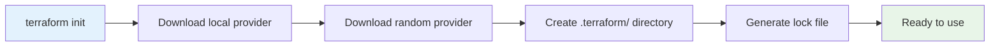
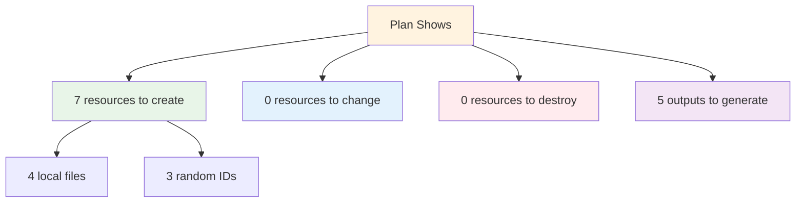
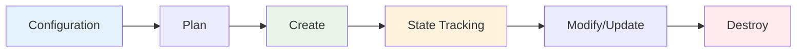

# 📁 Module 4: Local File Example (15 minutes)

<div align="center">


**🎯 First Terraform Project | 📁 File Creation | 🔧 Hands-On Practice**

</div>

---

## 🎯 **Learning Objectives**

By the end of this module, you'll have:
- ✅ Created your first Terraform configuration
- ✅ Understood HCL (HashiCorp Configuration Language) syntax
- ✅ Executed the complete Terraform workflow
- ✅ Learned about resources, outputs, and functions
- ✅ Practiced with terraform commands

---

## 🏗️ **What We're Building**

This module creates multiple local files to demonstrate Terraform fundamentals without requiring cloud credentials.

### **Project Architecture**

```mermaid
graph TB
    subgraph "Terraform Configuration"
        A[main.tf]
    end
    
    subgraph "Generated Files"
        B[welcome.txt<br/>📄 Welcome message]
        C[config.json<br/>⚙️ JSON configuration]
        D[demo-script.sh<br/>🔧 Executable script]
        E[secrets.env<br/>🔒 Sensitive file]
    end
    
    subgraph "Supporting Resources"
        F[random_id resources<br/>🎲 Random values]
    end
    
    A --> B
    A --> C
    A --> D
    A --> E
    F --> E
    
    style A fill:#e3f2fd
    style B fill:#e8f5e8
    style C fill:#fff3e0
    style D fill:#f3e5f5
    style E fill:#ffebee
    style F fill:#e1f5fe
```



---

## 📝 **Understanding the Configuration**

### **1. Provider Configuration**
```hcl
terraform {
  required_providers {
    local = {
      source  = "hashicorp/local"
      version = "~> 2.4"
    }
  }
  required_version = ">= 1.0"
}
```

**Explanation:**
- `terraform` block defines requirements
- `required_providers` specifies which providers to use
- `local` provider manages local files and directories
- Version constraints ensure compatibility

### **2. Resource Blocks**
```hcl
resource "local_file" "welcome" {
  content  = "Welcome to Terraform!"
  filename = "${path.module}/welcome.txt"
  file_permission = "0644"
}
```

**Breakdown:**
- `resource` keyword starts a resource definition
- `"local_file"` is the resource type
- `"welcome"` is the resource name (identifier)
- Inside the block are the resource arguments

### **3. String Interpolation**
```hcl
content = "Created on ${timestamp()}"
filename = "${path.module}/welcome.txt"
```

**Features:**
- `${}` syntax for interpolation
- `timestamp()` is a built-in function
- `path.module` refers to the current module directory

### **4. Here Documents**
```hcl
content = <<-EOT
  Welcome to Terraform!
  
  This is a multi-line string.
  It preserves formatting and spacing.
EOT
```

**Benefits:**
- Clean multi-line strings
- Preserves formatting
- No need to escape quotes

---

## 🚀 **Step-by-Step Walkthrough**

### **Step 1: Set Up the Project**

```bash
# Create project directory
mkdir terraform-local-example
cd terraform-local-example

# Copy the main.tf file (or create it)
# The file is already provided in this module
```

### **Step 2: Initialize Terraform**

```bash
terraform init
```

**Expected Output:**
```
Initializing the backend...

Initializing provider plugins...
- Finding hashicorp/local versions matching "~> 2.4"...
- Finding hashicorp/random versions matching ">= 2.0"...
- Installing hashicorp/local v2.4.0...
- Installing hashicorp/random v3.4.3...
- Installed hashicorp/local v2.4.0 (signed by HashiCorp)
- Installed hashicorp/random v3.4.3 (signed by HashiCorp)

Terraform has created a lock file .terraform.lock.hcl to record the provider
selections it made above.

Terraform has been successfully initialized!
```

**What Happened:**


### **Step 3: Validate Configuration**

```bash
terraform validate
```

**Expected Output:**
```
Success! The configuration is valid.
```

### **Step 4: Format Code**

```bash
terraform fmt
```

**What it does:**
- Standardizes indentation
- Aligns arguments consistently
- Sorts arguments where appropriate

### **Step 5: Create Execution Plan**

```bash
terraform plan
```

**Expected Output:**
```
Terraform will perform the following actions:

  # local_file.config will be created
  + resource "local_file" "config" {
      + content              = (known after apply)
      + content_base64sha256 = (known after apply)
      + content_base64sha512 = (known after apply)
      + content_md5          = (known after apply)
      + content_sha1         = (known after apply)
      + content_sha256       = (known after apply)
      + content_sha512       = (known after apply)
      + directory_permission = "0777"
      + file_permission      = "0644"
      + filename             = "./config.json"
      + id                   = (known after apply)
    }

  # local_file.script will be created
  + resource "local_file" "script" {
      + content              = (known after apply)
      + content_base64sha256 = (known after apply)
      + content_base64sha512 = (known after apply)
      + content_md5          = (known after apply)
      + content_sha1         = (known after apply)
      + content_sha256       = (known after apply)
      + content_sha512       = (known after apply)
      + directory_permission = "0777"
      + file_permission      = "0755"
      + filename             = "./demo-script.sh"
      + id                   = (known after apply)
    }

  # local_file.welcome will be created
  + resource "local_file" "welcome" {
      + content              = <<-EOT
            Welcome to Terraform!
            
            This file was created by Terraform on 2024-01-15T10:30:00Z.
            
            Project: Local File Example
            Purpose: Learning Terraform basics
            
            Key Concepts Demonstrated:
            - Resource creation
            - String interpolation
            - Built-in functions
            - State management
            
            Next Steps:
            - Explore terraform show
            - Try terraform plan
            - Modify this content and apply again
        EOT
      + content_base64sha256 = (known after apply)
      + content_base64sha512 = (known after apply)
      + content_md5          = (known after apply)
      + content_sha1         = (known after apply)
      + content_sha256       = (known after apply)
      + content_sha512       = (known after apply)
      + directory_permission = "0777"
      + file_permission      = "0644"
      + filename             = "./welcome.txt"
      + id                   = (known after apply)
    }

  # local_sensitive_file.secrets will be created
  + resource "local_sensitive_file" "secrets" {
      + content              = (sensitive value)
      + content_base64sha256 = (known after apply)
      + content_base64sha512 = (known after apply)
      + content_md5          = (known after apply)
      + content_sha1         = (known after apply)
      + content_sha256       = (known after apply)
      + content_sha512       = (known after apply)
      + directory_permission = "0777"
      + file_permission      = "0600"
      + filename             = "./secrets.env"
      + id                   = (known after apply)
    }

  # random_id.api_key will be created
  + resource "random_id" "api_key" {
      + b64_std     = (known after apply)
      + b64_url     = (known after apply)
      + byte_length = 16
      + dec         = (known after apply)
      + hex         = (known after apply)
      + id          = (known after apply)
    }

  # random_id.db_password will be created
  + resource "random_id" "db_password" {
      + b64_std     = (known after apply)
      + b64_url     = (known after apply)
      + byte_length = 12
      + dec         = (known after apply)
      + hex         = (known after apply)
      + id          = (known after apply)
    }

  # random_id.encryption_key will be created
  + resource "random_id" "encryption_key" {
      + b64_std     = (known after apply)
      + b64_url     = (known after apply)
      + byte_length = 32
      + dec         = (known after apply)
      + hex         = (known after apply)
      + id          = (known after apply)
    }

Plan: 7 to add, 0 to change, 0 to destroy.

Changes to Outputs:
  + config_structure        = {
      + application_name = "terraform-demo"
      + environment      = "development"
      + features_count   = 3
    }
  + created_files           = [
      + "./welcome.txt",
      + "./config.json",
      + "./demo-script.sh",
      + "./secrets.env",
    ]
  + creation_info           = {
      + creation_time     = (known after apply)
      + terraform_version = (known after apply)
      + working_directory = "."
    }
  + script_permissions      = "0755"
  + welcome_content_preview = "Welcome to Terraform!\n\nThis file was created by Terraform on 2024-01-15T10:30:00Z.\n\nPr"
```

**Plan Analysis:**


### **Step 6: Apply Configuration**

```bash
terraform apply
```

**Interactive Prompt:**
```
Do you want to perform these actions?
  Terraform will perform the actions described above.
  Only 'yes' will be accepted to approve.

  Enter a value: yes
```

**Expected Output:**
```
random_id.api_key: Creating...
random_id.db_password: Creating...
random_id.encryption_key: Creating...
random_id.api_key: Creation complete after 0s [id=abc123...]
random_id.db_password: Creation complete after 0s [id=def456...]
random_id.encryption_key: Creation complete after 0s [id=ghi789...]
local_file.welcome: Creating...
local_file.config: Creating...
local_file.script: Creating...
local_sensitive_file.secrets: Creating...
local_file.welcome: Creation complete after 0s [id=1234567890abcdef...]
local_file.config: Creation complete after 0s [id=abcdef1234567890...]
local_file.script: Creation complete after 0s [id=567890abcdef1234...]
local_sensitive_file.secrets: Creation complete after 0s [id=cdef1234567890ab...]

Apply complete! Resources: 7 added, 0 changed, 0 destroyed.

Outputs:

config_structure = {
  "application_name" = "terraform-demo"
  "environment" = "development"
  "features_count" = 3
}
created_files = [
  "./welcome.txt",
  "./config.json",
  "./demo-script.sh",
  "./secrets.env",
]
creation_info = {
  "creation_time" = "2024-01-15T10:35:42Z"
  "terraform_version" = "Terraform 1.6.0"
  "working_directory" = "."
}
script_permissions = "0755"
welcome_content_preview = "Welcome to Terraform!\n\nThis file was created by Terraform on 2024-01-15T10:35:42Z.\n\nPr"
```

### **Step 7: Verify Created Files**

```bash
# List created files
ls -la

# Check file contents
cat welcome.txt
cat config.json
cat demo-script.sh

# Run the generated script
./demo-script.sh
```

---

## 🔍 **Exploring the Results**

### **1. Examine the State File**

```bash
terraform show
```

**What you'll see:**
- Complete resource details
- All computed attributes
- Resource relationships
- Metadata information

### **2. Check Specific Outputs**

```bash
# Show all outputs
terraform output

# Show specific output
terraform output created_files

# Show output in JSON format
terraform output -json
```

### **3. Inspect State Details**

```bash
# List all resources in state
terraform state list

# Show specific resource
terraform state show local_file.welcome
```

---

## 🧪 **Experiment and Learn**

### **Experiment 1: Modify Content**

1. Edit the `main.tf` file
2. Change the welcome message content
3. Run `terraform plan` to see the changes
4. Apply the changes with `terraform apply`

### **Experiment 2: Add New File**

Add this resource to your `main.tf`:
```hcl
resource "local_file" "experiment" {
  content  = "This is my experiment file!"
  filename = "${path.module}/experiment.txt"
}
```

Then:
```bash
terraform plan
terraform apply
```

### **Experiment 3: Remove a Resource**

1. Comment out or delete the `local_file.script` resource
2. Run `terraform plan` to see the destruction plan
3. Apply to remove the file

---

## 🔧 **Understanding Key Concepts**

### **1. Resource Lifecycle**



### **2. State Management**
- **terraform.tfstate**: Tracks resource mappings
- **State locking**: Prevents concurrent modifications
- **State backup**: Automatic backup creation
- **Remote state**: For team collaboration

### **3. Built-in Functions**
```hcl
# String functions
upper("hello")          # "HELLO"
lower("WORLD")          # "world"
substr("terraform", 0, 5) # "terra"

# Date/time functions
timestamp()             # Current timestamp
formatdate("YYYY-MM-DD", timestamp())

# Path functions
path.module            # Current module path
path.root             # Root module path

# Encoding functions
jsonencode({key = "value"})  # Convert to JSON
base64encode("text")         # Base64 encoding
```

### **4. Interpolation Syntax**
```hcl
# Variable interpolation
"Hello ${var.name}"

# Resource attribute reference
"Instance ID: ${aws_instance.web.id}"

# Function calls
"Created at: ${timestamp()}"

# Conditional expressions
"Environment: ${var.env == "prod" ? "Production" : "Development"}"
```

---

## 🎯 **Best Practices Demonstrated**

### **1. Code Organization**
- Clear resource naming
- Logical grouping of resources
- Comprehensive comments
- Consistent formatting

### **2. Security Considerations**
- Using `local_sensitive_file` for sensitive data
- Appropriate file permissions
- Avoiding hardcoded secrets

### **3. Output Management**
- Descriptive output names
- Helpful descriptions
- Structured output values
- Preview capabilities

### **4. Resource Dependencies**
- Implicit dependencies through references
- Proper resource ordering
- Clean dependency chains

---

## 🚨 **Common Issues and Solutions**

### **Issue 1: Permission Denied**
```bash
Error: open ./welcome.txt: permission denied
```
**Solution:** Check directory permissions or run with appropriate privileges.

### **Issue 2: File Already Exists**
```bash
Error: file already exists
```
**Solution:** This shouldn't happen with Terraform, but if it does, check for manual file creation.

### **Issue 3: Invalid JSON**
```bash
Error: invalid JSON
```
**Solution:** Validate JSON syntax in the `jsonencode()` function.

### **Issue 4: State File Corruption**
```bash
Error: state file appears to be corrupted
```
**Solution:** Restore from backup or reinitialize (for this local example).

---

## 🧹 **Cleanup**

When you're done experimenting:

```bash
# Destroy all resources
terraform destroy

# Confirm destruction
# Type 'yes' when prompted

# Clean up Terraform files (optional)
rm -rf .terraform/
rm terraform.tfstate*
rm .terraform.lock.hcl
```

**Destruction Output:**
```
local_file.welcome: Destroying... [id=1234567890abcdef...]
local_file.config: Destroying... [id=abcdef1234567890...]
local_file.script: Destroying... [id=567890abcdef1234...]
local_sensitive_file.secrets: Destroying... [id=cdef1234567890ab...]
random_id.api_key: Destroying... [id=abc123...]
random_id.db_password: Destroying... [id=def456...]
random_id.encryption_key: Destroying... [id=ghi789...]

Destroy complete! Resources: 7 destroyed.
```

---

## ✅ **Module 4 Checkpoint**

### **Knowledge Check**
Before moving to Module 5, ensure you can:

- [ ] Write basic Terraform configuration in HCL
- [ ] Understand resource blocks and their components
- [ ] Use string interpolation and built-in functions
- [ ] Execute the complete Terraform workflow
- [ ] Interpret terraform plan output
- [ ] Examine state and outputs
- [ ] Modify and update resources
- [ ] Clean up resources with terraform destroy

### **Skills Acquired**
- 📝 **HCL Syntax**: Basic configuration language skills
- 🔧 **Resource Management**: Creating and managing resources
- 🔍 **State Understanding**: How Terraform tracks resources
- 📊 **Output Usage**: Extracting information from infrastructure
- 🛠️ **Workflow Mastery**: Complete init → plan → apply → destroy cycle

### **Key Takeaways**
- 🎯 **Local provider** is perfect for learning Terraform basics
- 📁 **File resources** demonstrate core Terraform concepts
- 🔄 **State management** is automatic and transparent
- 📊 **Outputs** provide valuable information about resources
- 🧪 **Experimentation** is safe with local resources
- 🧹 **Cleanup** is important for resource management

---

<div align="center">

### 🚀 **Ready for Cloud Resources?**

**Next Module: [05 - S3 Bucket Example](../05-s3-bucket-example/README.md)**

*Move from local files to real AWS infrastructure*

</div>

---

**Module Duration**: 15 minutes  
**Difficulty**: Beginner  
**Prerequisites**: Modules 1-3 completed  
**Files Created**: 4 local files + state file
