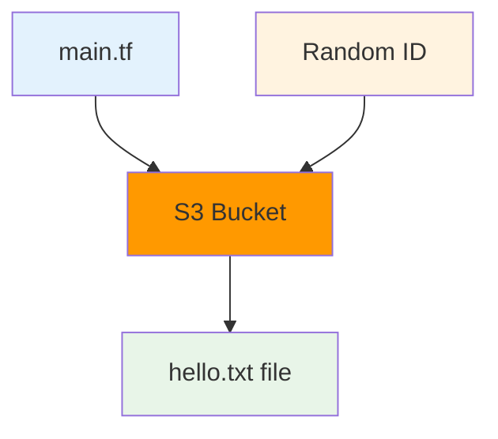
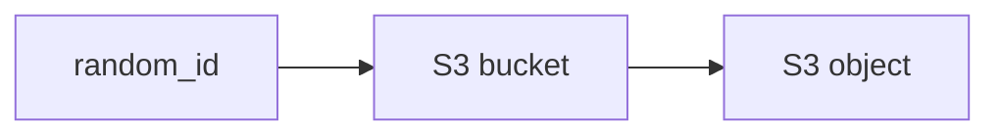

# 🪣 Module 5: S3 Bucket Example (12 minutes)

<div align="center">


**🎯 First AWS Resource | 🪣 S3 Bucket | ☁️ Cloud Infrastructure**

</div>

---

## 🎯 **What We're Building**

A simple S3 bucket with one file - your first real AWS infrastructure with Terraform!



---

## 📋 **Prerequisites**

```bash
# 1. AWS CLI configured
aws configure
# Enter your AWS Access Key ID, Secret, Region

# 2. Verify AWS access
aws sts get-caller-identity
```

---

## 🚀 **Step-by-Step Walkthrough**

### **Step 1: Navigate to S3 Example**

```bash
# Navigate to the S3 example directory
cd ../05-s3-bucket-example

# Or from the repository root:
# cd cloud-devops-learning-path/Section-2-DevOps/Session-8_terraform_and_infra_automation/05-s3-bucket-example

# Check the files
ls -la
```

### **Step 2: Understand the Code**

**main.tf breakdown:**
```hcl
# 1. Configure AWS provider
provider "aws" {
  region = "us-west-2"
}

# 2. Create random suffix (S3 names must be globally unique)
resource "random_id" "bucket_suffix" {
  byte_length = 4
}

# 3. Create S3 bucket
resource "aws_s3_bucket" "my_bucket" {
  bucket = "my-terraform-bucket-${random_id.bucket_suffix.hex}"
}

# 4. Upload a file
resource "aws_s3_object" "hello_file" {
  bucket  = aws_s3_bucket.my_bucket.id
  key     = "hello.txt"
  content = "Hello from Terraform!"
}
```

### **Step 3: Initialize and Plan**

```bash
# Initialize
terraform init

# Plan (see what will be created)
terraform plan
```

**Expected Plan Output:**
```
Plan: 3 to add, 0 to change, 0 to destroy.

Changes to Outputs:
  + bucket_name = (known after apply)
  + bucket_arn  = (known after apply)
  + uploaded_file = "hello.txt"
```

### **Step 4: Apply**

```bash
terraform apply
# Type 'yes' when prompted
```

**Expected Output:**
```
random_id.bucket_suffix: Creating...
random_id.bucket_suffix: Creation complete after 0s
aws_s3_bucket.my_bucket: Creating...
aws_s3_bucket.my_bucket: Creation complete after 2s
aws_s3_object.hello_file: Creating...
aws_s3_object.hello_file: Creation complete after 1s

Apply complete! Resources: 3 added, 0 changed, 0 destroyed.

Outputs:
bucket_name = "my-terraform-bucket-a1b2c3d4"
bucket_arn = "arn:aws:s3:::my-terraform-bucket-a1b2c3d4"
uploaded_file = "hello.txt"
```

### **Step 5: Verify in AWS Console**

1. Go to AWS Console → S3
2. Find your bucket (name from output)
3. Click on the bucket
4. See the `hello.txt` file
5. Click on the file to view its content

---

## 🔍 **Key Concepts Learned**

### **1. AWS Provider**
```hcl
provider "aws" {
  region = "us-west-2"
}
```
- Tells Terraform to use AWS
- Sets the region for resources

### **2. Resource Dependencies**

- Terraform automatically figures out the order
- Bucket must exist before uploading file

### **3. Resource References**
```hcl
bucket = aws_s3_bucket.my_bucket.id
```
- `aws_s3_bucket` = resource type
- `my_bucket` = resource name
- `id` = attribute we want

### **4. String Interpolation**
```hcl
bucket = "my-terraform-bucket-${random_id.bucket_suffix.hex}"
```
- `${}` syntax to insert values
- Makes bucket name unique globally

---

## 🧪 **Try These Experiments**

### **Experiment 1: Add Another File**
Add this to main.tf:
```hcl
resource "aws_s3_object" "goodbye_file" {
  bucket  = aws_s3_bucket.my_bucket.id
  key     = "goodbye.txt"
  content = "Goodbye from Terraform!"
}
```

Then:
```bash
terraform plan
terraform apply
```

### **Experiment 2: Change File Content**
1. Edit the content in `hello_file`
2. Run `terraform plan` - see the update
3. Run `terraform apply`
4. Check the file in AWS Console

### **Experiment 3: Use Variables**
Change the bucket name to use the variable:
```hcl
bucket = "${var.bucket_name}-${random_id.bucket_suffix.hex}"
```

---

## 📊 **Understanding the Output**

```bash
terraform output
```

Shows:
- **bucket_name**: The actual bucket name created
- **bucket_arn**: Amazon Resource Name (unique identifier)
- **uploaded_file**: The file we uploaded

---

## 🧹 **Cleanup**

**Important**: S3 buckets cost money (very little, but still)

```bash
# Destroy everything
terraform destroy
# Type 'yes' when prompted
```

**Expected Output:**
```
aws_s3_object.hello_file: Destroying...
aws_s3_object.hello_file: Destruction complete after 1s
aws_s3_bucket.my_bucket: Destroying...
aws_s3_bucket.my_bucket: Destruction complete after 1s
random_id.bucket_suffix: Destroying...
random_id.bucket_suffix: Destruction complete after 0s

Destroy complete! Resources: 3 destroyed.
```

---

## 🚨 **Common Issues**

### **Issue 1: AWS Credentials**
```
Error: No valid credential sources found
```
**Solution:**
```bash
aws configure
# Enter your credentials
```

### **Issue 2: Bucket Name Exists**
```
Error: BucketAlreadyExists
```
**Solution:** The random suffix should prevent this, but if it happens, run `terraform apply` again.

### **Issue 3: Permission Denied**
```
Error: AccessDenied
```
**Solution:** Check your AWS user has S3 permissions.

---

## ✅ **Module 5 Checkpoint**

Before moving on, make sure you:

- [ ] Successfully created an S3 bucket
- [ ] Uploaded a file to the bucket
- [ ] Saw the resources in AWS Console
- [ ] Understood resource dependencies
- [ ] Used terraform outputs
- [ ] Cleaned up resources with destroy

### **Key Takeaways**
- 🪣 **S3 buckets** need globally unique names
- 🔗 **Dependencies** are handled automatically by Terraform
- 📊 **Outputs** show important information about created resources
- 💰 **Cleanup** is important to avoid costs
- ☁️ **Real AWS resources** work the same as local files

---

<div align="center">

### 🚀 **Ready for Compute Resources?**

**Next Module: [06 - EC2 Instance Example](../06-ec2-instance-example/README.md)**

*Create your first virtual server in the cloud*

</div>

---

**Module Duration**: 12 minutes  
**Difficulty**: Beginner  
**Cost**: ~$0.01 (if cleaned up quickly)
