# 🖥️ Module 6: EC2 Instance Example ()

<div align="center">


**🎯 Virtual Server | 🌐 Web Server | 🔒 Security Groups**

</div>

---

## 🎯 **What We're Building**

A simple web server running on AWS EC2 with a security group for access control.

```mermaid
graph TB
    A[Security Group<br/>🔒 Firewall Rules] --> B[EC2 Instance<br/>🖥️ Virtual Server]
    B --> C[Web Server<br/>🌐 Apache HTTP]
    
    style A fill:#ffebee
    style B fill:#ff9900
    style C fill:#e8f5e8
```



---

## 🚀 **Step-by-Step Walkthrough**

### **Step 1: Navigate to EC2 Example**

```bash
# Navigate to the EC2 example directory
cd ../06-ec2-instance-example

# Or from the repository root:
# cd cloud-devops-learning-path/Section-2-DevOps/Session-8_terraform_and_infra_automation/06-ec2-instance-example

# Check the files
ls -la
```

### **Step 2: Understand the Code**

**Security Group (Firewall):**
```hcl
resource "aws_security_group" "web_sg" {
  name = "terraform-web-sg"
  
  # Allow HTTP (port 80)
  ingress {
    from_port   = 80
    to_port     = 80
    protocol    = "tcp"
    cidr_blocks = ["0.0.0.0/0"]  # From anywhere
  }
  
  # Allow SSH (port 22)
  ingress {
    from_port   = 22
    to_port     = 22
    protocol    = "tcp"
    cidr_blocks = ["0.0.0.0/0"]  # From anywhere
  }
}
```

**EC2 Instance:**
```hcl
resource "aws_instance" "web_server" {
  ami           = "ami-0c02fb55956c7d316"  # Amazon Linux 2
  instance_type = "t2.micro"               # Free tier
  
  vpc_security_group_ids = [aws_security_group.web_sg.id]
  
  user_data = <<-EOF
    #!/bin/bash
    yum install -y httpd
    systemctl start httpd
    echo "<h1>Hello from Terraform!</h1>" > /var/www/html/index.html
  EOF
}
```

### **Step 3: Deploy**

```bash
# Initialize
terraform init

# Plan
terraform plan

# Apply
terraform apply
# Type 'yes'
```

**Expected Output:**
```
aws_security_group.web_sg: Creating...
aws_security_group.web_sg: Creation complete after 2s
aws_instance.web_server: Creating...
aws_instance.web_server: Still creating... [10s elapsed]
aws_instance.web_server: Still creating... [20s elapsed]
aws_instance.web_server: Creation complete after 31s

Apply complete! Resources: 2 added, 0 changed, 0 destroyed.

Outputs:
instance_id = "i-1234567890abcdef0"
public_ip = "54.123.45.67"
website_url = "http://54.123.45.67"
```

### **Step 4: Test Your Web Server**

```bash
# Get the website URL
terraform output website_url

# Visit the URL in your browser
# You should see "Hello from Terraform!"
```

---

## 🔍 **Key Concepts**

### **1. Security Groups**
- Act like a firewall for your instance
- Control inbound and outbound traffic
- Must be created before the instance

### **2. User Data**
- Script that runs when instance starts
- Installs and configures software
- Runs as root user

### **3. AMI (Amazon Machine Image)**
- Template for the operating system
- `ami-0c02fb55956c7d316` = Amazon Linux 2
- Different regions have different AMI IDs

### **4. Instance Types**
- `t2.micro` = 1 vCPU, 1 GB RAM
- Free tier eligible (750 hours/month)
- Good for learning and small applications

---

## 🧪 **Experiments**

### **Experiment 1: Change the Web Page**
Edit the user_data script:
```hcl
user_data = <<-EOF
  #!/bin/bash
  yum install -y httpd
  systemctl start httpd
  echo "<h1>My Custom Page!</h1>" > /var/www/html/index.html
  echo "<p>Instance ID: $(curl -s http://169.254.169.254/latest/meta-data/instance-id)</p>" >> /var/www/html/index.html
EOF
```

Then:
```bash
terraform apply
```

### **Experiment 2: Add HTTPS**
Add to security group:
```hcl
ingress {
  from_port   = 443
  to_port     = 443
  protocol    = "tcp"
  cidr_blocks = ["0.0.0.0/0"]
}
```

---

## 📊 **Check Your Resources**

### **In AWS Console:**
1. Go to EC2 Dashboard
2. Click "Instances" - see your server
3. Click "Security Groups" - see your firewall rules
4. Note the public IP address

### **Using Terraform:**
```bash
# Show all resources
terraform show

# Get specific output
terraform output public_ip

# List all resources
terraform state list
```

---

## 🧹 **Cleanup**

**Important**: EC2 instances cost money (~$0.01/hour)

```bash
terraform destroy
# Type 'yes'
```

**Expected Output:**
```
aws_instance.web_server: Destroying...
aws_instance.web_server: Still destroying... [10s elapsed]
aws_instance.web_server: Destruction complete after 31s
aws_security_group.web_sg: Destroying...
aws_security_group.web_sg: Destruction complete after 1s

Destroy complete! Resources: 2 destroyed.
```

---

## 🚨 **Common Issues**

### **Issue 1: Website Not Loading**
- Wait 2- after creation
- Check security group allows port 80
- Verify public IP in browser

### **Issue 2: Wrong AMI**
```
Error: InvalidAMIID.NotFound
```
**Solution:** AMI IDs are region-specific. Use:
- `us-west-2`: `ami-0c02fb55956c7d316`
- `us-east-1`: `ami-0abcdef1234567890`

### **Issue 3: Instance Won't Start**
- Check user_data script syntax
- Look at instance logs in AWS Console

---

## ✅ **Module 6 Checkpoint**

Make sure you:

- [ ] Created a security group with HTTP and SSH rules
- [ ] Launched an EC2 instance
- [ ] Accessed the web server in your browser
- [ ] Understood user_data scripts
- [ ] Cleaned up resources

### **Key Takeaways**
- 🔒 **Security groups** control network access
- 🖥️ **EC2 instances** are virtual servers in the cloud
- 📜 **User data** automates software installation
- 💰 **Always clean up** to avoid charges
- 🌐 **Public IPs** allow internet access

---

<div align="center">

### 🚀 **Ready for Advanced Configuration?**

**Next Module: [07 - Configuration Management](../07-configuration-management/README.md)**

*Learn variables, outputs, and advanced Terraform features*

</div>

---

**Module Duration**:   
**Difficulty**: Beginner  
**Cost**: ~$0.15 (if cleaned up within an hour)
