# ⚙️ Module 7: Configuration Management ()

<div align="center">


**🎯 Variables & Outputs | 📝 Templates | 🔧 Advanced Config**

</div>

---

## 🎯 **What We're Learning**

Advanced Terraform configuration using variables, outputs, data sources, and templates.

```mermaid
graph TB
    A[variables.tf<br/>📝 Input Variables] --> B[main.tf<br/>🏗️ Resources]
    C[terraform.tfvars<br/>⚙️ Variable Values] --> B
    D[user-data.sh<br/>📄 Template] --> B
    B --> E[outputs.tf<br/>📊 Results]
    
    style A fill:#e3f2fd
    style B fill:#fff3e0
    style C fill:#f3e5f5
    style D fill:#e8f5e8
    style E fill:#ffebee
```



---

## 🔧 **Key Concepts**

### **1. Variables**
```hcl
variable "project_name" {
  description = "Name of the project"
  type        = string
  default     = "terraform-demo"
}
```

### **2. Local Values**
```hcl
locals {
  common_tags = {
    Project     = var.project_name
    Environment = var.environment
    ManagedBy   = "Terraform"
  }
}
```

### **3. Data Sources**
```hcl
data "aws_ami" "amazon_linux" {
  most_recent = true
  owners      = ["amazon"]
  
  filter {
    name   = "name"
    values = ["amzn2-ami-hvm-*-x86_64-gp2"]
  }
}
```

### **4. Template Files**
```hcl
user_data = templatefile("${path.module}/user-data.sh", {
  project_name = var.project_name
  environment  = var.environment
})
```

---

## 🚀 **Step-by-Step**

### **Step 1: Navigate to Configuration Management Example**
```bash
# Navigate to the configuration management directory
cd ../07-configuration-management

# Or from the repository root:
# cd cloud-devops-learning-path/Section-2-DevOps/Session-8_terraform_and_infra_automation/07-configuration-management

# Check the files
ls -la
```

### **Step 2: Set Up Variables**
```bash
# Copy example file
cp terraform.tfvars.example terraform.tfvars

# Edit with your values
nano terraform.tfvars
```

### **Step 3: Deploy**
```bash
terraform init
terraform plan
terraform apply
```

### **Step 4: Test Different Configurations**
Edit `terraform.tfvars`:
```hcl
project_name  = "my-cool-app"
environment   = "staging"
instance_type = "t2.small"
enable_ssh    = false
```

Then:
```bash
terraform plan  # See what changes
terraform apply # Apply changes
```

---

## 🧪 **Experiments**

### **Experiment 1: Add New Variable**
Add to `variables.tf`:
```hcl
variable "server_port" {
  description = "Port for web server"
  type        = number
  default     = 80
}
```

Use in security group:
```hcl
ingress {
  from_port   = var.server_port
  to_port     = var.server_port
  protocol    = "tcp"
  cidr_blocks = ["0.0.0.0/0"]
}
```

### **Experiment 2: Conditional Resources**
```hcl
# Only create if SSH is enabled
resource "aws_key_pair" "web_key" {
  count      = var.enable_ssh ? 1 : 0
  key_name   = "${var.project_name}-key"
  public_key = file("~/.ssh/id_rsa.pub")
}
```

---

## 📊 **Understanding Outputs**

```bash
# See all outputs
terraform output

# Get specific output
terraform output website_url

# Use output in scripts
URL=$(terraform output -raw website_url)
curl $URL
```

---

## ✅ **Module 7 Checkpoint**

Make sure you understand:

- [ ] How to define and use variables
- [ ] Local values for computed data
- [ ] Data sources for existing resources
- [ ] Template files for dynamic content
- [ ] Conditional resource creation
- [ ] Structured outputs

### **Key Takeaways**
- 📝 **Variables** make configurations reusable
- 🔍 **Data sources** query existing resources
- 📄 **Templates** create dynamic content
- 📊 **Outputs** expose important information
- 🏷️ **Locals** compute values from variables

---

<div align="center">

### 🚀 **Ready for Final Projects?**

**Next Module: [08 - Final Project 1](../08-final-project-1/README.md)**

*Build a complete web server stack*

</div>
