# 🎯 Final Project 1: Web Server Stack

<div align="center">


**🎯 Complete Stack | 🔑 SSH Access | 🌐 Beautiful Website**

</div>

---

## 🎯 **What We're Building**

A complete web server stack with all the essentials:

```mermaid
graph TB
    A[🔑 SSH Key Pair] --> B[🖥️ EC2 Instance]
    C[🔒 Security Group] --> B
    B --> D[🌐 Web Server]
    D --> E[📄 Custom Website]
    
    style A fill:#e3f2fd
    style B fill:#ff9900
    style C fill:#ffebee
    style D fill:#e8f5e8
    style E fill:#fff3e0
```



---

## 🚀 **Quick Deploy**

### **Step 1: Navigate to Final Project 1**
```bash
# Navigate to the final project 1 directory
cd ../08-final-project-1

# Or from the repository root:
# cd cloud-devops-learning-path/Section-2-DevOps/Session-8_terraform_and_infra_automation/08-final-project-1

# Check the files
ls -la
```

### **Step 2: Verify SSH Key**
```bash
# Check your SSH key exists
ls ~/.ssh/id_rsa.pub

# If you don't have one, create it:
# ssh-keygen -t rsa -b 2048 -f ~/.ssh/id_rsa
```

### **Step 3: Deploy**
```bash
terraform init
terraform apply
# Type 'yes'
```

### **Step 4: Test**
```bash
# Get website URL
terraform output website_url

# Visit in browser - you'll see a beautiful website!

# SSH to server
terraform output ssh_command
# Use your private key: ssh -i ~/.ssh/id_rsa ec2-user@[PUBLIC-IP]
```

---

## 🎉 **What You've Accomplished**

- ✅ **Complete Infrastructure Stack**
- ✅ **SSH Key Management** (using your existing keys)
- ✅ **Security Group Configuration**
- ✅ **Custom Web Application**
- ✅ **Professional-Looking Website**

---

## 🧹 **Cleanup**
```bash
terraform destroy
```

---

<div align="center">

### 🚀 **Ready for the Ultimate Challenge?**

**Next Module: [09 - Final Project 2](../09-final-project-2/README.md)**

*Build a full application with Load Balancer + S3 + EC2*

</div>
