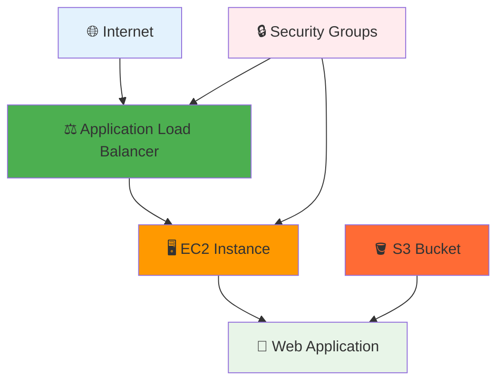

# 🏆 Final Project 2: Full-Stack Application

<div align="center">


**🎯 Production Ready | ⚖️ Load Balanced | 🪣 S3 Integration**

</div>

---

## 🎯 **The Ultimate Terraform Project**

A complete, production-ready application with all the bells and whistles:



---

## 🚀 **Deploy the Ultimate Stack**

### **One Command Deploy**
```bash
terraform init
terraform apply
# Type 'yes' and wait ~3-4 minutes
```

### **Access Your Application**
```bash
# Get the application URL
terraform output application_url

# Visit in browser - see your full-stack app!
```

---

## 🎉 **What You've Built**

### **Infrastructure Components:**
- ⚖️ **Application Load Balancer** - Distributes traffic
- 🖥️ **EC2 Instance** - Runs your application
- 🪣 **S3 Bucket** - Stores static assets (CSS)
- 🔒 **Security Groups** - Network security
- 🎯 **Target Groups** - Health checking
- 🌐 **VPC Integration** - Network configuration

### **Application Features:**
- 📱 **Responsive Design** - Works on all devices
- 🎨 **CSS from S3** - Static assets served from S3
- 📊 **Real-time Metadata** - Shows server information
- 🏆 **Professional UI** - Production-quality interface

---

## 🎓 **Congratulations!**

You've completed the **Complete Terraform Mastery Course**!

### **Skills You've Mastered:**
- ✅ Terraform fundamentals and architecture
- ✅ AWS resource provisioning
- ✅ Infrastructure as Code best practices
- ✅ Resource dependencies and relationships
- ✅ Variables, outputs, and configuration management
- ✅ Security group configuration
- ✅ Load balancer setup
- ✅ S3 integration
- ✅ Complete application deployment

### **What's Next:**
- 🚀 Build your own projects
- 📚 Explore Terraform modules
- 🔧 Learn advanced features (remote state, workspaces)
- 🏢 Apply these skills in production environments
- 🎯 Get Terraform certified

---

## 🧹 **Cleanup**
```bash
terraform destroy
# Type 'yes' to clean up all resources
```

---

<div align="center">

### 🎉 **Course Complete!**

**You're now a Terraform practitioner ready to build real infrastructure!**

*Thank you for completing the Complete Terraform Mastery Course*

</div>

---

**Skills Level**: Beginner → Intermediate  
**Resources Created**: 8 AWS resources in a production-ready stack
