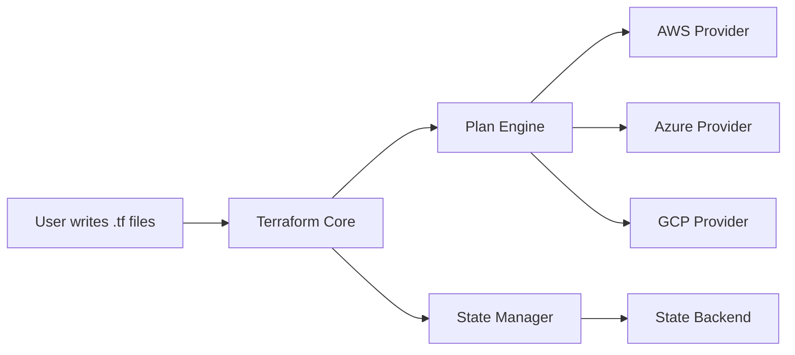
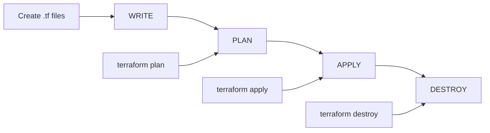
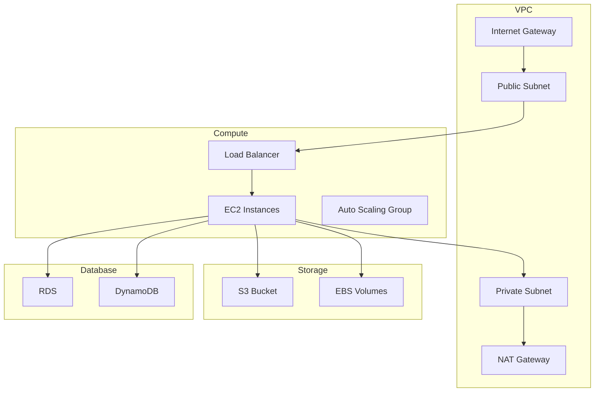
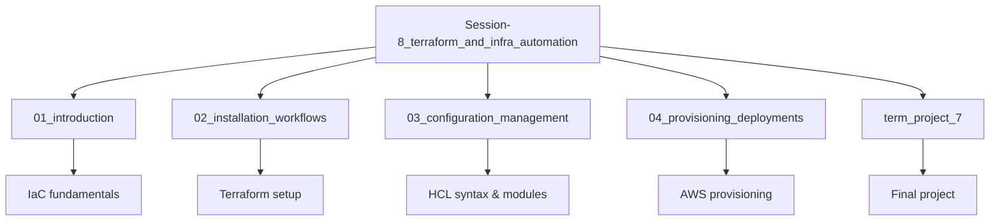

# 🏗️ Session 8: Terraform and Infrastructure Automation

<div align="center">


**🎯 Master Infrastructure as Code | 🚀 Automate Cloud Deployments | 📊 Terraform Workflows**

</div>

---

## 📋 Module Overview

This module will help you create, manage and maintain resources using Terraform and gain experience using Terraform to provision resources in cloud environments.

### 🎯 Learning Objectives
- ✅ Understand Infrastructure as Code principles
- ✅ Master Terraform installation and workflows
- ✅ Implement configuration management and orchestration
- ✅ Deploy and manage AWS resources with Terraform

---

## 🚀 **What is Terraform?**

Terraform is an open-source Infrastructure as Code (IaC) tool created by **HashiCorp** in **2014** by founders **Mitchell Hashimoto** and **Armon Dadgar**.

### **The Problem Terraform Solves:**
- ❌ Manual infrastructure setup through GUI clicks
- ❌ Configuration drift and inconsistencies
- ❌ No version control for infrastructure changes
- ❌ Slow provisioning (hours/days)
- ❌ Human errors in manual configurations

### **Terraform Solution:**
- ✅ **Declarative Configuration** - Define what you want, not how to get it
- ✅ **Multi-Cloud Support** - Works with AWS, Azure, GCP, and 3000+ providers
- ✅ **State Management** - Tracks real vs desired infrastructure state
- ✅ **Fast Provisioning** - Minutes instead of hours/days

---

## 🏗️ **How Terraform Works**

### **Terraform Architecture:**



### **Terraform Workflow:**



### **Example Configuration:**
```hcl
# Simple EC2 instance
resource "aws_instance" "web" {
  ami           = "ami-0c02fb55956c7d316"
  instance_type = "t3.micro"
  
  tags = {
    Name = "HelloWorld"
  }
}
```

---

## ⚡ **Key Features**

| Feature | Description | Benefit |
|---------|-------------|---------|
| **Fast Startup** | < 2 seconds cold start | Quick development cycles |
| **Parallel Execution** | Up to 10 concurrent operations | Faster deployments |
| **State Management** | Tracks infrastructure changes | Prevents configuration drift |
| **Multi-Cloud** | 3000+ providers supported | Avoid vendor lock-in |
| **Plan Preview** | See changes before applying | Reduce deployment risks |

---

## 📚 Course Topics

### **1. Introduction to Infrastructure as Code**
- IaC fundamentals and benefits
- Terraform vs other tools

### **2. Terraform Installation & Workflows**
- Installation and setup
- CLI commands and usage

### **3. Configuration Management & Orchestration**
- HCL syntax and structure
- Variables and modules

### **4. Provisioning and Deployments**
- AWS provider configuration
- Resource provisioning

---

## 🎯 Term Project 7: Deploy Resources using Terraform on AWS

### **Project Architecture:**



### **Project Goals:**
- ✅ Create reusable Terraform modules
- ✅ Provision AWS resources (EC2, VPC, S3, RDS)
- ✅ Implement proper state management
- ✅ Follow Terraform best practices

### **Deliverables:**
- [ ] Terraform configuration files (.tf)
- [ ] AWS resource deployment
- [ ] Remote state with S3 backend
- [ ] Reusable modules
- [ ] Documentation

---

## 🚀 Getting Started

### **Prerequisites:**
- ✅ AWS CLI configured
- ✅ Terraform installed
- ✅ AWS account with permissions

### **Quick Start:**
```bash
# Navigate to module directory
cd /tmp/cloud-devops-learning-path/Section-2-DevOps/Session-8_terraform_and_infra_automation

# Check Terraform installation
terraform version

# Initialize Terraform
terraform init

# Plan deployment
terraform plan

# Apply changes
terraform apply
```

### **Install Terraform (Ubuntu):**
```bash
wget -O- https://apt.releases.hashicorp.com/gpg | sudo gpg --dearmor -o /usr/share/keyrings/hashicorp-archive-keyring.gpg
echo "deb [signed-by=/usr/share/keyrings/hashicorp-archive-keyring.gpg] https://apt.releases.hashicorp.com $(lsb_release -cs) main" | sudo tee /etc/apt/sources.list.d/hashicorp.list
sudo apt update && sudo apt install terraform
```

---

## 📁 Module Structure



---

## 📊 Expected Learning Outcomes

After completing this module:

### **Technical Skills:**
- ✅ Write and manage Terraform configurations
- ✅ Provision AWS infrastructure automatically
- ✅ Handle Terraform state effectively
- ✅ Create reusable infrastructure modules

### **Professional Skills:**
- ✅ Implement DevOps practices
- ✅ Version control infrastructure code
- ✅ Document infrastructure solutions
- ✅ Follow security best practices

---

<div align="center">

### 🎯 **Ready to Automate Your Infrastructure?**

**Start Learning: [01 Introduction to IaC](./01_introduction/README.md)**

*Transform your infrastructure management with Terraform automation!*

</div>
