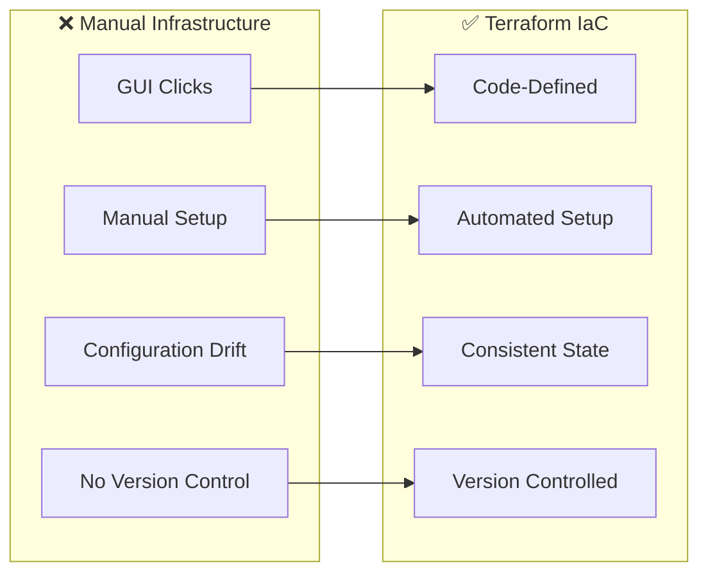
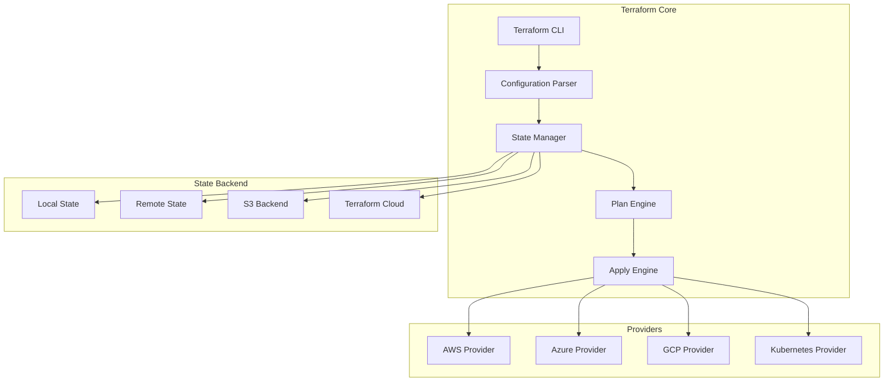
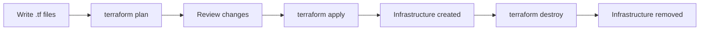
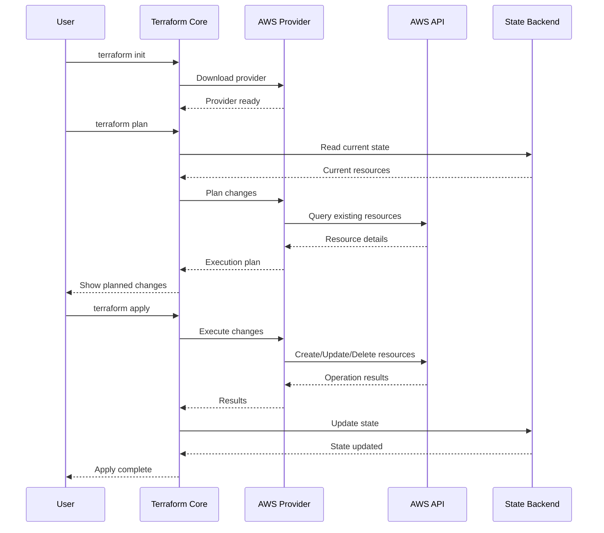

# 🏗️ Session 8: Terraform and Infrastructure Automation

<div align="center">


**🎯 Master Infrastructure as Code | 🚀 Automate Cloud Deployments | 📊 Terraform Workflows**

</div>

---

## 📋 **What You'll Learn**

By the end of this session, you'll master:
- ✅ **Terraform Fundamentals** - Infrastructure as Code concepts
- ✅ **AWS Resource Provisioning** - Create and manage cloud infrastructure
- ✅ **Terraform Workflows** - Plan, apply, and destroy infrastructure
- ✅ **Production Deployment** - Real-world infrastructure automation

---

## 📚 **What is Terraform?**

### **Simple Explanation:**
Terraform is an Infrastructure as Code (IaC) tool that lets you define cloud resources using configuration files instead of clicking through web consoles.

### **The Problem It Solves:**



### **Key Benefits:**
- 🔄 **Repeatable** - Same infrastructure every time
- 📝 **Version Controlled** - Track all infrastructure changes
- 🚀 **Fast Provisioning** - Minutes instead of hours
- 🔒 **Consistent** - No configuration drift
- 🌐 **Multi-Cloud** - Works with AWS, Azure, GCP

---

## 📖 **Terraform History & Evolution**

### **Timeline:**
- **2014** - Terraform created by **Mitchell Hashimoto** at HashiCorp
- **2015** - First stable release (v0.1.0) with basic AWS support
- **2016** - Multi-provider support added (Azure, GCP, VMware)
- **2017** - Terraform Enterprise launched for teams
- **2018** - HCL 2.0 introduced with improved syntax
- **2019** - Terraform Cloud launched (SaaS offering)
- **2020** - Terraform 0.13 with provider registry
- **2021** - Terraform 1.0 released (stable API guarantee)
- **2023** - Terraform 1.5+ with advanced state management

### **Key Milestones:**
- **50+ Million Downloads** - Most popular IaC tool
- **3000+ Providers** - Support for virtually every cloud service
- **100,000+ Organizations** - Using Terraform in production
- **Open Source** - Apache 2.0 license with active community

### **Founders & Vision:**
- **Mitchell Hashimoto** - Co-founder of HashiCorp, creator of Vagrant, Consul
- **Armon Dadgar** - Co-founder, focus on distributed systems
- **Vision:** "Infrastructure as Code for everyone, everywhere"

---

## 🏗️ **Terraform Architecture**

### **Core Components:**



### **How Terraform Works:**



### **Terraform Workflow Deep Dive:**



### **Architecture Components:**

| Component | Purpose | Example |
|-----------|---------|---------|
| **Terraform Core** | Main engine that processes configurations | CLI, plan/apply logic |
| **Providers** | Plugins that interact with APIs | AWS, Azure, GCP providers |
| **State** | Tracks real-world resource mapping | terraform.tfstate file |
| **Configuration** | HCL files defining desired infrastructure | main.tf, variables.tf |
| **Modules** | Reusable infrastructure components | VPC module, web server module |

---

## 🆚 **Terraform vs Alternatives**

| Feature | Terraform | CloudFormation | Pulumi | Manual Setup |
|---------|-----------|----------------|--------|--------------|
| **Multi-Cloud** | ✅ Yes | ❌ AWS Only | ✅ Yes | ❌ No |
| **Learning Curve** | ⭐⭐⭐ Medium | ⭐⭐⭐ Medium | ⭐⭐⭐⭐ Hard | ⭐ Easy |
| **State Management** | ✅ Built-in | ✅ Managed | ✅ Built-in | ❌ None |
| **Community** | 🌟 Large | 📊 Medium | 📈 Growing | ❌ None |
| **Speed** | ⚡ Fast | 📊 Medium | ⚡ Fast | 🐌 Slow |
| **Version Control** | ✅ Yes | ✅ Yes | ✅ Yes | ❌ No |
| **Founded** | 2014 | 2011 | 2017 | N/A |
| **Language** | HCL | JSON/YAML | Multiple | N/A |

### **When to Choose Terraform:**
- ✅ Multi-cloud or cloud-agnostic infrastructure
- ✅ Team collaboration on infrastructure
- ✅ Complex infrastructure requirements
- ✅ Infrastructure versioning and rollbacks
- ✅ Learning industry-standard IaC

---

## 🎯 **Learning Path**

### **📁 Module Structure:**
```
Session-8_terraform_and_infra_automation/
├── README.md                    # This overview guide
├── 02_installation_workflows/   # Hands-on: Install & First Resources
├── 03_configuration_management/ # Advanced: Variables & Modules  
├── 04_provisioning_deployments/ # Production: Real AWS Infrastructure
└── term_project_7/             # Final: Complete Multi-Service App
```

### **🚀 Recommended Learning Flow:**

1. **[02 Installation & Workflows](./02_installation_workflows/)** - Start here for hands-on practice
2. **[03 Configuration Management](./03_configuration_management/)** - Learn advanced concepts
3. **[04 Provisioning & Deployments](./04_provisioning_deployments/)** - Build production infrastructure
4. **[Term Project 7](./term_project_7/)** - Complete integrated project

---

## ⚡ **Essential Commands Reference**

### **Basic Workflow:**
```bash
terraform init      # Initialize project
terraform plan      # Preview changes
terraform apply     # Apply changes
terraform destroy   # Delete resources
```

### **State Management:**
```bash
terraform show      # Show current state
terraform state list    # List resources
terraform output    # Show outputs
terraform refresh   # Update state
```

### **Code Quality:**
```bash
terraform fmt       # Format code
terraform validate  # Check syntax
terraform graph     # Visualize dependencies
```

---

## 📊 **Success Criteria**

By completing this module, you'll be able to:

### **Technical Skills:**
- [ ] Understand Terraform architecture and components
- [ ] Write Terraform configurations in HCL
- [ ] Provision AWS resources automatically
- [ ] Manage infrastructure state effectively
- [ ] Create reusable infrastructure modules
- [ ] Implement infrastructure best practices

### **Practical Knowledge:**
- [ ] Plan and apply infrastructure changes safely
- [ ] Version control infrastructure code
- [ ] Troubleshoot common Terraform issues
- [ ] Design scalable infrastructure patterns
- [ ] Implement security best practices

---

<div align="center">

### 🚀 **Ready to Get Hands-On?**

**Start Here: [02 Installation & Workflows](./02_installation_workflows/README.md)**

*From theory to practice - build your first infrastructure with code!*

</div>
