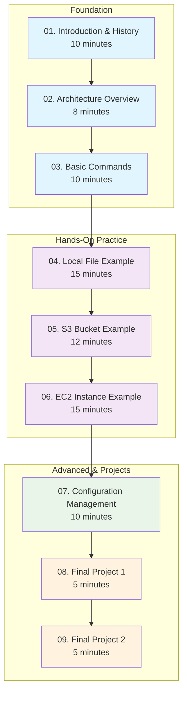
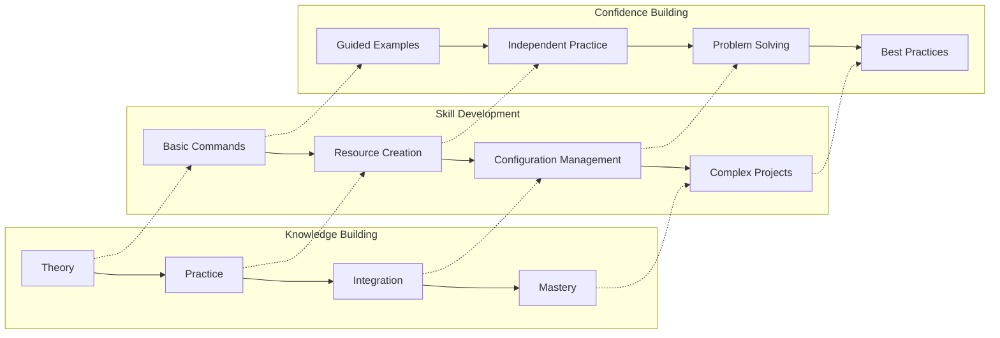

# 🚀 Complete Terraform Mastery Course

<div align="center">


**🎯 From Zero to Infrastructure Hero | 🚀 Hands-On Learning | 📊 Real Projects**

</div>

---

## 📋 **Course Overview**

Transform from Terraform beginner to confident Infrastructure as Code practitioner through hands-on projects and real-world examples.

### **🎯 Learning Outcomes**
By the end of this course, you'll be able to:
- ✅ Understand Terraform fundamentals and architecture
- ✅ Write and execute Terraform configurations
- ✅ Deploy AWS infrastructure automatically
- ✅ Manage infrastructure state and variables
- ✅ Build complete multi-service applications
- ✅ Follow Terraform best practices

---

## ⏰ **Course Timeline**

```mermaid
gantt
    title Complete Terraform Course Timeline
    dateFormat X
    axisFormat %M min
    
    section Foundation
    Introduction & History     :intro, 0, 10
    Architecture Overview      :arch, 10, 8
    Basic Commands            :commands, 18, 10
    
    section Hands-On Practice
    Local File Example        :local, 28, 15
    S3 Bucket Example         :s3, 43, 12
    EC2 Instance Example      :ec2, 55, 15
    
    section Advanced Concepts
    Configuration Management  :config, 70, 10
    
    section Final Projects
    Project 1 - Web Server    :proj1, 80, 5
    Project 2 - Full Stack    :proj2, 85, 5
```



---

## 📚 **Module Structure**

### **🏗️ Course Architecture**



---

## 📖 **Detailed Module Breakdown**

### **Module 1: Introduction & History (10 minutes)**
- **What is Terraform?** - Infrastructure as Code fundamentals
- **History & Evolution** - From 2014 to present day
- **Why Terraform?** - Problems it solves vs manual infrastructure
- **Key Benefits** - Repeatability, version control, consistency

### **Module 2: Architecture Overview (8 minutes)**
- **Core Components** - CLI, providers, state, configuration
- **Terraform Workflow** - init, plan, apply, destroy
- **Provider Ecosystem** - AWS, Azure, GCP, and 3000+ providers
- **State Management** - How Terraform tracks resources

### **Module 3: Basic Commands (10 minutes)**
- **Essential Commands** - init, plan, apply, destroy, show
- **Command Options** - Common flags and parameters
- **Workflow Best Practices** - Safe deployment patterns
- **Troubleshooting** - Common errors and solutions

### **Module 4: Local File Example (15 minutes)**
- **First Terraform Project** - Simple local file creation
- **Configuration Syntax** - HCL basics and structure
- **Step-by-Step Execution** - Complete walkthrough
- **Understanding Output** - Reading Terraform responses

### **Module 5: S3 Bucket Example (12 minutes)**
- **AWS Provider Setup** - Authentication and configuration
- **S3 Resource Creation** - Basic bucket with properties
- **Resource Dependencies** - Understanding implicit dependencies
- **State Inspection** - Examining terraform.tfstate

### **Module 6: EC2 Instance Example (15 minutes)**
- **EC2 Configuration** - Instance, AMI, instance type
- **Security Groups** - Network access controls
- **Key Pairs** - SSH access setup
- **Resource Relationships** - Explicit dependencies

### **Module 7: Configuration Management (10 minutes)**
- **Variables** - Input variables and default values
- **Outputs** - Exposing resource information
- **Data Sources** - Querying existing resources
- **Local Values** - Computed values and expressions

### **Module 8: Final Project 1 (5 minutes)**
- **Web Server Stack** - EC2 + Security Group + Key Pair
- **User Data Script** - Automated software installation
- **Static Website** - Simple index.html deployment
- **Testing & Validation** - Verifying deployment

### **Module 9: Final Project 2 (5 minutes)**
- **Full Application Stack** - ALB + S3 + EC2 + Security Groups
- **Load Balancer Setup** - Application Load Balancer configuration
- **Multi-Service Integration** - Connecting all components
- **Production Readiness** - Best practices implementation

---

## 🗂️ **Directory Structure**

```
terraform-90min-course/
├── README.md                           # This course overview
├── 01-introduction-history/            # Module 1: Foundation
│   └── README.md
├── 02-architecture-overview/           # Module 2: Architecture
│   └── README.md
├── 03-basic-commands/                  # Module 3: Commands
│   └── README.md
├── 04-local-file-example/              # Module 4: First Project
│   ├── README.md
│   └── main.tf
├── 05-s3-bucket-example/               # Module 5: AWS Basics
│   ├── README.md
│   ├── main.tf
│   └── variables.tf
├── 06-ec2-instance-example/            # Module 6: Compute
│   ├── README.md
│   ├── main.tf
│   ├── variables.tf
│   └── outputs.tf
├── 07-configuration-management/        # Module 7: Advanced Config
│   ├── README.md
│   ├── main.tf
│   ├── variables.tf
│   ├── outputs.tf
│   └── terraform.tfvars.example
├── 08-final-project-1/                 # Module 8: Web Server
│   ├── README.md
│   ├── main.tf
│   ├── variables.tf
│   ├── outputs.tf
│   └── user-data.sh
└── 09-final-project-2/                 # Module 9: Full Stack
    ├── README.md
    ├── main.tf
    ├── variables.tf
    ├── outputs.tf
    └── user-data.sh
```

---

## 🚀 **Getting Started**

### **Prerequisites**
- **AWS Account** - Free tier eligible
- **AWS CLI** - Configured with credentials
- **Terraform** - Version 1.0+ installed
- **SSH Key Pair** - Available locally (we'll use your existing SSH keys)
- **Text Editor** - VS Code recommended
- **Terminal Access** - Command line interface

### **Quick Setup**
```bash
# Verify prerequisites
terraform version
aws sts get-caller-identity

# Check SSH keys (we'll use these in projects)
ls ~/.ssh/
# You should see id_rsa and id_rsa.pub (or similar)

# Start with Module 1
cd 01-introduction-history
```

---

## 📊 **Learning Path Visualization**



---

## 🎯 **Success Metrics**

### **Knowledge Checkpoints**
- [ ] Can explain what Infrastructure as Code means
- [ ] Understands Terraform's core architecture
- [ ] Knows essential Terraform commands
- [ ] Can write basic Terraform configurations
- [ ] Understands variables and outputs
- [ ] Can deploy multi-resource infrastructure
- [ ] Follows Terraform best practices

### **Practical Skills**
- [ ] Successfully deploys local file resource
- [ ] Creates and manages S3 bucket
- [ ] Provisions EC2 instance with security group
- [ ] Implements variable-driven configurations
- [ ] Builds complete web server stack
- [ ] Deploys full application infrastructure

---

## 🔧 **Troubleshooting Guide**

### **Common Issues & Solutions**

| Issue | Symptom | Solution |
|-------|---------|----------|
| **Provider Not Found** | `provider not found` | Run `terraform init` |
| **Authentication Error** | `Unable to locate credentials` | Configure AWS CLI |
| **State Lock** | `state locked` | Check for running processes |
| **Resource Exists** | `already exists` | Import or use different name |
| **Permission Denied** | `Access Denied` | Check IAM permissions |

### **Best Practices Checklist**
- ✅ Always run `terraform plan` before `apply`
- ✅ Use version control for all `.tf` files
- ✅ Never commit `.tfstate` files
- ✅ Use meaningful resource names
- ✅ Add comments to complex configurations
- ✅ Validate configurations with `terraform validate`
- ✅ Format code with `terraform fmt`

---

## 📚 **Additional Resources**

### **Official Documentation**
- [Terraform Documentation](https://www.terraform.io/docs)
- [AWS Provider Documentation](https://registry.terraform.io/providers/hashicorp/aws/latest/docs)
- [Terraform Best Practices](https://www.terraform.io/docs/cloud/guides/recommended-practices/index.html)

### **Community Resources**
- [Terraform GitHub](https://github.com/hashicorp/terraform)
- [Terraform Community Forum](https://discuss.hashicorp.com/c/terraform-core)
- [AWS Terraform Examples](https://github.com/terraform-aws-modules)

---

<div align="center">

### 🚀 **Ready to Start Your Terraform Journey?**

**Begin Here: [Module 1 - Introduction & History](./01-introduction-history/README.md)**

*Transform your infrastructure management in the next 90 minutes!*

</div>

---

**Course Created by**: AI Learning Path Program  
**Duration**: 90 Minutes  
**Difficulty**: Beginner to Intermediate  
**Last Updated**: December 2024
