# 🏗️ Session 8: Terraform and Infrastructure Automation

<div align="center">


**🎯 Master Infrastructure as Code | 🚀 Automate Cloud Deployments | 📊 Terraform Workflows**

</div>

---

## 📋 **What You'll Learn**

By the end of this session, you'll master:
- ✅ **Terraform Fundamentals** - Infrastructure as Code concepts
- ✅ **AWS Resource Provisioning** - Create and manage cloud infrastructure
- ✅ **Terraform Workflows** - Plan, apply, and destroy infrastructure
- ✅ **Production Deployment** - Real-world infrastructure automation

---

## 📚 **What is Terraform?**

### **Simple Explanation:**
Terraform is an Infrastructure as Code (IaC) tool that lets you define cloud resources using configuration files instead of clicking through web consoles.

### **The Problem It Solves:**

```mermaid
graph LR
    subgraph "❌ Manual Infrastructure"
        A1[GUI Clicks]
        A2[Manual Setup]
        A3[Configuration Drift]
        A4[No Version Control]
    end
    
    subgraph "✅ Terraform IaC"
        B1[Code-Defined]
        B2[Automated Setup]
        B3[Consistent State]
        B4[Version Controlled]
    end
    
    A1 --> B1
    A2 --> B2
    A3 --> B3
    A4 --> B4
```



### **Key Benefits:**
- 🔄 **Repeatable** - Same infrastructure every time
- 📝 **Version Controlled** - Track all infrastructure changes
- 🚀 **Fast Provisioning** - Minutes instead of hours
- 🔒 **Consistent** - No configuration drift
- 🌐 **Multi-Cloud** - Works with AWS, Azure, GCP

---

## 📖 **Terraform History & Evolution**

### **Timeline:**
- **2014** - Terraform created by **Mitchell Hashimoto** at HashiCorp
- **2015** - First stable release (v0.1.0) with basic AWS support
- **2016** - Multi-provider support added (Azure, GCP, VMware)
- **2017** - Terraform Enterprise launched for teams
- **2018** - HCL 2.0 introduced with improved syntax
- **2019** - Terraform Cloud launched (SaaS offering)
- **2020** - Terraform 0.13 with provider registry
- **2021** - Terraform 1.0 released (stable API guarantee)
- **2023** - Terraform 1.5+ with advanced state management

### **Key Milestones:**
- **50+ Million Downloads** - Most popular IaC tool
- **3000+ Providers** - Support for virtually every cloud service
- **100,000+ Organizations** - Using Terraform in production
- **Open Source** - Apache 2.0 license with active community

### **Founders & Vision:**
- **Mitchell Hashimoto** - Co-founder of HashiCorp, creator of Vagrant, Consul
- **Armon Dadgar** - Co-founder, focus on distributed systems
- **Vision:** "Infrastructure as Code for everyone, everywhere"

---

## 🏗️ **Terraform Architecture**

### **Core Components:**


### **How Terraform Works:**


### **Terraform Workflow Deep Dive:**


### **Architecture Components:**

| Component | Purpose | Example |
|-----------|---------|---------|
| **Terraform Core** | Main engine that processes configurations | CLI, plan/apply logic |
| **Providers** | Plugins that interact with APIs | AWS, Azure, GCP providers |
| **State** | Tracks real-world resource mapping | terraform.tfstate file |
| **Configuration** | HCL files defining desired infrastructure | main.tf, variables.tf |
| **Modules** | Reusable infrastructure components | VPC module, web server module |

---

## 🚀 **Quick Start Guide**

### **Prerequisites:**
- AWS CLI configured with credentials
- Terraform installed on your system
- Basic understanding of cloud concepts

### **5-Minute Setup:**
```bash
# 1. Clone the repository
git clone https://github.com/manikcloud/cloud-devops-learning-path.git

# 2. Navigate to Terraform session
cd cloud-devops-learning-path/Section-2-DevOps/Session-8_terraform_and_infra_automation

# 3. Check Terraform installation
terraform version

# 4. Start with installation guide
cd 02_installation_workflows
```

---

## ⚡ **Essential Commands**

### **Basic Workflow:**
```bash
# Initialize Terraform
terraform init

# Plan changes
terraform plan

# Apply changes
terraform apply

# Destroy resources
terraform destroy
```

### **Useful Commands:**
```bash
# Format code
terraform fmt

# Validate configuration
terraform validate

# Show current state
terraform show

# List resources
terraform state list

# Import existing resources
terraform import aws_instance.example i-1234567890abcdef0
```

---

## 🛠️ **Install Terraform**

### **Install on Amazon Linux**

#### **Method 1: Using HashiCorp Repository (Recommended)**
```bash
# Update system packages
sudo yum update -y

# Install required packages
sudo yum install -y yum-utils

# Add HashiCorp repository
sudo yum-config-manager --add-repo https://rpm.releases.hashicorp.com/AmazonLinux/hashicorp.repo

# Install Terraform
sudo yum install terraform -y

# Verify installation
terraform version
```

#### **Method 2: Manual Installation**
```bash
# Download latest Terraform (check https://releases.hashicorp.com/terraform/ for latest version)
TERRAFORM_VERSION="1.6.6"
wget https://releases.hashicorp.com/terraform/${TERRAFORM_VERSION}/terraform_${TERRAFORM_VERSION}_linux_amd64.zip

# Install unzip if not available
sudo yum install unzip -y

# Extract Terraform
unzip terraform_${TERRAFORM_VERSION}_linux_amd64.zip

# Move to system PATH
sudo mv terraform /usr/local/bin/

# Make executable
sudo chmod +x /usr/local/bin/terraform

# Verify installation
terraform version

# Clean up
rm terraform_${TERRAFORM_VERSION}_linux_amd64.zip
```

#### **Method 3: Using tfenv (Terraform Version Manager)**
```bash
# Install git if not available
sudo yum install git -y

# Clone tfenv
git clone https://github.com/tfutils/tfenv.git ~/.tfenv

# Add to PATH
echo 'export PATH="$HOME/.tfenv/bin:$PATH"' >> ~/.bashrc
source ~/.bashrc

# Install latest Terraform
tfenv install latest
tfenv use latest

# Verify installation
terraform version
```

### **Install on Ubuntu/Linux**

#### **Method 1: Using HashiCorp Repository (Recommended)**
```bash
# Download and install Terraform
wget -O- https://apt.releases.hashicorp.com/gpg | sudo gpg --dearmor -o /usr/share/keyrings/hashicorp-archive-keyring.gpg
echo "deb [signed-by=/usr/share/keyrings/hashicorp-archive-keyring.gpg] https://apt.releases.hashicorp.com $(lsb_release -cs) main" | sudo tee /etc/apt/sources.list.d/hashicorp.list
sudo apt update && sudo apt install terraform

# Verify installation
terraform version
```

#### **Method 2: Manual Installation**
```bash
# Download latest Terraform
TERRAFORM_VERSION="1.6.6"
wget https://releases.hashicorp.com/terraform/${TERRAFORM_VERSION}/terraform_${TERRAFORM_VERSION}_linux_amd64.zip

# Extract and install
unzip terraform_${TERRAFORM_VERSION}_linux_amd64.zip
sudo mv terraform /usr/local/bin/
sudo chmod +x /usr/local/bin/terraform

# Verify installation
terraform version

# Clean up
rm terraform_${TERRAFORM_VERSION}_linux_amd64.zip
```

### **Configure AWS CLI:**
```bash
# Install AWS CLI v2 (Amazon Linux)
curl "https://awscli.amazonaws.com/awscli-exe-linux-x86_64.zip" -o "awscliv2.zip"
unzip awscliv2.zip
sudo ./aws/install

# Install AWS CLI (Ubuntu)
sudo apt install awscli

# Configure credentials
aws configure
# Enter: Access Key ID, Secret Access Key, Region (us-east-1), Output format (json)

# Verify configuration
aws sts get-caller-identity
```

### **Clone Repository:**
```bash
# Clone the learning repository
git clone https://github.com/manikcloud/cloud-devops-learning-path.git

# Navigate to Terraform session
cd cloud-devops-learning-path/Section-2-DevOps/Session-8_terraform_and_infra_automation

# Check structure
ls -la
```

---

## 🆚 **Terraform vs Alternatives**

| Feature | Terraform | CloudFormation | Pulumi | Manual Setup |
|---------|-----------|----------------|--------|--------------|
| **Multi-Cloud** | ✅ Yes | ❌ AWS Only | ✅ Yes | ❌ No |
| **Learning Curve** | ⭐⭐⭐ Medium | ⭐⭐⭐ Medium | ⭐⭐⭐⭐ Hard | ⭐ Easy |
| **State Management** | ✅ Built-in | ✅ Managed | ✅ Built-in | ❌ None |
| **Community** | 🌟 Large | 📊 Medium | 📈 Growing | ❌ None |
| **Speed** | ⚡ Fast | 📊 Medium | ⚡ Fast | 🐌 Slow |
| **Version Control** | ✅ Yes | ✅ Yes | ✅ Yes | ❌ No |
| **Founded** | 2014 | 2011 | 2017 | N/A |
| **Language** | HCL | JSON/YAML | Multiple | N/A |

### **When to Choose Terraform:**
- ✅ Multi-cloud or cloud-agnostic infrastructure
- ✅ Team collaboration on infrastructure
- ✅ Complex infrastructure requirements
- ✅ Infrastructure versioning and rollbacks
- ✅ Learning industry-standard IaC

---

## 📊 **Success Criteria**

By completing this module, you'll be able to:

### **Technical Skills:**
- [ ] Install and configure Terraform on Amazon Linux/Ubuntu
- [ ] Understand Terraform architecture and components
- [ ] Write Terraform configurations in HCL
- [ ] Provision AWS resources automatically
- [ ] Manage infrastructure state effectively
- [ ] Create reusable infrastructure modules
- [ ] Implement infrastructure best practices

### **Practical Knowledge:**
- [ ] Plan and apply infrastructure changes safely
- [ ] Version control infrastructure code
- [ ] Troubleshoot common Terraform issues
- [ ] Design scalable infrastructure patterns
- [ ] Implement security best practices

---

## 🎉 **Ready to Start?**

### **Next Steps:**
1. **Install Terraform** using one of the methods above
2. **Configure AWS CLI** with your credentials
3. **Clone the repository** and navigate to Session 8
4. **Start with [Installation & Workflows](./02_installation_workflows/)** - Learn the basics
5. **Progress through each module** at your own pace

### **Getting Help:**
- Check each module's README for detailed instructions
- All code examples are in separate files for easy testing
- Each section includes troubleshooting guides
- Follow the progressive learning path for best results

---

<div align="center">

### 🚀 **Start Your Infrastructure Automation Journey**

**Begin Here: [02 Installation & Workflows](./02_installation_workflows/README.md)**

*Transform your infrastructure management with Terraform!*

</div>
