# 🏗️ Session 8: Terraform and Infrastructure Automation

<div align="center">


**🎯 Master Infrastructure as Code | 🚀 Automate Cloud Deployments | 📊 Terraform Workflows**

</div>

---

## 📋 **What You'll Learn**

By the end of this session, you'll master:
- ✅ **Terraform Fundamentals** - Infrastructure as Code concepts
- ✅ **AWS Resource Provisioning** - Create and manage cloud infrastructure
- ✅ **Terraform Workflows** - Plan, apply, and destroy infrastructure
- ✅ **Production Deployment** - Real-world infrastructure automation

---

## 🚀 **Quick Start Guide**

### **Prerequisites:**
- AWS CLI configured with credentials
- Terraform installed on your system
- Basic understanding of cloud concepts

### **5-Minute Setup:**
```bash
# 1. Clone the repository
git clone https://github.com/manikcloud/cloud-devops-learning-path.git

# 2. Navigate to Terraform session
cd cloud-devops-learning-path/Section-2-DevOps/Session-8_terraform_and_infra_automation

# 3. Check Terraform installation
terraform version

# 4. Start with installation guide
cd 02_installation_workflows
```

---

## 📚 **What is Terraform?**

### **Simple Explanation:**
Terraform is an Infrastructure as Code (IaC) tool that lets you define cloud resources using configuration files instead of clicking through web consoles.

### **The Problem It Solves:**

```mermaid
graph LR
    subgraph "❌ Manual Infrastructure"
        A1[GUI Clicks]
        A2[Manual Setup]
        A3[Configuration Drift]
        A4[No Version Control]
    end
    
    subgraph "✅ Terraform IaC"
        B1[Code-Defined]
        B2[Automated Setup]
        B3[Consistent State]
        B4[Version Controlled]
    end
    
    A1 --> B1
    A2 --> B2
    A3 --> B3
    A4 --> B4
```



### **Key Benefits:**
- 🔄 **Repeatable** - Same infrastructure every time
- 📝 **Version Controlled** - Track all infrastructure changes
- 🚀 **Fast Provisioning** - Minutes instead of hours
- 🔒 **Consistent** - No configuration drift
- 🌐 **Multi-Cloud** - Works with AWS, Azure, GCP

---

## 🏗️ **How Terraform Works**

### **Terraform Workflow:**


### **Example Configuration:**
```hcl
# Simple EC2 instance
resource "aws_instance" "web" {
  ami           = "ami-0c02fb55956c7d316"
  instance_type = "t3.micro"
  
  tags = {
    Name = "MyWebServer"
  }
}
```

---

## 📁 **Learning Path Structure**

### **Progressive Learning Journey:**

```mermaid
graph TD
    A[02_installation_workflows] --> B[03_configuration_management]
    B --> C[04_provisioning_deployments]
    C --> D[term_project_7]
    
    A1[• Install Terraform<br/>• Basic Commands<br/>• First Resources] --> A
    B1[• HCL Syntax<br/>• Variables & Outputs<br/>• Modules] --> B
    C1[• AWS Provider<br/>• Real Resources<br/>• Best Practices] --> C
    D1[• Complete Project<br/>• Multi-Service App<br/>• Production Ready] --> D
```



### **Module Structure:**
```
Session-8_terraform_and_infra_automation/
├── README.md                           # This guide
├── 02_installation_workflows/          # Start here - Terraform basics
│   ├── README.md                      # Installation and first steps
│   ├── main.tf                        # Basic EC2 example
│   └── setup.sh                       # Installation script
├── 03_configuration_management/        # Advanced concepts
│   ├── README.md                      # Variables and modules
│   ├── variables.tf                   # Variable definitions
│   ├── outputs.tf                     # Output configurations
│   └── modules/                       # Reusable modules
├── 04_provisioning_deployments/       # Real AWS resources
│   ├── README.md                      # Production deployment
│   ├── vpc.tf                         # VPC configuration
│   ├── ec2.tf                         # EC2 instances
│   └── security.tf                    # Security groups
└── term_project_7/                    # Final project
    ├── README.md                      # Complete application
    ├── main.tf                        # Main configuration
    ├── variables.tf                   # Project variables
    ├── outputs.tf                     # Project outputs
    └── modules/                       # Custom modules
```

---

## 🎯 **Learning Journey**

### **🚀 Step 1: [Installation & Workflows](./02_installation_workflows/)**
**What you'll learn:** Terraform basics and first resources
- Install Terraform on your system
- Understand Terraform commands and workflow
- Create your first AWS resources
- Learn plan, apply, and destroy lifecycle

**Time:** 30-45 minutes

### **⚙️ Step 2: [Configuration Management](./03_configuration_management/)**
**What you'll learn:** Advanced Terraform concepts
- Master HCL syntax and structure
- Use variables and outputs effectively
- Create reusable modules
- Organize complex configurations

**Time:** 45-60 minutes

### **🏗️ Step 3: [Provisioning & Deployments](./04_provisioning_deployments/)**
**What you'll learn:** Real-world AWS infrastructure
- Deploy VPC with subnets and security groups
- Launch EC2 instances with proper configuration
- Implement security best practices
- Manage infrastructure lifecycle

**Time:** 60-90 minutes

### **🎯 Step 4: [Term Project 7](./term_project_7/)**
**What you'll build:** Complete multi-service application
- Deploy web application with database
- Implement load balancing and auto-scaling
- Set up monitoring and logging
- Production-ready infrastructure

**Time:** 2-3 hours

---

## ⚡ **Essential Commands**

### **Basic Workflow:**
```bash
# Initialize Terraform
terraform init

# Plan changes
terraform plan

# Apply changes
terraform apply

# Destroy resources
terraform destroy
```

### **Useful Commands:**
```bash
# Format code
terraform fmt

# Validate configuration
terraform validate

# Show current state
terraform show

# List resources
terraform state list

# Import existing resources
terraform import aws_instance.example i-1234567890abcdef0
```

---

## 🛠️ **Prerequisites Setup**

### **Install Terraform (Ubuntu/Linux):**
```bash
# Download and install Terraform
wget -O- https://apt.releases.hashicorp.com/gpg | sudo gpg --dearmor -o /usr/share/keyrings/hashicorp-archive-keyring.gpg
echo "deb [signed-by=/usr/share/keyrings/hashicorp-archive-keyring.gpg] https://apt.releases.hashicorp.com $(lsb_release -cs) main" | sudo tee /etc/apt/sources.list.d/hashicorp.list
sudo apt update && sudo apt install terraform

# Verify installation
terraform version
```

### **Configure AWS CLI:**
```bash
# Install AWS CLI (if not installed)
sudo apt install awscli

# Configure credentials
aws configure
# Enter: Access Key ID, Secret Access Key, Region (us-east-1), Output format (json)

# Verify configuration
aws sts get-caller-identity
```

### **Clone Repository:**
```bash
# Clone the learning repository
git clone https://github.com/manikcloud/cloud-devops-learning-path.git

# Navigate to Terraform session
cd cloud-devops-learning-path/Section-2-DevOps/Session-8_terraform_and_infra_automation

# Check structure
ls -la
```

---

## 🆚 **Terraform vs Alternatives**

| Feature | Terraform | CloudFormation | Pulumi | Manual Setup |
|---------|-----------|----------------|--------|--------------|
| **Multi-Cloud** | ✅ Yes | ❌ AWS Only | ✅ Yes | ❌ No |
| **Learning Curve** | ⭐⭐⭐ Medium | ⭐⭐⭐ Medium | ⭐⭐⭐⭐ Hard | ⭐ Easy |
| **State Management** | ✅ Built-in | ✅ Managed | ✅ Built-in | ❌ None |
| **Community** | 🌟 Large | 📊 Medium | 📈 Growing | ❌ None |
| **Speed** | ⚡ Fast | 📊 Medium | ⚡ Fast | 🐌 Slow |
| **Version Control** | ✅ Yes | ✅ Yes | ✅ Yes | ❌ No |

### **When to Choose Terraform:**
- ✅ Multi-cloud or cloud-agnostic infrastructure
- ✅ Team collaboration on infrastructure
- ✅ Complex infrastructure requirements
- ✅ Infrastructure versioning and rollbacks
- ✅ Learning industry-standard IaC

---

## 📊 **Success Criteria**

By completing this module, you'll be able to:

### **Technical Skills:**
- [ ] Install and configure Terraform
- [ ] Write Terraform configurations in HCL
- [ ] Provision AWS resources automatically
- [ ] Manage infrastructure state effectively
- [ ] Create reusable infrastructure modules
- [ ] Implement infrastructure best practices

### **Practical Knowledge:**
- [ ] Plan and apply infrastructure changes safely
- [ ] Version control infrastructure code
- [ ] Troubleshoot common Terraform issues
- [ ] Design scalable infrastructure patterns
- [ ] Implement security best practices

---

## 🎉 **Ready to Start?**

### **Next Steps:**
1. **Ensure prerequisites** are installed (Terraform, AWS CLI)
2. **Clone the repository** and navigate to Session 8
3. **Start with [Installation & Workflows](./02_installation_workflows/)** - Learn the basics
4. **Progress through each module** at your own pace
5. **Complete Term Project 7** for hands-on experience

### **Getting Help:**
- Check each module's README for detailed instructions
- All code examples are in separate files for easy testing
- Each section includes troubleshooting guides
- Follow the progressive learning path for best results

---

<div align="center">

### 🚀 **Start Your Infrastructure Automation Journey**

**Begin Here: [02 Installation & Workflows](./02_installation_workflows/README.md)**

*Transform your infrastructure management with Terraform!*

</div>
