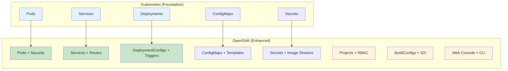
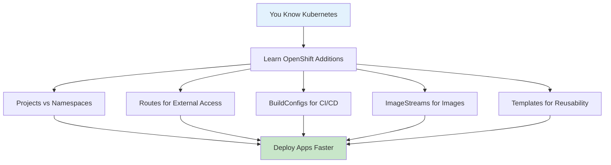

# ☸️ ➡️ 🚀 **From Kubernetes to OpenShift - What's Different?**

<div align="center">


**🎯 Same Concepts, Better Experience | 📊 Side-by-Side Examples**

</div>

---

## 🤔 **Quick Summary: What's the Relationship?**



**OpenShift = Kubernetes + Enterprise Features + Developer Experience**

---

## 📋 **Concept Mapping: Kubernetes ↔ OpenShift**

### **1. 📦 Pods - Same but Secured**

#### **Kubernetes Pod:**
```yaml
# From Session-7_Kubernetes/03-pods/01-simple-pod.yaml
apiVersion: v1
kind: Pod
metadata:
  name: my-pod
spec:
  containers:
  - name: nginx
    image: nginx
```

#### **OpenShift Pod:**
```yaml
# Same YAML works, but OpenShift adds:
apiVersion: v1
kind: Pod
metadata:
  name: my-pod
  namespace: my-project  # OpenShift Projects
spec:
  securityContext:       # Enhanced security
    runAsNonRoot: true
  containers:
  - name: nginx
    image: nginx
    securityContext:
      allowPrivilegeEscalation: false
```

**🔍 Key Differences:**
- ✅ **Same YAML** - Kubernetes pods work in OpenShift
- 🔒 **Enhanced Security** - OpenShift adds security by default
- 📁 **Projects** - OpenShift uses Projects instead of Namespaces

---

### **2. 🌐 Services vs Routes**

#### **Kubernetes Service (Internal Only):**
```yaml
# From Session-7_Kubernetes/05-services-networking/01-clusterip-service.yaml
apiVersion: v1
kind: Service
metadata:
  name: my-service
spec:
  selector:
    app: my-app
  ports:
  - port: 80
    targetPort: 8080
```

#### **OpenShift Service + Route (External Access):**
```yaml
# Service (same as Kubernetes)
apiVersion: v1
kind: Service
metadata:
  name: my-service
spec:
  selector:
    app: my-app
  ports:
  - port: 80
    targetPort: 8080
---
# Route (OpenShift addition for external access)
apiVersion: route.openshift.io/v1
kind: Route
metadata:
  name: my-route
spec:
  to:
    kind: Service
    name: my-service
  port:
    targetPort: 8080
```

**🔍 Key Differences:**
- ✅ **Services Same** - Kubernetes services work in OpenShift
- 🌐 **Routes Added** - OpenShift adds easy external access
- 🔗 **Automatic URLs** - Get `http://my-app-project.apps.cluster.com`

---

### **3. 🚀 Deployments vs DeploymentConfigs**

#### **Kubernetes Deployment:**
```yaml
# From Session-7_Kubernetes/04-deployment-and-scaling/
apiVersion: apps/v1
kind: Deployment
metadata:
  name: my-app
spec:
  replicas: 3
  selector:
    matchLabels:
      app: my-app
  template:
    metadata:
      labels:
        app: my-app
    spec:
      containers:
      - name: app
        image: nginx:1.20
```

#### **OpenShift DeploymentConfig:**
```yaml
apiVersion: apps.openshift.io/v1
kind: DeploymentConfig
metadata:
  name: my-app
spec:
  replicas: 3
  selector:
    app: my-app
  template:
    metadata:
      labels:
        app: my-app
    spec:
      containers:
      - name: app
        image: nginx:1.20
  triggers:                    # OpenShift addition
  - type: ImageChange          # Auto-deploy on image update
    imageChangeParams:
      automatic: true
      containerNames:
      - app
      from:
        kind: ImageStreamTag
        name: nginx:1.20
```

**🔍 Key Differences:**
- ✅ **Both Work** - Can use Kubernetes Deployments or OpenShift DeploymentConfigs
- 🔄 **Triggers** - DeploymentConfigs can auto-deploy on image changes
- 📦 **ImageStreams** - Better image management

---

### **4. 🔨 Building Images: Kubernetes vs OpenShift**

#### **Kubernetes Approach:**
```bash
# Manual process
docker build -t my-app .
docker push registry.com/my-app
kubectl set image deployment/my-app app=registry.com/my-app:latest
```

#### **OpenShift Approach:**
```yaml
# BuildConfig - Automated build from source
apiVersion: build.openshift.io/v1
kind: BuildConfig
metadata:
  name: my-app
spec:
  source:
    git:
      uri: https://github.com/user/my-app
  strategy:
    sourceStrategy:           # Source-to-Image (S2I)
      from:
        kind: ImageStreamTag
        name: nodejs:16
  output:
    to:
      kind: ImageStreamTag
      name: my-app:latest
  triggers:
  - type: GitHub              # Auto-build on git push
```

**🔍 Key Differences:**
- 🔨 **Manual vs Automated** - Kubernetes requires manual builds, OpenShift automates
- 📦 **S2I** - Source-to-Image builds from source code directly
- 🔄 **Git Integration** - Auto-build on code changes

---

## 🎯 **Practical Examples: Same Goal, Different Approach**

### **Example: Deploy Web App from GitHub**

#### **Kubernetes Way (Multiple Steps):**
```bash
# Step 1: Build image manually
git clone https://github.com/openshift/nodejs-ex
cd nodejs-ex
docker build -t my-nodejs-app .
docker push registry.com/my-nodejs-app

# Step 2: Create deployment
kubectl create deployment nodejs-app --image=registry.com/my-nodejs-app

# Step 3: Expose service
kubectl expose deployment nodejs-app --port=8080

# Step 4: Create ingress for external access
kubectl create ingress nodejs-app --rule="nodejs-app.example.com/*=nodejs-app:8080"
```

#### **OpenShift Way (One Command):**
```bash
# One command does everything
oc new-app https://github.com/openshift/nodejs-ex --name=nodejs-app
oc expose service nodejs-app

# Result: Built, deployed, and accessible via URL
```

---

## 📊 **Feature Comparison Table**

| Feature | Kubernetes | OpenShift | Benefit |
|---------|------------|-----------|---------|
| **Pods** | ✅ Basic | ✅ + Security | Enhanced security by default |
| **Services** | ✅ Internal | ✅ + Routes | Easy external access |
| **Deployments** | ✅ Basic | ✅ + Triggers | Auto-deploy on changes |
| **Image Building** | ❌ Manual | ✅ Automated | Build from source code |
| **Web Console** | ❌ Basic | ✅ Full-featured | Visual management |
| **User Management** | ❌ Complex | ✅ Built-in | Easy team management |
| **Templates** | ❌ None | ✅ Built-in | Reusable app patterns |
| **Monitoring** | ❌ Add-on | ✅ Built-in | Ready-to-use dashboards |

---

## 🔄 **Migration Examples**

### **Converting Kubernetes YAML to OpenShift**

#### **Your Kubernetes Service:**
```yaml
# This works as-is in OpenShift
apiVersion: v1
kind: Service
metadata:
  name: web-service
spec:
  selector:
    app: web-app
  ports:
  - port: 80
    targetPort: 8080
```

#### **Add OpenShift Route:**
```yaml
# Add this to make it externally accessible
apiVersion: route.openshift.io/v1
kind: Route
metadata:
  name: web-route
spec:
  to:
    kind: Service
    name: web-service
```

#### **OpenShift Command:**
```bash
# Or just use this command
oc expose service web-service
```

---

## 🎓 **Learning Path: Kubernetes → OpenShift**

### **If You Know Kubernetes:**



### **Study Order:**
1. ✅ **Use existing Kubernetes knowledge** - Most concepts are the same
2. 🌐 **Learn Routes** - External access made easy
3. 🔨 **Try BuildConfigs** - Build from source code
4. 📦 **Understand ImageStreams** - Better image management
5. 📁 **Use Projects** - Enhanced namespaces
6. 🎨 **Explore Web Console** - Visual management

---

## 🚀 **Quick Migration Commands**

### **From kubectl to oc:**
```bash
# Most kubectl commands work with oc
kubectl get pods        →  oc get pods
kubectl apply -f app.yaml  →  oc apply -f app.yaml
kubectl logs my-pod     →  oc logs my-pod

# OpenShift additions
oc new-app [source/image]  # Deploy app quickly
oc expose service [name]   # Create route
oc start-build [name]      # Trigger build
```

---

## 🎉 **Summary**

### **Key Takeaways:**
- ✅ **Kubernetes knowledge transfers** - Same core concepts
- 🚀 **OpenShift adds convenience** - Easier deployment and management
- 🔒 **Enhanced security** - Production-ready by default
- 👨‍💻 **Better developer experience** - Web console, S2I, routes
- 📈 **Faster time to market** - One command deployments

### **Bottom Line:**
**If you know Kubernetes, you're 80% ready for OpenShift. The remaining 20% makes your life much easier!**

---

*Ready to see OpenShift in action? Try the [basic tutorial](../basic-tutorial/) with your Kubernetes knowledge!* 🎓
