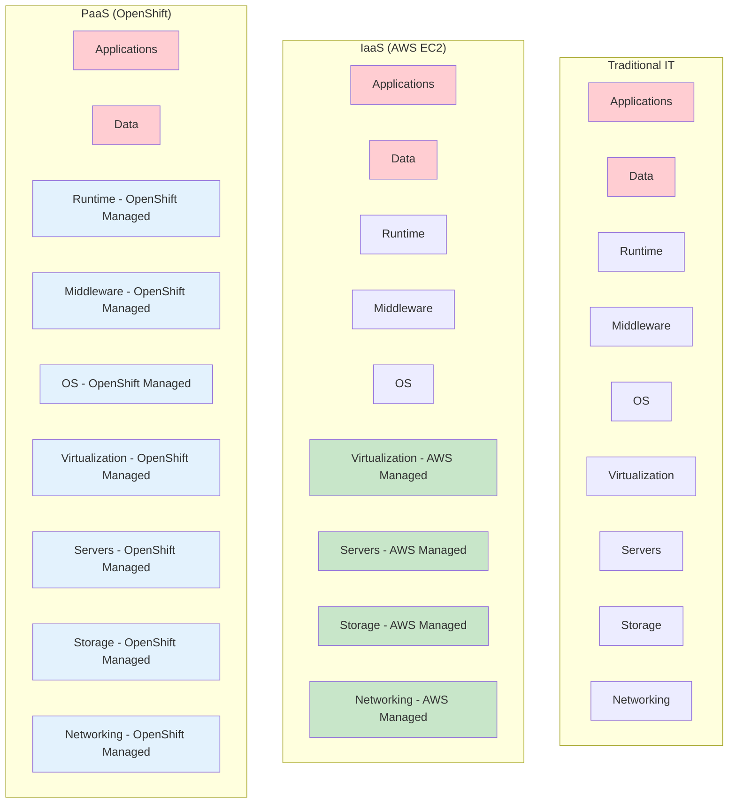
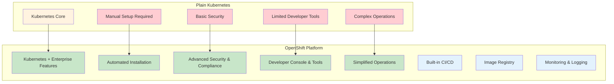
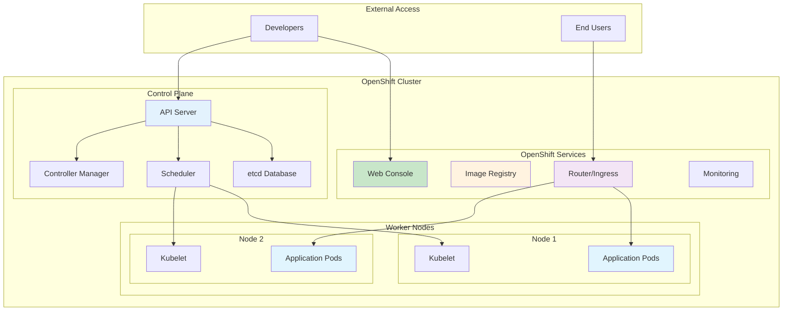
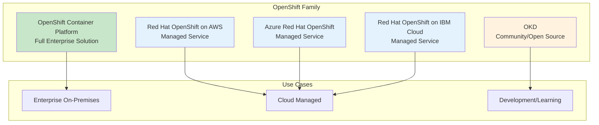
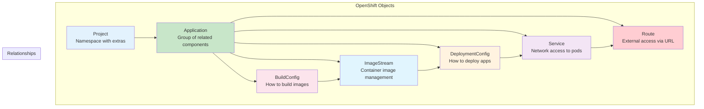
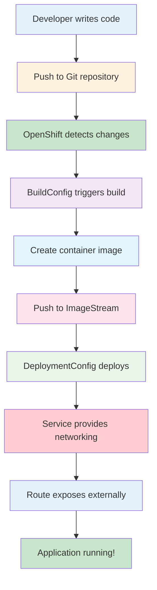
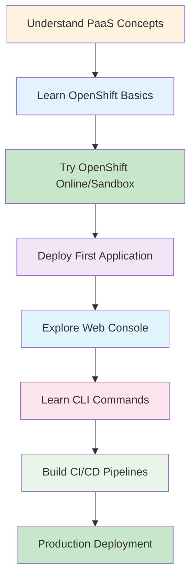

# 🚀 **OpenShift - Enterprise Kubernetes Platform**

**🎯 Enterprise Ready | 🔒 Security First | 🛠️ Developer Friendly | ☁️ Multi-Cloud**

---

## 🤔 **What is PaaS (Platform as a Service)?**

### **Cloud Service Models:**

### **PaaS Benefits:**
- **🚀 Faster Development** - Focus on code, not infrastructure
- **🔧 Built-in Tools** - CI/CD, monitoring, scaling included
- **💰 Cost Effective** - Pay for what you use
- **🛡️ Security** - Platform handles security patches
- **📈 Auto Scaling** - Handles traffic spikes automatically

---

## 🎯 **Why OpenShift?**

### **OpenShift vs Plain Kubernetes:**

### **Key Advantages:**
- **🏢 Enterprise Ready** - Production-grade from day one
- **🔒 Security First** - Built-in security policies and scanning
- **👨‍💻 Developer Experience** - Web console, CLI, and IDE integration
- **🔄 GitOps Ready** - Integrated CI/CD pipelines
- **📊 Observability** - Built-in monitoring and logging
- **🌐 Multi-Cloud** - Run anywhere (AWS, Azure, GCP, on-premises)

---

## 🏗️ **OpenShift Architecture**

### **High-Level Architecture:**

### **Core Components:**
- **🎛️ Control Plane** - Manages the entire cluster
- **💻 Worker Nodes** - Run your applications
- **🌐 Web Console** - User-friendly management interface
- **📦 Image Registry** - Store and manage container images
- **🔀 Router** - Handle external traffic routing
- **📊 Monitoring** - Track cluster and application health

---

## 📋 **OpenShift Types & Deployment Options**

### **OpenShift Variants:**

### **Deployment Options:**

#### **🏢 On-Premises**
- **OpenShift Container Platform (OCP)** - Full control, your infrastructure
- **Best for:** Large enterprises, strict compliance requirements

#### **☁️ Cloud Managed**
- **ROSA (AWS)** - Red Hat manages OpenShift on your AWS account
- **ARO (Azure)** - Microsoft and Red Hat managed service
- **Best for:** Organizations wanting cloud benefits without operational overhead

#### **🆓 Community/Learning**
- **OKD** - Open source version, perfect for learning
- **CodeReady Containers** - Local development environment
- **Best for:** Developers, students, proof of concepts

---

## 🧩 **Basic OpenShift Concepts**

### **Key Objects & Concepts:**

### **Essential Concepts:**

#### **📁 Project**
- **What:** Kubernetes namespace + OpenShift extras
- **Purpose:** Organize and isolate applications
- **Example:** `my-web-app-project`

#### **🚀 Application**
- **What:** Logical grouping of related components
- **Purpose:** Manage related services together
- **Example:** Frontend + Backend + Database

#### **🔄 DeploymentConfig**
- **What:** Defines how to deploy and update applications
- **Purpose:** Automated deployments and rollbacks
- **Features:** Rolling updates, triggers, hooks

#### **🌐 Route**
- **What:** External URL to access your application
- **Purpose:** Expose services to the internet
- **Example:** `https://my-app.apps.cluster.com`

#### **📦 ImageStream**
- **What:** Manages container images and versions
- **Purpose:** Track image updates and trigger deployments
- **Benefits:** Automatic updates, security scanning

#### **🔨 BuildConfig**
- **What:** Defines how to build container images from source code
- **Purpose:** Automated CI/CD from Git repositories
- **Types:** Source-to-Image (S2I), Docker builds

---

## 🎯 **Developer Workflow**

### **Typical Development Process:**

### **Developer Benefits:**
- **🔄 Automated Builds** - Code to container automatically
- **🚀 Easy Deployments** - One command deployment
- **📊 Built-in Monitoring** - See your app's health
- **🔧 Debugging Tools** - Logs, metrics, terminal access
- **🌐 Instant URLs** - Get public URLs immediately

---

## 🛠️ **Getting Started**

### **Learning Path:**

### **Free Learning Resources:**
- **🌐 [OpenShift Sandbox](https://developers.redhat.com/developer-sandbox)** - Free cluster for learning
- **📚 [Interactive Learning](https://learn.openshift.com/)** - Hands-on tutorials
- **🎥 [OpenShift YouTube](https://www.youtube.com/c/OpenShift)** - Video tutorials
- **📖 [Documentation](https://docs.openshift.com/)** - Official guides

### **Next Steps:**
1. **Sign up** for OpenShift Sandbox (free)
2. **Complete** interactive tutorials
3. **Deploy** your first application
4. **Explore** the web console
5. **Learn** CLI commands
6. **Build** a simple CI/CD pipeline

---

## 🎓 **Key Takeaways**

### **OpenShift Simplifies:**
- ✅ **Container Management** - No complex Kubernetes setup
- ✅ **Application Deployment** - From code to running app in minutes
- ✅ **Security** - Built-in security policies and scanning
- ✅ **Scaling** - Automatic scaling based on demand
- ✅ **Monitoring** - Built-in observability tools
- ✅ **CI/CD** - Integrated build and deployment pipelines

### **Perfect For:**
- **🏢 Enterprises** - Production-ready platform
- **👨‍💻 Developers** - Focus on code, not infrastructure
- **🚀 Startups** - Quick time to market
- **🎓 Students** - Learn modern cloud-native development

---

## 🚀 **Ready to Start?**

**OpenShift makes container orchestration simple and enterprise-ready!**

1. **🌐 Try OpenShift Sandbox** - Get hands-on experience
2. **📚 Follow tutorials** - Learn by doing
3. **🔨 Build applications** - Deploy real projects
4. **📈 Scale up** - Move to production when ready

*Transform your development workflow with OpenShift!* ✨
