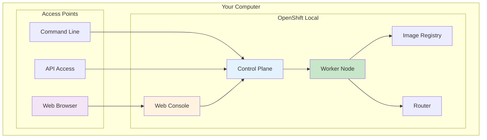

# 🛠️ **OpenShift Local Installation - Learning Environment**

<div align="center">


**🎯 Single-Node Cluster | 💻 Local Development | 🚀 Quick Setup**

</div>

---

## 🎯 **What is OpenShift Local?**

**OpenShift Local** (formerly CodeReady Containers) is a **single-node OpenShift cluster** that runs on your laptop/desktop.

### **Perfect for:**
- 🎓 **Learning OpenShift** - Full OpenShift experience locally
- 👨‍💻 **Development** - Test applications before production
- 🧪 **Experimentation** - Try features without cloud costs
- 📚 **Training** - Hands-on practice anytime

### **What You Get:**


---

## 💻 **System Requirements**

### **Minimum Requirements:**
- **💾 RAM:** 8 GB (12 GB recommended)
- **💿 Disk:** 35 GB free space
- **🖥️ CPU:** 4 cores (Intel/AMD x64)
- **🖱️ OS:** Windows 10/11, macOS 10.14+, Linux

### **Supported Operating Systems:**
- ✅ **Windows 10/11** - With Hyper-V or VirtualBox
- ✅ **macOS 10.14+** - With HyperKit
- ✅ **Linux** - RHEL 8+, Fedora 32+, Ubuntu 18.04+

---

## 🚀 **Installation Steps**

### **Step 1: Download OpenShift Local**

1. **Visit:** https://developers.redhat.com/products/openshift-local/overview
2. **Create free Red Hat account** (if you don't have one)
3. **Download** for your operating system
4. **Get pull secret** - You'll need this during setup

### **Step 2: Install OpenShift Local**

#### **Windows:**
```powershell
# Extract downloaded file
# Run installer as Administrator
crc-windows-installer.exe

# Verify installation
crc version
```

#### **macOS:**
```bash
# Extract downloaded file
tar -xf crc-macos-amd64.tar.xz

# Move to PATH
sudo mv crc /usr/local/bin/

# Verify installation
crc version
```

#### **Linux:**
```bash
# Extract downloaded file
tar -xf crc-linux-amd64.tar.xz

# Move to PATH
sudo mv crc /usr/local/bin/

# Verify installation
crc version
```

### **Step 3: Setup OpenShift Local**

```bash
# Setup the environment (one-time setup)
crc setup

# Start OpenShift Local
crc start

# When prompted, paste your pull secret
# Wait 10-15 minutes for first startup
```

### **Step 4: Access Your Cluster**

```bash
# Get cluster information
crc console --url

# Get login credentials
crc console --credentials

# Login via CLI
oc login -u developer -p developer https://api.crc.testing:6443
```

---

## 🌐 **Accessing OpenShift**

### **Web Console Access:**
```bash
# Open web console in browser
crc console

# Or get URL manually
crc console --url
# Output: https://console-openshift-console.apps-crc.testing
```

### **Default Credentials:**
- **👨‍💻 Developer User:**
  - Username: `developer`
  - Password: `developer`
  
- **👑 Admin User:**
  - Username: `kubeadmin`
  - Password: `[shown during crc start]`

### **CLI Access:**
```bash
# Login as developer
oc login -u developer -p developer

# Login as admin
oc login -u kubeadmin -p [admin-password]

# Check cluster status
oc get nodes
oc get projects
```

---

## 🧪 **Quick Test - Deploy Your First App**

### **Deploy a Simple Web App:**

```bash
# Login as developer
oc login -u developer -p developer

# Create new project
oc new-project my-first-app

# Deploy sample application
oc new-app --name hello-world \
  --docker-image=quay.io/redhat-developer-demos/hello-world:latest

# Expose the service
oc expose service hello-world

# Get the route URL
oc get route hello-world
```

### **Access Your App:**
```bash
# Get the application URL
oc get route hello-world -o jsonpath='{.spec.host}'

# Open in browser or curl
curl http://[your-app-url]
```

---

## 🛠️ **Useful Commands**

### **Cluster Management:**
```bash
# Start cluster
crc start

# Stop cluster
crc stop

# Delete cluster (reset)
crc delete

# Check status
crc status

# Get cluster info
crc ip
crc console --url
crc console --credentials
```

### **Resource Management:**
```bash
# Check resource usage
crc config get cpus
crc config get memory

# Adjust resources (requires restart)
crc config set cpus 6
crc config set memory 16384
```

---

## 🔧 **Troubleshooting**

### **Common Issues:**

#### **❌ Not Enough Memory**
```bash
# Check current memory
crc config get memory

# Increase memory (MB)
crc config set memory 12288
crc delete
crc start
```

#### **❌ Network Issues**
```bash
# Check if cluster is running
crc status

# Restart networking
crc stop
crc start
```

#### **❌ Pull Secret Issues**
```bash
# Update pull secret
crc config set pull-secret-file /path/to/pull-secret.txt
```

#### **❌ Slow Performance**
```bash
# Allocate more CPU
crc config set cpus 6

# Check disk space
crc config get disk-size
```

---

## 📚 **Next Steps**

### **Learning Path:**
1. ✅ **Install OpenShift Local** - You're here!
2. 🌐 **Explore Web Console** - Navigate the interface
3. 🚀 **Deploy Applications** - Try different deployment methods
4. 🔨 **Build from Source** - Use Source-to-Image (S2I)
5. 🔄 **CI/CD Pipelines** - Automate deployments
6. 📊 **Monitoring** - Observe application health

### **Practice Projects:**
- **Simple Web App** - HTML/CSS/JS application
- **REST API** - Node.js or Python API
- **Database App** - App with PostgreSQL
- **Microservices** - Multiple connected services

### **Resources:**
- 📖 **[OpenShift Local Docs](https://access.redhat.com/documentation/en-us/red_hat_openshift_local)**
- 🎥 **[Video Tutorials](https://www.youtube.com/c/OpenShift)**
- 🌐 **[Interactive Learning](https://learn.openshift.com/)**
- 💬 **[Community Forums](https://developers.redhat.com/products/openshift-local/community)**

---

## 🎉 **Success!**

You now have a **full OpenShift cluster running locally**! 

**What you can do:**
- ✅ Deploy applications
- ✅ Test CI/CD pipelines  
- ✅ Learn OpenShift concepts
- ✅ Experiment without cloud costs
- ✅ Develop cloud-native applications

**Ready to build amazing applications on OpenShift!** 🚀
