# 🏗️ Module 2: Architecture Overview (8 minutes)

<div align="center">


**🎯 Core Components | 🔄 Workflow Understanding | 📊 System Design**

</div>

---

## 🎯 **Learning Objectives**

By the end of this module, you'll understand:
- ✅ Terraform's core architecture components
- ✅ How the Terraform workflow operates
- ✅ Provider ecosystem and state management
- ✅ The relationship between configuration, state, and infrastructure

---

## 🏗️ **Terraform Core Architecture**

### **High-Level System Overview**


---

## 🔧 **Core Components Deep Dive**

### **1. Terraform CLI**
The command-line interface that users interact with directly.

**Key Responsibilities:**
- Parse user commands and options
- Coordinate between core components
- Display output and error messages
- Handle user authentication

**Common Commands:**
```bash
terraform init      # Initialize working directory
terraform plan      # Create execution plan
terraform apply     # Apply changes
terraform destroy   # Destroy infrastructure
terraform show      # Show current state
terraform validate  # Validate configuration
```

### **2. Configuration Parser**
Reads and interprets Terraform configuration files written in HCL.


**What it processes:**
- Resource definitions
- Variable declarations
- Output specifications
- Provider configurations
- Module references

### **3. Resource Graph Builder**
Creates a dependency graph of all resources to determine execution order.


### **4. State Manager**
Tracks the current state of infrastructure and maps it to configuration.

**State File Contents:**
- Resource metadata
- Attribute values
- Dependencies
- Provider information
- Terraform version

### **5. Plan Engine**
Compares desired state (configuration) with current state to create execution plan.


### **6. Apply Engine**
Executes the plan by making API calls through providers.

**Execution Process:**
1. Validate execution plan
2. Acquire state lock (if remote state)
3. Execute changes in dependency order
4. Update state file
5. Release state lock

---

## 🔌 **Provider Ecosystem**

### **What are Providers?**
Providers are plugins that enable Terraform to interact with APIs of various services.


### **Provider Categories**

| Category | Examples | Use Cases |
|----------|----------|-----------|
| **Cloud Providers** | AWS, Azure, GCP | Infrastructure provisioning |
| **SaaS Providers** | Datadog, PagerDuty | Service configuration |
| **Network Providers** | Cloudflare, F5 | Network management |
| **Database Providers** | MongoDB, PostgreSQL | Database setup |
| **Monitoring Providers** | Grafana, New Relic | Observability |
| **Security Providers** | Vault, Auth0 | Security configuration |

### **Provider Configuration Example**
```hcl
# Configure the AWS Provider
terraform {
  required_providers {
    aws = {
      source  = "hashicorp/aws"
      version = "~> 5.0"
    }
  }
}

provider "aws" {
  region = "us-west-2"
}
```

---

## 📊 **State Management Deep Dive**

### **What is Terraform State?**
State is Terraform's way of tracking which real-world resources correspond to your configuration.


### **State Storage Options**

```mermaid
graph TB
    subgraph "Local State"
        A["terraform.tfstate (Local File)"]
        A1[✅ Simple setup]
        A2[❌ No collaboration]
        A3[❌ No locking]
        A4[❌ Security risk]
    end
    
    subgraph "Remote State"
        B["S3 + DynamoDB (AWS Backend)"]
        B1[✅ Team collaboration]
        B2[✅ State locking]
        B3[✅ Encryption]
        B4[✅ Versioning]
        
        C["Terraform Cloud (SaaS Backend)"]
        C1[✅ Managed service]
        C2[✅ UI interface]
        C3[✅ Policy enforcement]
        C4[✅ Cost estimation]
    end
    
    style A fill:#ffebee
    style B fill:#e8f5e8
    style C fill:#e3f2fd
```



### **State File Structure**
```json
{
  "version": 4,
  "terraform_version": "1.5.0",
  "serial": 1,
  "lineage": "unique-id",
  "outputs": {},
  "resources": [
    {
      "mode": "managed",
      "type": "aws_instance",
      "name": "web",
      "provider": "provider[\"registry.terraform.io/hashicorp/aws\"]",
      "instances": [
        {
          "schema_version": 1,
          "attributes": {
            "id": "i-1234567890abcdef0",
            "ami": "ami-12345",
            "instance_type": "t2.micro"
          }
        }
      ]
    }
  ]
}
```

---

## 🔄 **Terraform Workflow**

### **Complete Workflow Visualization**


### **Workflow Commands Deep Dive**

#### **1. terraform init**


**What happens:**
- Downloads required providers
- Initializes backend configuration
- Downloads referenced modules
- Creates `.terraform/` directory
- Prepares working directory

#### **2. terraform plan**


**Plan Output Symbols:**
- `+` Create new resource
- `~` Update existing resource
- `-` Delete existing resource
- `+/-` Replace resource (delete then create)

#### **3. terraform apply**


#### **4. terraform destroy**


---

## 🔍 **Resource Graph & Dependencies**

### **Dependency Resolution**


### **Parallel Execution**
Terraform can create resources in parallel when there are no dependencies:


---

## 📁 **Configuration Structure**

### **Typical Project Layout**
```
terraform-project/
├── main.tf              # Primary configuration
├── variables.tf         # Input variables
├── outputs.tf          # Output values
├── terraform.tfvars    # Variable values
├── versions.tf         # Provider requirements
├── .terraform/         # Provider plugins (auto-generated)
├── terraform.tfstate   # State file (if local)
└── .terraform.lock.hcl # Dependency lock file
```

### **Configuration File Types**

| File | Purpose | Example Content |
|------|---------|-----------------|
| **main.tf** | Primary resources | `resource "aws_instance" "web" {...}` |
| **variables.tf** | Input definitions | `variable "instance_type" {...}` |
| **outputs.tf** | Output definitions | `output "instance_ip" {...}` |
| **terraform.tfvars** | Variable values | `instance_type = "t2.micro"` |
| **versions.tf** | Provider versions | `terraform { required_providers {...} }` |

---

## ✅ **Module 2 Checkpoint**

### **Knowledge Check**
Before moving to Module 3, ensure you understand:

- [ ] What are the core components of Terraform architecture?
- [ ] How does the Terraform workflow operate (init, plan, apply)?
- [ ] What is the role of providers in Terraform?
- [ ] How does Terraform state management work?
- [ ] What is the difference between local and remote state?
- [ ] How does Terraform handle resource dependencies?

### **Key Takeaways**
- 🏗️ **Terraform architecture** is modular with clear separation of concerns
- 🔄 **Workflow is predictable** with init → plan → apply → destroy cycle
- 🔌 **Providers enable** interaction with any API-driven service
- 📊 **State management** is critical for tracking infrastructure
- 🔗 **Dependency resolution** ensures correct resource creation order
- ⚡ **Parallel execution** optimizes deployment speed

---

<div align="center">

### 🚀 **Ready to Learn Essential Commands?**

**Next Module: [03 - Basic Commands](../03-basic-commands/README.md)**

*Master the Terraform CLI and essential workflows*

</div>

---

**Module Duration**: 8 minutes  
**Difficulty**: Beginner  
**Prerequisites**: Module 1 completed
